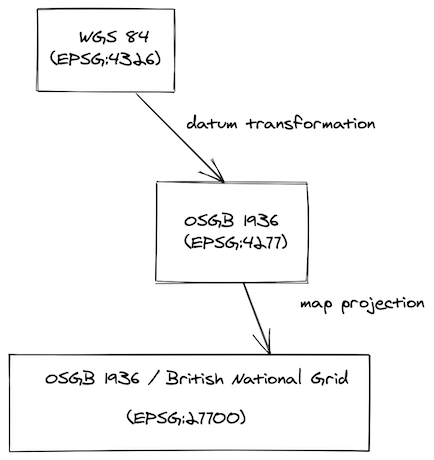
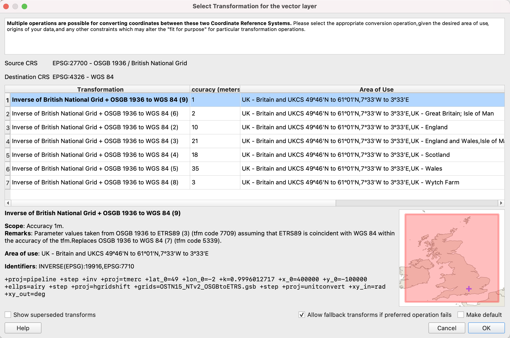

# Projections <Badge text="Expert" type="error"/>

[[toc]]

## Map Projections

**Map projection** is the operation defining how to show/display spatial data (your data with associated coordinate reference system) on 2D flat surface (QGIS map canvas or printed paper map). There are various types of projections that are used in cartography (planar projection, cylindrical projections, conic projections). Each type of projection could preserve some attribute of the 2d "flat" map. Some projections preserve distance, others areas, etc. For example Mercator Projection was created to display accurate compass bearings for sea travel.

You can read more about map projections in the <QGISHelp ver="3.16" link="gentle_gis_introduction/coordinate_reference_systems.html#map-projection-in-detail" text="QGIS docs" /> or [Wikipedia](https://en.wikipedia.org/wiki/Map_projection).

## Coordinate Reference Systems

All your spatial data include information about where your data is located on earth. Let's say you to store the position of a heritage tree. You may stand next to it with GPS receiver and note down latitude and longitude and altitude of the place. Two numbers in degrees and one in meters. You think the three numbers will mark exactly the heritage tree position for your children. Not that easy. What if in 50 years the GPS will be replaced by some different technology not using the latitude and longitude? Or let's say the tree is in Australia. The continent sits on the world’s fastest-moving continental tectonic plate with speed around 7 centimetres per year. And your GPS position is related to the global/world coordinates. Ok, at least we should mark down to our notes the date when we captured the coordinates and which **coordinate reference system** (CRS) we used.

Sometimes the coordinates of spatial data are in meters or feet, sometimes in degrees and therefore you need also coordinate reference system which defines how your spatial data could be transformed to the position on the Earth. Each coordinate reference system could be geographic (e.g. for whole globe, using latitude and longitude in degrees) or projected (for example the Great Britain or part of the USA, using metric units as feet). So the coordinate reference system consists of:

 - the mathematical **parameters** such as an origin and scale (e.g. prime meridian which specifies the location of 0° longitude)
 - horizontal (and vertical) **units** (degrees, meters, feet, ...)
 - **datum**, the ellipsoid/geoid which represents the Earth's shape and its position relative to the surface

The coordinate reference systems are not set in stone. Most of them are part of [EPSG registry](https://en.wikipedia.org/wiki/EPSG_Geodetic_Parameter_Dataset) and they have associated the simple number that can be looked up and the precise definition could be found out. To elaborate on our example with the heritage tree in Australia, you could have used [GDA94](https://en.wikipedia.org/wiki/Geocentric_Datum_of_Australia_1994).

When we want to show the data stored in one coordinate reference system on a map in other coordinate reference system (e.g. when we have multiple layers each with different coordinate system), we need to do **transformation**. When two coordinate systems do not use the same datum, there are multiple ways how to transform from system one to another. This operation is typically only approximate and multiple operations may exist for different purposes, or depending on how the data was originally collected in the first place. Therefore as spatial data users we need to make an informed choice about which operation is fit for purpose and the correct one to use for your current project.

More detailed information about the coordinate reference systems and projections could be found in the <QGISHelp ver="3.16" link="gentle_gis_introduction/coordinate_reference_systems.html" text="QGIS online documentation" /> or [PROJ documentation](https://proj.org/operations/index.html).

## How is it used in QGIS?

QGIS is FOSS (free and open source) software standing on the shoulders of other FOSS libraries. Notably projection support is handled by [PROJ](https://proj.org). The version proj4 was used for decades, but in recent years it was recreated from scratch to reflect the recent modern ways for handling transformations and the increasing demand for high precision location. Different version of PROJ uses different set of resource files required to handle projections accurately. See [PROJ help](https://proj.org/resource_files.html) for details. Most importantly, the recent release of QGIS 3.16 LTR and QGIS 3.18 for all platforms is on PROJ6+ version.

Your QGIS installation contains the basic set of PROJ resources required for most day-to-day work. But if you need some special coordinate reference systems, the required files for [PROJ7](https://github.com/OSGeo/PROJ-data) and for [PROJ6](https://github.com/OSGeo/proj-datumgrid) are available online. Also note that QGIS can automatically download the required files for your when requested. Just follow the instructions when you see the QGIS warning in the transformation dialog:


## Example Capture GPS point for Great Britain  

For example, imagine we have a project for the Great Britain, where we use map projection British National Grid (EPSG:27700) to display map. We have background map in the same coordinate reference system, so there is no datum transformation required to show it. However we want to capture point by GPS receiver in the field by [Input app](https://inputapp.io), and we add a point layer in WGS 84 coordinate reference system. When we add point to this point layer, we store the coordinate values (latitude and longitude received from GPS) as is in the data section of our layer. When we want to show the point on the QGIS map canvas, QGIS needs to first do datum transformation, following by map projection.



### 1. Datum transformation

British National Grid (EPSG:27700) is based on datum OSGB 1936 which is different from WGS 84. QGIS recognises that there is possibility to do datum transformation in multiple ways so user is asked to select the one from the list:



In this case, the recommended transform is the[OSTN15 transformation](https://www.ordnancesurvey.co.uk/business-government/tools-support/os-net/for-developers)which uses a grid file to transform coordinates. Other transforms are using [Helmert transformation](https://en.wikipedia.org/wiki/Helmert_transformation) method and offer lower accuracy. Grid files for transforms are usually not shipped with QGIS. But QGIS *offers to auto install* these to the correct location for you! These files are then automatically used for all your projects if required. Once this is selected and ready, QGIS calls PROJ library to do datum transformation.

### 2. Map projection

Once the data is in the same datum, they are projected to 2d flat space (map canvas) and rendered to the user in QGIS or [Input app](https://inputapp.io).

## What could possibly go wrong?

There are multiple scenarios where you can end up with shifted or misplaced points on your map.

Probably most commonly the misplaced data are when the coordinate reference system of layers is not defined or assigned incorrectly.

Other issues are visible when:
1. datum transformation needs to be done during reprojection (i.e. GPS / survey layer / map do not have the
same geodetic datum)
2. AND the datum transformation is not correct.

For example imagine that you digitised your point to be in the corner of the rectangle in QGIS desktop. But when opened in the Input app in the field it is obviously shifted by dozens of centimetres. Or other way around, you digitise the point in the field, and when opened in QGIS it is misplaced.


The likely reason is that there is correctly downloaded and used extra datum shift file in QGIS, but missing in Input app (more information in [this blog](https://www.lutraconsulting.co.uk/blog/2021/04/21/projections-field/))

## QGIS Transformation tab

QGIS exposes a nice interface for coordinate reference systems through the Transformation tab in Settings. It is powered by [PROJ](https://proj.org/index.html), which tries to find the [best available](https://proj.org/operations/operations_computation.html)transformation route from the source to the destination coordinate reference system.

Let's say we want to setup default transformation between British National Grid (EPSG:27700) and World Geodetic System used in GPS (EPSG:4326) for all our future QGIS projects.


Using the "+" button we add a new entry and select EPSG:27700 and EPSG:4326. Let's examine the first transformation with the accuracy of 1 meter:


At the bottom there is an interesting PROJ description line with pipeline to be used by underlying PROJ library. You can read more about [PROJ pipeline](https://proj.org/operations/pipeline.html), but to start with it definition of several mathematical operations to be done:

```
+proj=pipeline
+step +inv +proj=tmerc +lat_0=49 +lon_0=-2 +k=0.9996012717 +x_0=400000 +y_0=-100000 +ellps=airy
+step +proj=hgridshift +grids=OSTN15_NTv2_OSGBtoETRS.gsb
+step +proj=unitconvert +xy_in=rad +xy_out=deg
```

Huh. Let's see if we can get at least some information from it by help of [PROJ documentation](https://proj.org/)

We see there are 3 steps:
- inversion `+inv` for the `tmerc`([Transverse Mercator](https://proj.org/operations/projections/tmerc.html)) with [Airy](https://proj.org/operations/projections/airy.html?highlight=airy) ellipsoid ("map projection")
- following by `hgridshift`([Horizontal grid shift](https://proj.org/operations/transformations/hgridshift.html?highlight=hgridshift)) defined by **datum shift file** `OSTN15_NTv2_OSGBtoETRS.gsb` ("datum transformation")
- finally unit conversion from radians to degrees (GPS coordinates are in degrees)

Well, quite importantly for second step you have to have **datum shift file** `OSTN15_NTv2_OSGBtoETRS.gsb` on your computer. If you do not have it, this is why there is a big red warning in the dialog. But **QGIS is always nice to you** and offers you to automatically download and store it for later use!

You can check the downloaded PROJ files in these locations:

- For Windows users: `C:\Users\USER\AppData\Roaming\QGIS\QGIS3\profiles\default\proj` (replace USER with your username)
- For macOS users: `~/Library/Application\ Support/QGIS/QGIS3/profiles/default/proj`
- For Linux users: `~/.local/share/QGIS/QGIS3/profiles/default/proj`
