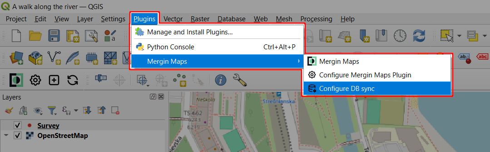
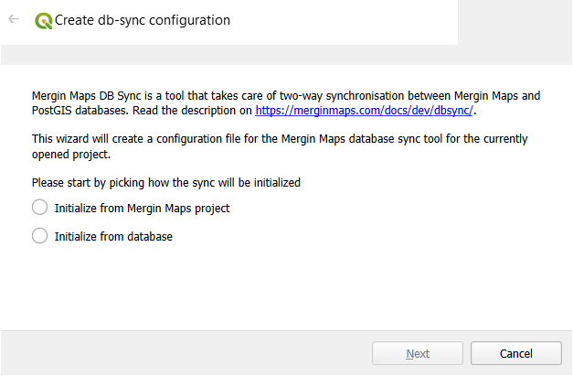
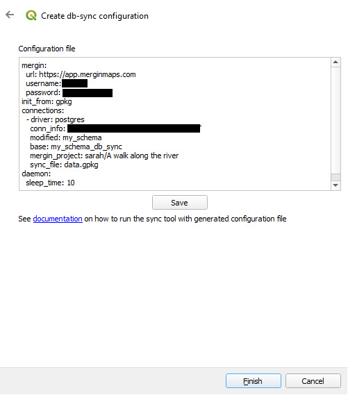

# PostgreSQL DB Sync
[[toc]]

**DB Sync** is a tool that takes care of two-way synchronisation between <MainPlatformNameLink /> and PostGIS databases. The synchronisation works both ways: changes made in a PostGIS database are automatically pushed to a configured <MainPlatformName /> project and changes made in a GeoPackage in the <MainPlatformName /> project are pushed to the PostGIS database.

<YouTube id="4mWcaKs9jkw" />

**Interested in using DB Sync?** Go to <GitHubRepo id="MerginMaps/db-sync" /> repository for the source code and a Quick start that will guide you through the steps to get DB Sync up and running. 

Windows users may use a Windows executable for DB sync. On Linux/Mac users are advised to use a docker container. [DB Sync configuration wizard](#db-sync-configuration-wizard) can help you with creating the configuration file.

:::tip Usage details
DB Sync can be used with *Team*, *Academia* and *Non-profit* <MainDomainNameLink id="pricing" desc="subscription plans"/>, as well as in [<CommunityPlatformName />](./mergince/) and [<EnterprisePlatformName />](./merginmaps-ee/).

It is not available in *Individual* or *Professional* subscriptions.

You can try DB Sync for free during the trial period.
:::

## DB Sync configuration wizard
<SinceBadge type="Plugin" version="2023.4" />

DB Sync configuration file can be generated in QGIS using <QGISPluginName />:
1. Open your <MainPlatformName /> project in QGIS
2. Using the **Plugin** menu bar, navigate to **Mergin Maps > Configure DB sync** tool 
   

3. DB sync wizard opens. 

   Choose if you want to initialise the sync from <MainPlatformName /> project or from the database and follow the steps.
   

4. At the end, the wizard will generate a file that can be used as initial configuration file for this project to set up DB Sync
   
