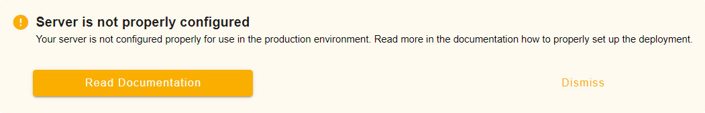

# Mergin Maps Community Edition

<MainPlatformNameLink /> is a web platform for storage and synchronisation of data between mobile devices, <MainPlatformNameLink /> service and QGIS Desktop. 

There is also <MainPlatformName /> Community Edition (<MainPlatformName /> CE) that is licensed as open source software. The source code for <MainPlatformName /> CE can be modified and used for custom deployments. You can contribute your code to <GitHubRepo id="MerginMaps/mergin" />.

## How to deploy Mergin Maps CE
**Interested in deploying <MainPlatformName /> CE?** You can start by going to <GitHubRepo id="MerginMaps/mergin" /> on GitHub and read instructions on how to deploy it for your platform.

## How to opt out of sending statistics
<SinceBadge type="Server" version="2023.2" />
By default, <MainPlatformName /> CE collects anonymous usage information to make the service better. There is a variable named `COLLECT_STATISTICS` that controls if statistics are collected and sent to <MainPlatformNameLink />. 

If you do not want to provide these data, you can opt-out any time by setting this variable to *false* 
```
COLLECT_STATISTICS=false
```

## Mergin Maps CE server is not properly configured
Did you get an error that the server is not properly configured?


1. Check if `MERGIN_BASE_URL` docker environment variable is assigned correctly.
   `MERGIN_BASE_URL` should contain the URL of your <MainPlatformName /> CE server.
   
2. Restart the container with the `MERGIN_BASE_URL` variable

## Migrate to the latest Mergin Maps CE version
To migrate from older <MainPlatformName /> Community Edition to the latest version, follow our [Migration Guides](./ce-migration/)


