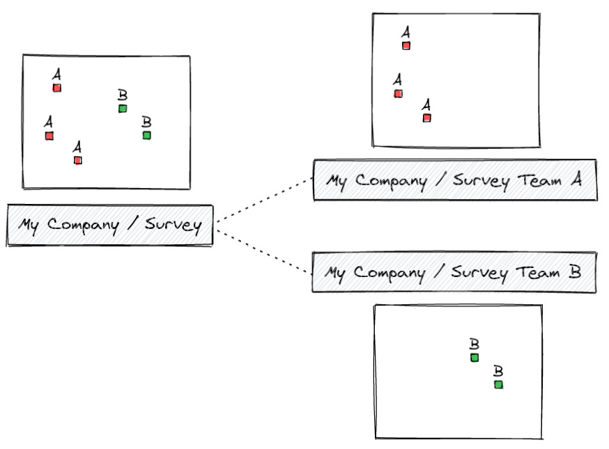

# Work Packages
[[toc]]

The **Work Packages** tool is designed to manage field surveys for multiple teams. This tool allows to create <MainPlatformName /> *work packages projects* that contain a subset of data of the main <MainPlatformNameLink/> project and set up two-way synchronisation between the main project and the dependent projects as illustrated here:

<YouTube id="_iM-mql9by4" />

The main <MainPlatformNameLink/> project (*Survey*) contains all data. The admin of the main project can assign some of the data to working package projects (*Survey Team A*, *Survey Team B*). The teams can see and modify only the data that are assigned to them.

**Interested in using Work Packages?** Go to <GitHubRepo id="MerginMaps/work-packages" /> repository for the source code, more details and a quick start with a simple project.

:::tip Usage details
Work Packages can be used with *Team*, *Academia* and *Non-profit* <MainDomainNameLink id="pricing" desc="subscription plans"/>, as well as in [<CommunityPlatformName />](../../server/) and [<EnterprisePlatformName />](../../server/).

It is not available in *Individual* or *Professional* subscriptions.

You can try Work Packages for free during the trial period.
:::
