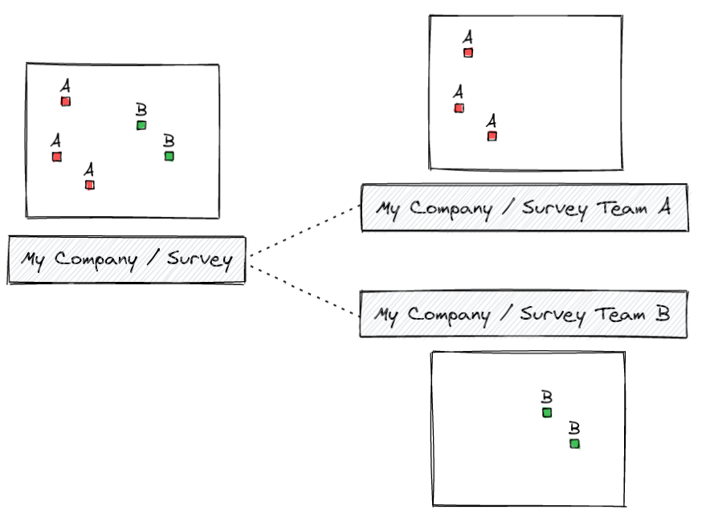

# Work Packages
[[toc]]

The <MainPlatformName /> Work Packages tool is designed to manage field surveys for multiple teams. This tool allows to create <MainPlatformName /> *work packages projects* that contain a subset of data of the main <MainPlatformName /> project and set up two-way synchronisation between the main project and the dependent projects as illustrated here:

The main <MainPlatformName /> project (*Survey*) contains all data. The admin of the main project can assign some of the data to working package projects (*Survey Team A*, *Survey Team B*). The teams can see and modify only the data that are assigned to them.

**Interested in using Work Packages?** Go to <GitHubRepo id="MerginMaps/mergin-work-packages" /> repository for the source code and more details. You can also follow the [Quick start guide](https://github.com/MerginMaps/mergin-work-packages#quick-start) to start with a simple pre-configured project.
