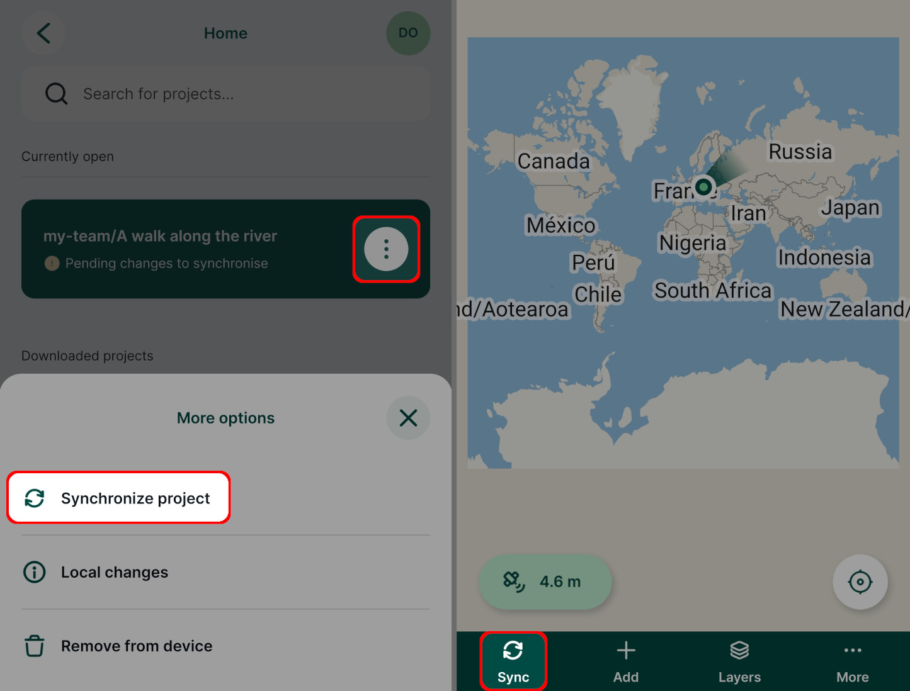
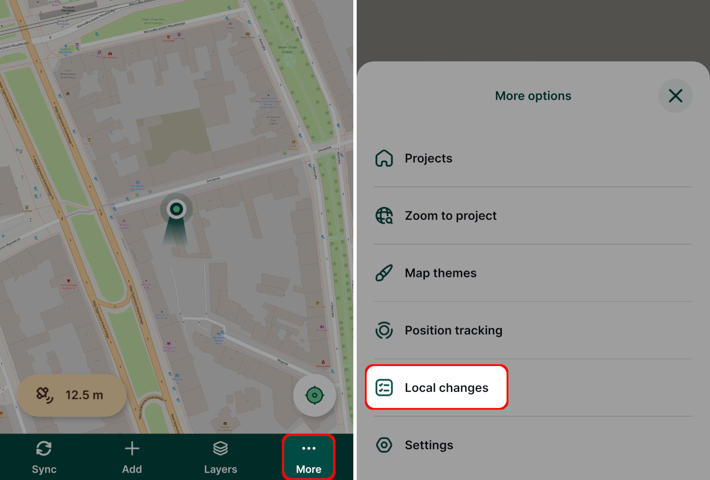
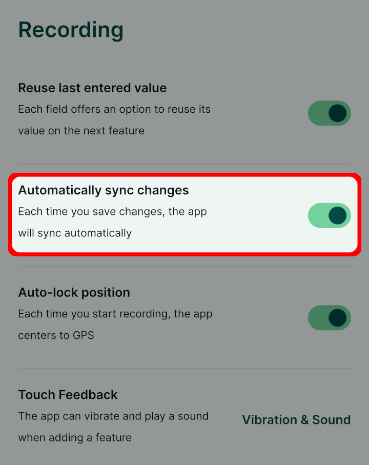
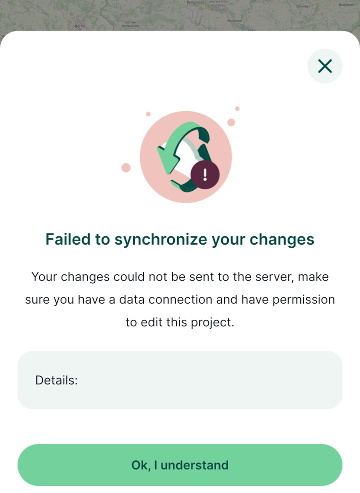

# Synchronisation in Mergin Maps Mobile App
[[toc]]

Changes in your project can be synchronised by using **Synchronise project** option on the main page of the <MobileAppNameShort /> or during the survey:
- [manually](#manual-synchronisation) by clicking the **Sync** button
- [automatically](#automatic-synchronisation) by using the **Automatically sync changes** option

To be able to synchronise a project, you need to:
- be signed in to your <MainPlatformNameLink /> account
- be connected to the internet
- have write [permission](../../manage/permissions/) to the project

:::tip More about synchronisation
Want to learn more about synchronisation in <MainPlatformNameLink />? Go to [**Synchronisation**](../../manage/synchronisation/) for more details.

Are you missing some data after synchronisation? [How to Recover Missing Data](../../manage/missing-data/) will show you how to deal with [conflict files](../../manage/missing-data/#there-are-conflict-files-in-the-folder) and how to [manually download](../../manage/missing-data/#there-are-no-conflict-files-in-the-folder) data from your mobile device.
:::

## Manual synchronisation
You can synchronise local changes by tapping the sync button in the map window. The sync button will stop rotating once the synchronisation process is finished and the **Successfully synchronised** message will appear at the top of the window.

If you want to inspect what has changed before synchronising, tap on the **More** button and go to **Local changes**.

Here, you will see the overview of your local changes.

## Automatic synchronisation
To allow automatic synchronisation in <MobileAppName />, navigate to **Settings** and toggle on **Automatically sync changes**. 

As changes will be done during the survey, such as adding new features or changing field values, the synchronisation will start automatically. The sync button will indicate that synchronisation is in progress and once it is done, the **Successfully synchronised** message will appear.

If changes can not be synchronised automatically, e.g. when internet connection is lost during the survey, the changes need to be synchronised manually after reconnecting to the internet. 

