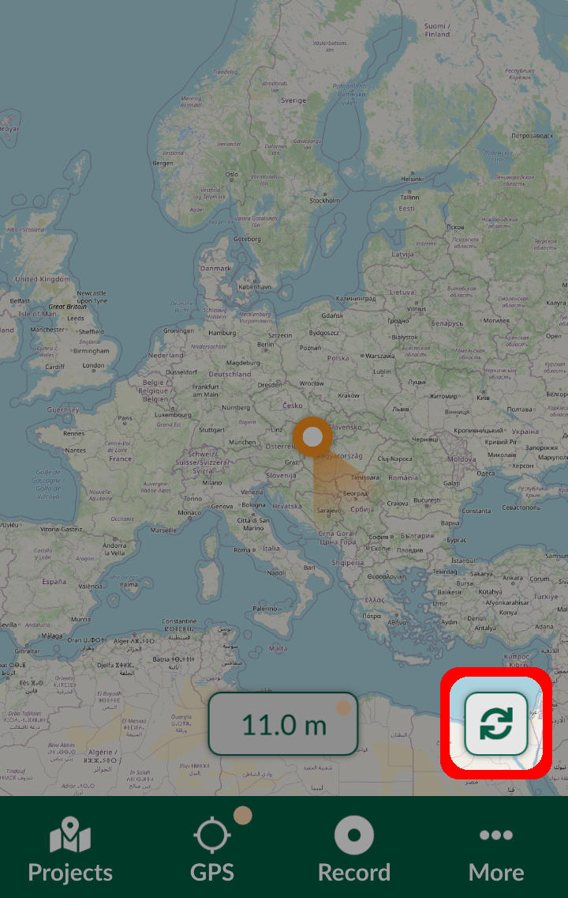

# Synchronisation in Mergin Maps Input
[[toc]]

Changes in your project can be synchronised during the survey manually by using the sync button or automatically by allowing the automatic synchronisation in <MobileAppName />. 

To be able to synchronise a project, you need to:
- be signed in to your <MainPlatformNameLink /> account
- be connected to the internet
- have write [permission](../../manage/permissions/) to the project

The sync button is displayed in the map window.

:::tip
Are you missing some data after synchronisation? [How to Recover Missing Data](../../manage/missing-data/) will show you how to deal with [conflict files](../../manage/missing-data/#there-are-conflict-files-in-the-folder) and how to [manually download](../../manage/missing-data/#there-are-no-conflict-files-in-the-folder) data from your mobile device.
:::

## Manual synchronisation
You can synchronise local changes by tapping the sync button in the map window. The sync button will stop rotating once the synchronisation process is finished and the **Successfully synchronised** message will appear at the top of the window.

Pressing and holding the sync button opens the Project status, where you can see changes yet to be synchronised.

Changes can be also synchronised from the **Projects' Home** tab by pressing the **sync** button.

## Automatic synchronisation
To allow automatic synchronisation in <MobileAppName />, navigate to **Settings** and toggle on **Automatically sync changes**. 

As changes will be done during the survey, such as adding new features or changing field values, the synchronisation will start automatically. The sync button will indicate that synchronisation is in progress and once it is done, the **Successfully synchronised** message will appear.

If changes can not be synchronised automatically, e.g. when internet connection is lost during the survey, the changes need to be synchronised manually after reconnecting to the internet. 

