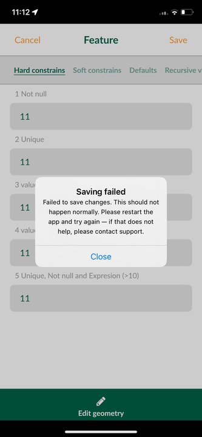
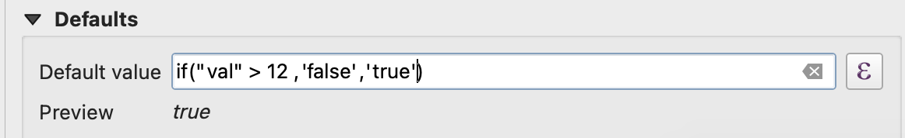
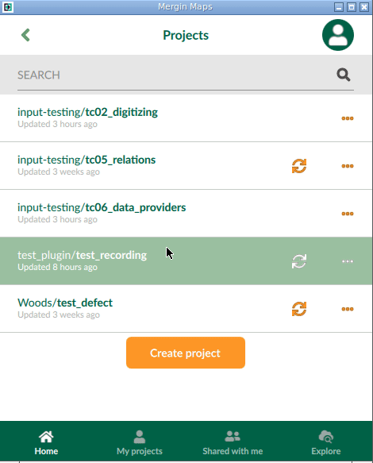
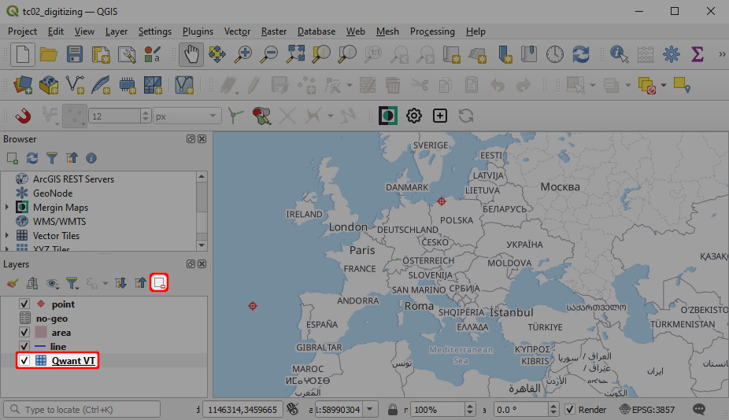
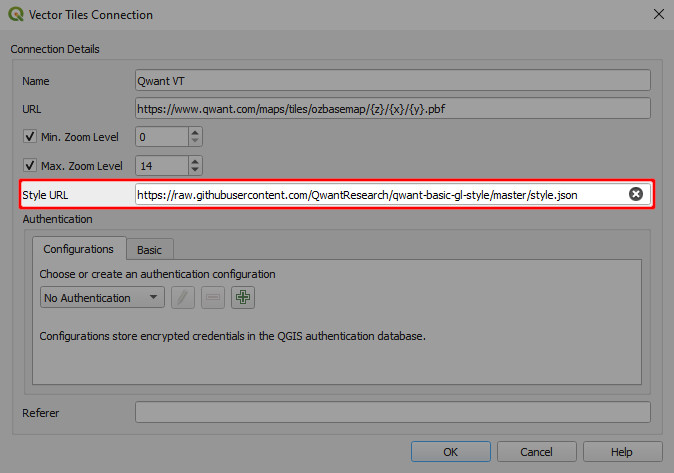
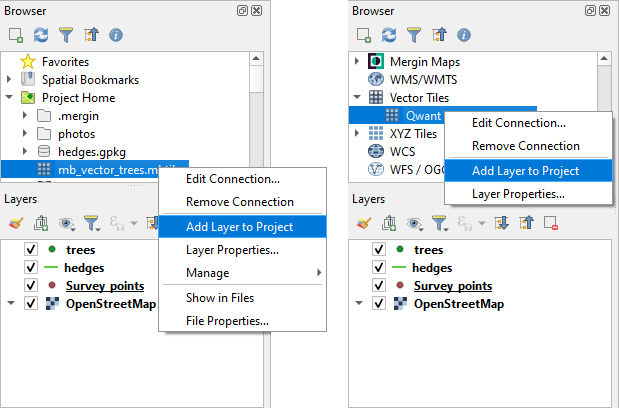

# How to Fix a Broken Project
[[toc]]

Do you get an error message when trying to open a project or a form in <MobileAppName />? There can be multiple reasons for what went wrong. Here we will try to guide you through some basic steps that can help you.

:::tip
Need more help with your issue? <CommunityJoin />
:::

## Saving of feature failed (vector layer)

<SinceBadge type="App" version="2.5.0" />

The error is caused by a change of behaviour in QGIS versions 3.34.0 and higher as well as <MobileAppName /> 2.5.0 and higher. 

:::details
You can see the detailed upstream issue report <GitHubRepo id="qgis/QGIS/issues/55517" desc="on this link" />. 
::: 

The error can be identified by notification *Failed to save changes* in the <MobileAppName /> when a feature is added or modified. 

connected with the diagnostics log error *Failed to commit changes ... wrong data type for attribute ...*, e.g.

```
2023-12-05 09:04:25.058221+0100 Input[2593:32260] "2023-12-05T08:04:25.058Z CommitChanges: Failed to commit changes:\nERROR: 1 feature(s) not added.\n\n  Provider errors:\n    wrong data type for attribute 12 of feature -2: 10\n"
```

**To fix the project**:
1. Open your <MainPlatformName /> project in QGIS.
2. Open problematic vector layer's properties in the project. 
3. Find boolean fields that use Default values `'false'` or `'true'`.

4. Replace string representation `'false'` or `'true'` by literal `false` or `true` (remove single quotation marks).
5. Save and sync the project.


## Failed to read project issue (vector tiles)



The error is caused by a bug, which should be fixed in QGIS versions 3.20, 3.18.3 and 3.16.7 and higher, so only projects created in older versions of QGIS are affected. Unfortunately, saving the project in a newer QGIS version is not enough to fix it.

:::details
From a technical point of view, the issue is caused by a bug in parsing <NoSpellcheck id="Mapbox GL" /> style for vector tile layers that caused issues when loading <NoSpellcheck id="Qt5-based" /> QGIS projects from older QGIS versions in <NoSpellcheck id="Qt6-based" /> QGIS. This bug was fixed and should not appear in QGIS versions 3.20, 3.18.3 and 3.16.7 and higher. 

Qt6 has been used in <MobileAppName /> since version 2.0.0. Thus, if you use a QGIS project that was created in older QGIS versions, you may encounter this error.

When trying to identify what to fix in your project, look for these:
- a [vector tile](../../gis/settingup_background_map/#vector-tiles) layer with JSON style
- when a rule has `text-size` with "stops"
- data-defined text size gets badly stored expression (as 0x01 character instead of the proper expression)

There is a high chance that these settings are the culprit behind the error!
:::

**To fix the project**:
1. Open your <MainPlatformName /> project in QGIS.
2. Remove problematic vector tile layers from the project. 
   
   
3. If you use online vector tiles, navigate to **Vector Tiles** in the **Browser** panel and create a new [vector tiles connection](../../gis/settingup_background_map/#vector-tiles) to the data source. 
   
   :::details
   You may also inspect the **Style URL** in the **Vector Tiles Connection**.
       
   For instance, if the **Style URL** looks like this (Qwant Maps settings used here):
   `styleUrl=https://raw.githubusercontent.com/QwantResearch/qwant-basic-gl-style/master/style.json&type=xyz&url=https://www.qwant.com/maps/tiles/ozbasemap/%7Bz%7D/%7Bx%7D/%7By%7D.pbf&zmax=14&zmin=0`
   try removing the part of the link after `style.json` to get:
   `styleUrl=https://raw.githubusercontent.com/QwantResearch/qwant-basic-gl-style/master/style.json`
   :::
   
4. Add the layers back to the project.
   Offline vector tiles should be located in the project folder on your computer. Online vector tiles connections can be managed in **Vector Tiles** in the **Browser**.
   
   
5. Save and sync the project.

:::danger WARNING
Copying styles from problematic layers and pasting them to other layers can cause the error to occur again. Unless you know what exactly causes the issues and are able to fix that, you might need to recreate the styles.
:::

