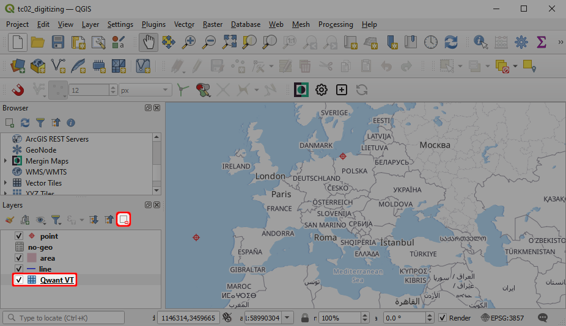

# How to Fix a Broken Project
<Badge text="since Input 2.0.0" type="tip"/>
[[toc]]

Do you get an error message when trying to open a project in <MobileAppName />? There can be multiple reasons for what went wrong. Here we will try to guide you through some basic steps that can help you.

Since <MobileAppName /> version 2.0.0, you may encounter an error when working with QGIS projects that were created in older versions in QGIS. It is caused by a bug that should be fixed in QGIS versions 3.20, 3.18.3 and 3.16.7 and higher.

To fix the project:
1. Open your <MainPlatformName /> project in QGIS.
2. Remove problematic vector layers from the project. 
   
3. Add layers back to the project.
4. Save and sync the project.

:::details
From a technical point of view, the issue is caused by a bug that was present in older versions of QGIS. There was a bug in parsing <NoSpellcheck id="Mapbox GL" /> style for vector tile layers that caused issues when loading <NoSpellcheck id="Qt5-based" /> QGIS projects from older QGIS versions in Qt6<NoSpellcheck id="Qt6-based" /> QGIS. This bug was fixed and should not appear in QGIS versions 3.20, 3.18.3 and 3.16.7 and higher. 

Qt6 has been used in <MobileAppName /> since version 2.0.0. Thus, if you use a QGIS project that was created in older QGIS versions, you can encounter this error.
:::

::: tip
If you were not able to solve your problem, you can contact the [support](../../misc//troubleshoot/#support) or get [diagnostic logs](../../misc/troubleshoot/#diagnostic-logs) to inspect the issues thoroughly.
:::
