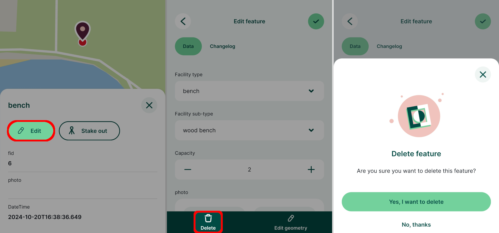
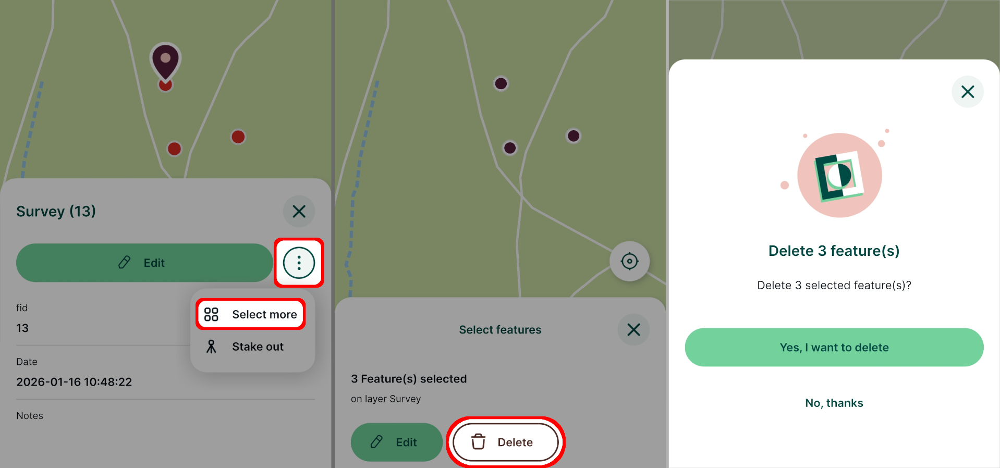

# Deleting Features

[[toc]]

## Deleting features

1. Tap on a feature on the map or find it through [**Layers**](../../field/layers/)
2. Use the **Edit** button to open the attributes form
3. Tap the **Delete** button and confirm the deletion

After confirming that you want to delete the feature, it will be removed from the layer.

## Multi-features deleting
Multiple features can be deleted at once:

1. Select one of the features you want to delete and use the **Select more** button.

   Depending on your mobile device, you may need to use a button next to **Edit** to display this option.

2. Select all features that should be deleted on the map

3. Use the **Delete** button to delete all selected features at once

