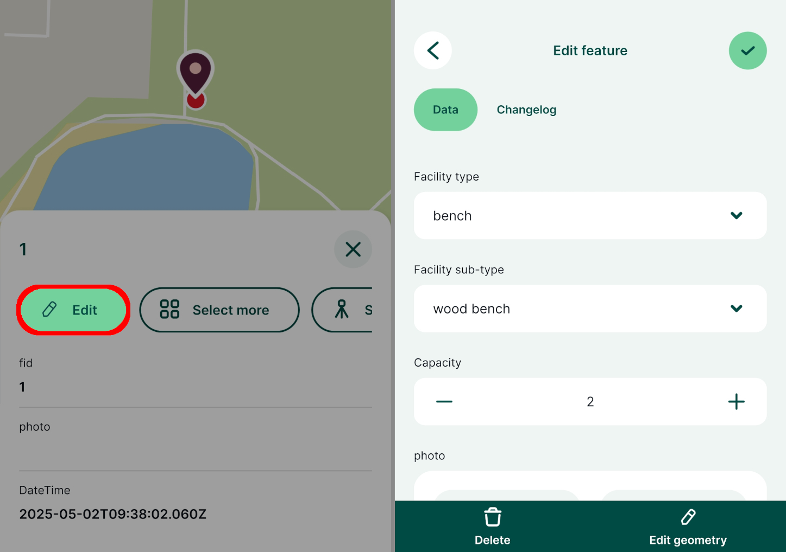
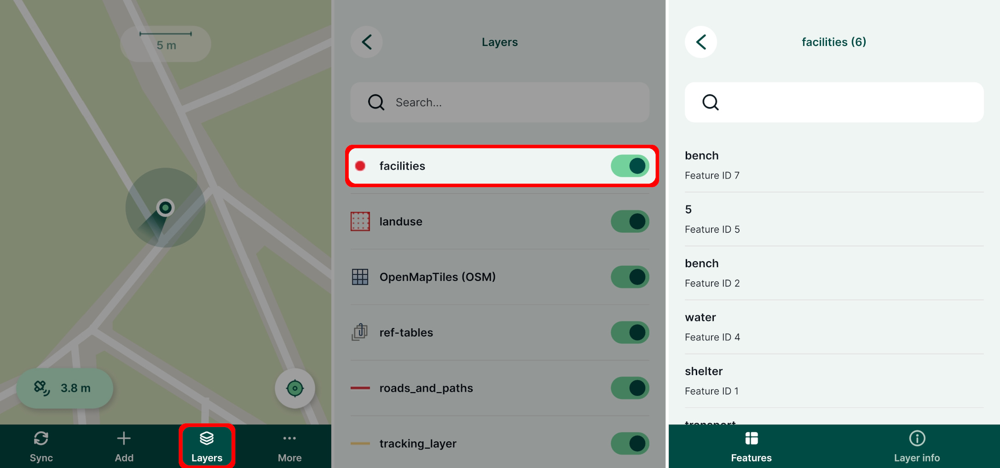
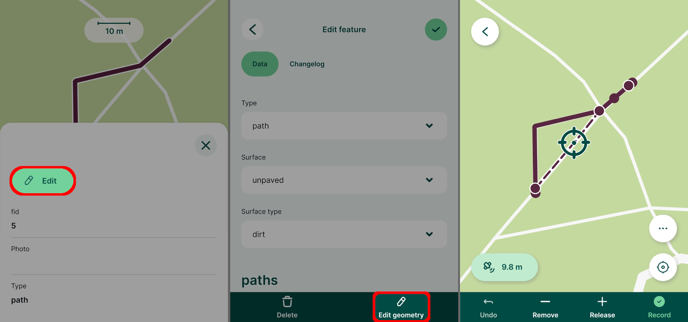
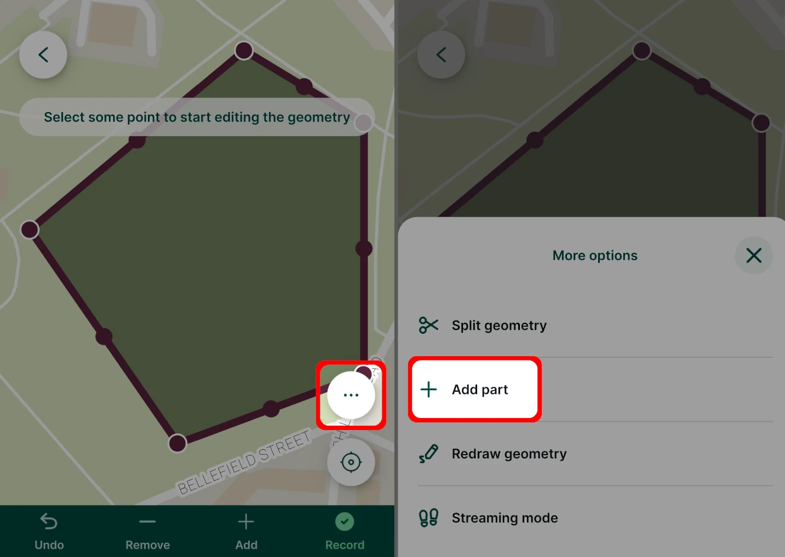
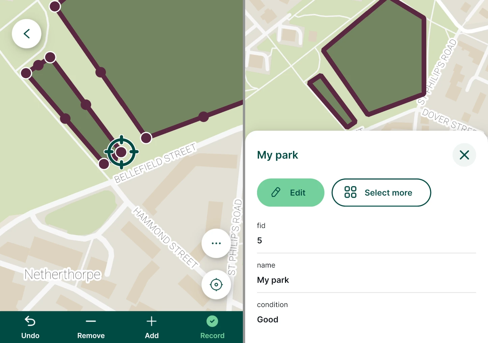
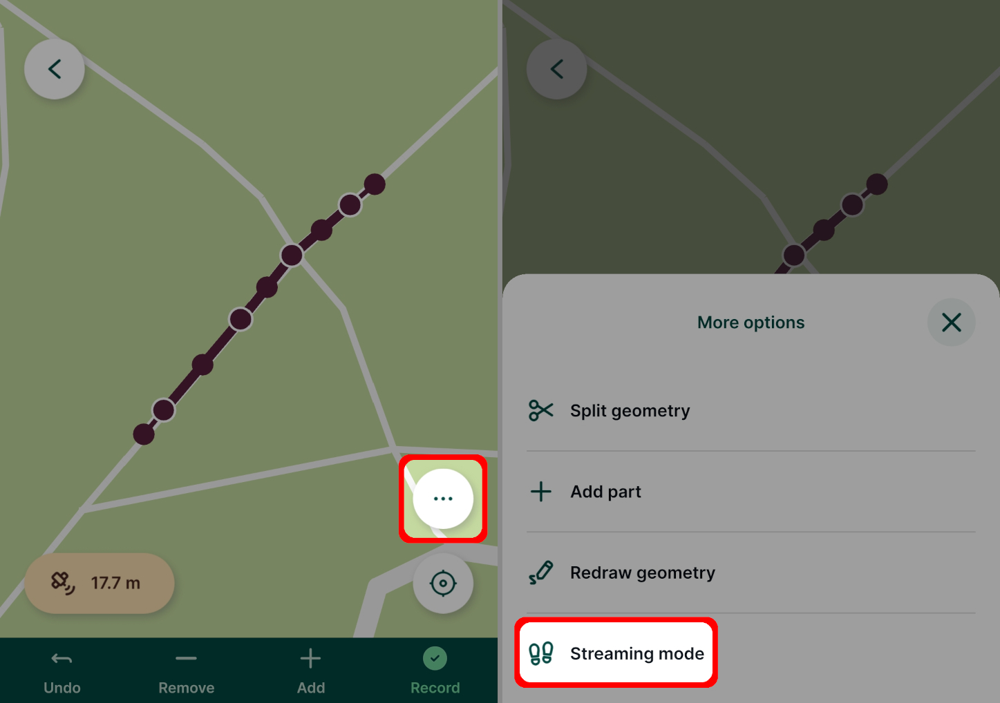
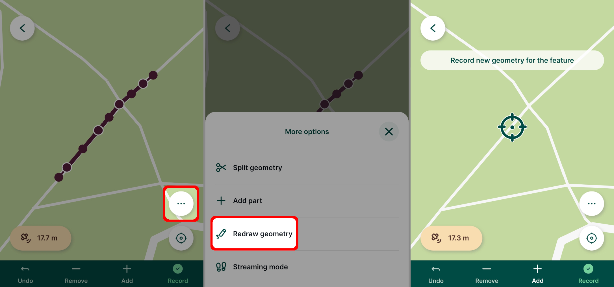
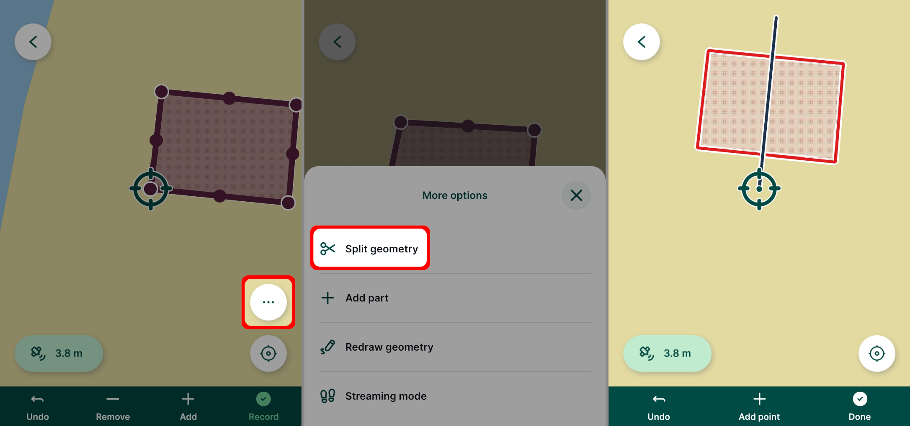
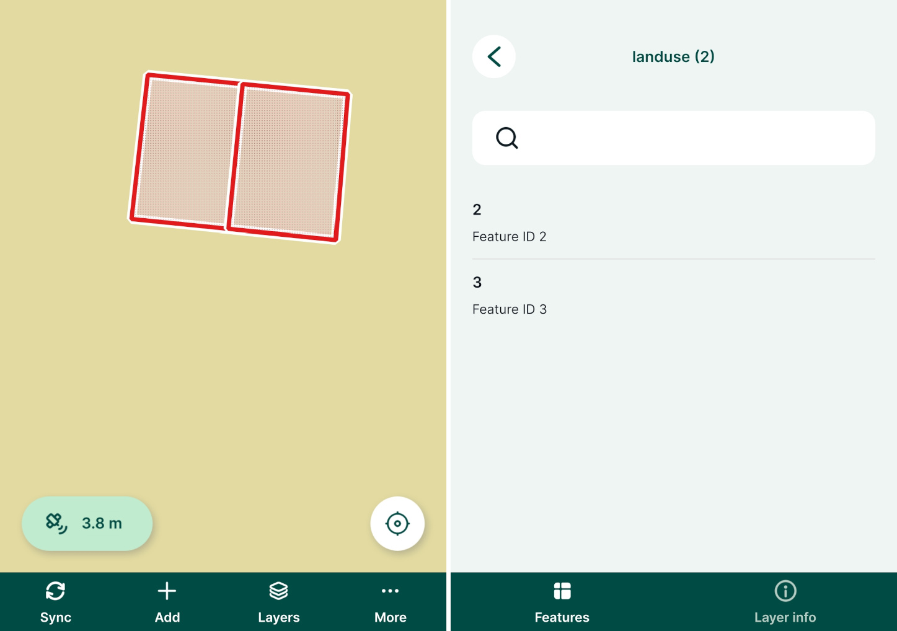
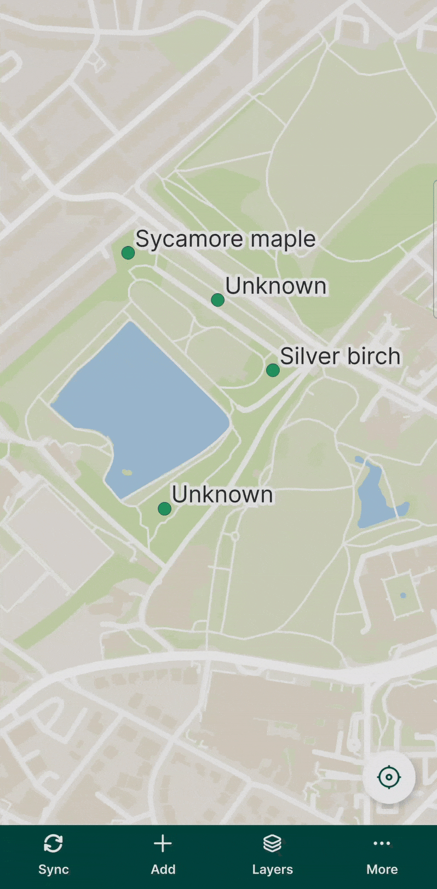

# Editing Features

[[toc]]

The <MobileAppNameShort />  can be used to add, edit and delete features in the field by users with [writer or editor permission](../../manage/permissions/) to the <MainPlatformName /> project. 

Until the project is synchronised to <MainPlatformNameLink />, all changes are local (stored only on your mobile device). Changes can be [synchronised](../autosync/) manually or automatically.

## Editing features
Tap a feature on the map or *tap and hold* to select one from multiple overlaying features to display the form.

Use the **Edit** button to open the attributes form for editing. To edit the geometry of a feature, tap the **Edit geometry** button.

Once you are finished with your changes, use the **Save** :heavy_check_mark: button.

Features can also be browsed, edited and deleted through the [Layers](../layers/) panel. Layers that are set as [read-only](../../gis/enable_digitising/) in the project properties cannot be edited.
- Tap the **Layers** button in the bottom navigation panel and select a layer to see the list of features it contains. 
- Select a feature from the list in the **Layers** panel to display its form and edit the values or geometry. 

### Editing geometry
There are multiple options of editing the geometry of features depending on the geometry type of the survey layer: editing the vertices, [redrawing](#redraw-geometry) or [splitting](#split-geometry-of-lines-or-areas) features.

To edit geometry of a point feature simply adjust the location in the same manner as when [adding new features](#capture-points).

Layers with MultiPoint, Line, MultiLine, Polygon and MultiPolygon geometries offer more options. Tap a feature, press the **Edit** button and then use **Edit geometry**. The vertices of the feature will be highlighted. You can move, **Release** or **Remove** them as needed. Tap the **Record** button to save the modified geometry.

### Adding part of multipart geometry
Parts can be added to features from survey layers with multipart geometry type (MultiPoint, MultiLine, MultiPolygon) while editing geometry.

Tap the **More option** button while editing geometry and use the **Add part** option.

Capture the part by using the editing tools and **Record** your changes. The part is added to the geometry of the feature.

### Using streaming mode to edit geometry
The [streaming mode](#streaming-mode) can be also used while editing features with compatible geometry type. Tap the **More option** button and use the **Streaming mode**. 

### Redraw geometry
The existing geometry of MultiPoint, Line, MultiLine, Polygon and MultiPolygon geometry can also be redrawn.

Tap the **More option** button and select the **Redraw geometry** option. 

Capture the new geometry of the feature using the editing tools or streaming and use the **Record** button to save your changes.

### Split geometry of lines or areas
Lines and areas can be split into two or more new features that will keep the same attributes as the original feature.

Tap the **More option** button and select the **Split geometry** option. Create the splitting line by using the **Add point** button. 

When finished, tap **Done**.

In this case, two individual features are created. Both have the same attributes, except for `Feature ID` (one feature keeps the original id, the other gets a new one).

## Multi-features editing

Attributes of multiple features from the same layer can be edited at once.

1. Tap on a feature on the map and select the **Select more** option.

   Depending on your mobile device, you may need to use a button next to **Edit** to display this option.
   

2. Select all features that should be edited. 

3. In the attributes form, enter the new values of attributes and **Save**.

   All selected features have been modified at once.

## Edit non-spatial features
Non-spatial features, such as tables for [value relations](../../layer/value-select/#value-relation), can also be added or edited in the <MobileAppNameShort />.

1. Tap the **Layers** button and select the layer you want to edit
   

2. Tap an existing feature to change it or tap the **Add feature** button to create a new feature
   
   
3. Fill in the attributes and **Save** :heavy_check_mark: the changes

