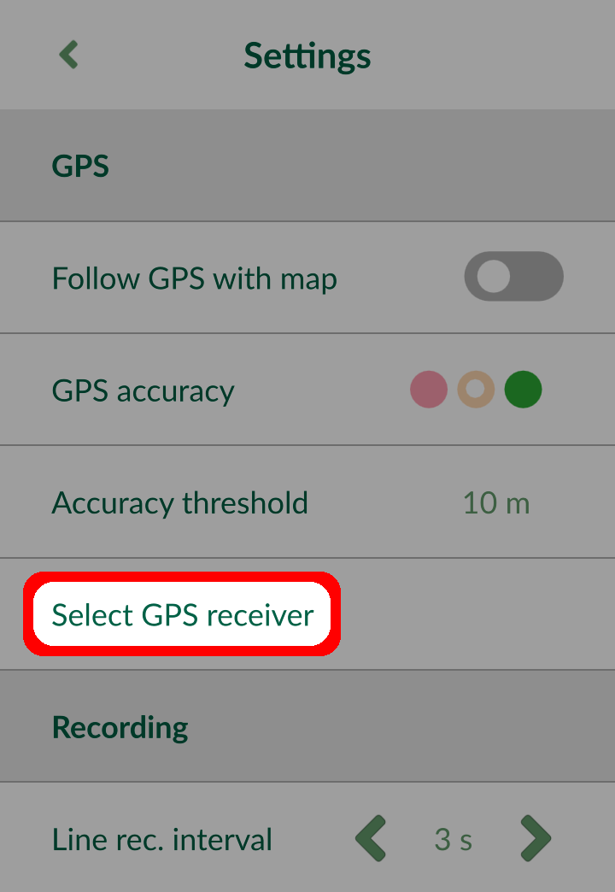
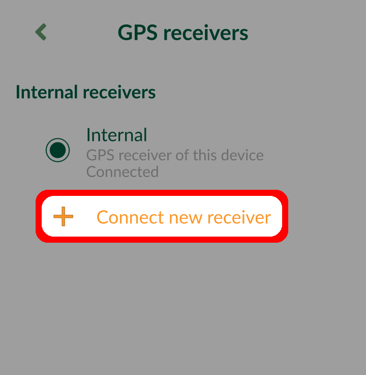
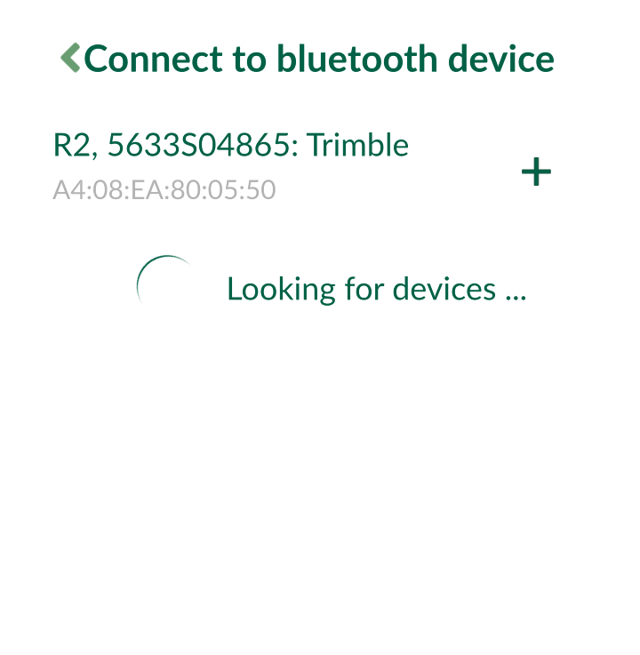
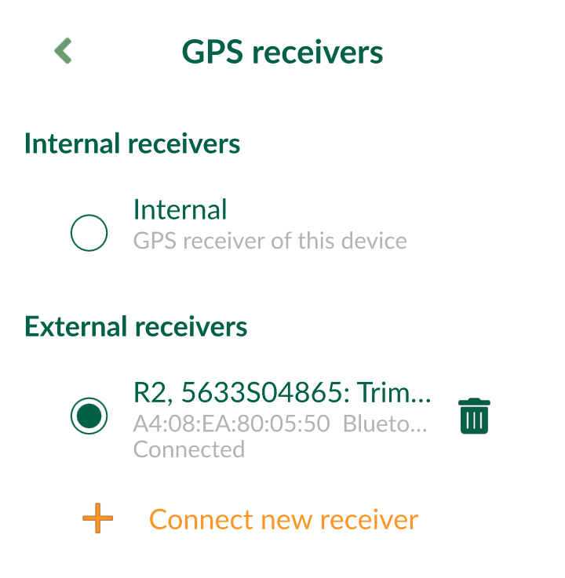
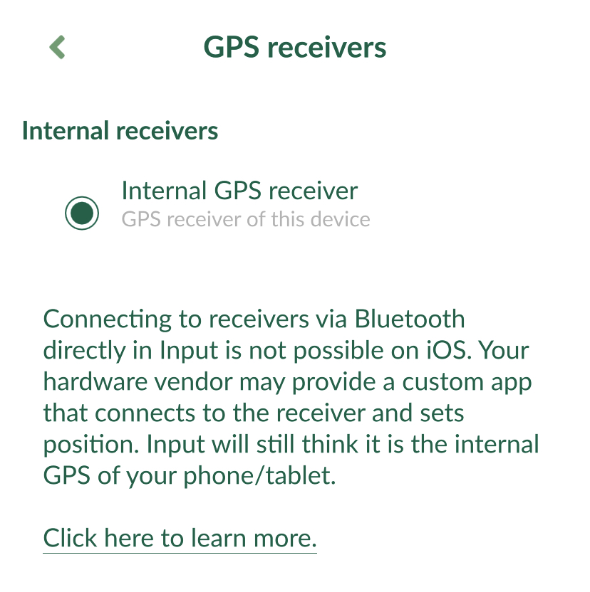

# External GPS

<!--- IMPORTANT: This permalink is referenced from Input App -->

[[toc]]

External GPS receivers can be connected to your mobile device via Bluetooth and used in Input to achieve higher GPS accuracy.

Before you start:
- Set up your device according to the instructions of its manufacturer. You should continue only when you are sure that the device is working and sending data.
- Make sure that your mobile device offers the functionality to pair with an external GPS device and that it communicates through a standard interface.

## External GPS in Android
In Android, there are two ways how to use an external GPS device in Input:
- directly through Input as an external receiver
- connecting GPS receiver to your mobile device using an app that will provide mock location to Input

### How to connect external GPS receiver in Input app
1. Connect the GPS receiver to your mobile device via Bluetooth.
2. Open Input and navigate **Select GPS receiver** in Settings:

3. Tap on **Connect new receiver** in GPS receivers panel:

4. Choose your GPS receiver from the list of Bluetooth devices. You might be asked to pair your device during this process.

5. You can now switch between internal and external receivers:

### How to connect external GPS receiver in Android
External GPS can be connected and configured in Android to provide mock location to your Android device. Input and other apps in your device will get the GPS position from the external GPS.

Android offers **Allow mock locations**, where you can use GPS apps (e.g. [Bluetooth GPS](https://play.google.com/store/apps/details?id=de.pilablu.gpsconnector) or apps from specific GPS manufacturers) as your source of GPS signal.

:::tip
GPS manufacturer's apps often provide a setup for a NTRIP client, through which you are able to receive GPS corrections and achieve centimetre level accuracy.
:::

To enable **Allow mock locations**:
- In Android device, enable **Developer options**, which are hidden by default:
  - On newer Android versions, go to **Android Settings** > **About phone** and scroll down to find the **Build number**. Tap the build number 7 times. A message appears with a count-down until you **become a developer**.
  - On older Android versions, the developer settings can be made visible under the **Android Settings** > **Applications** > **Development**.
- Once you have the developers option enabled, go to **System** > **Advanced** > **Developer options** > **Select mock location app** and select your GPS app.

The mock location will be used by Input automatically as if received from the internal receiver.

## External GPS in iOS

External GPS can be connected to your iOS device via Bluetooth. Depending on the GPS manufacturer, there may be a custom app, which then provides position to your iOS device. Input sees this as an internal GPS receiver automatically, without additional configuration.

## External GPS troubleshooting
If you encounter issues with external GPS in Input, make sure that:
- your Bluetooth is turned on
- GPS is paired with your mobile device
- your GPS receiver is turned on, has battery and is sending data
- remove the device in Input, and add it again from Input

## List of known supported GPS devices
External GPS functionality depends on the manufacturer and on the specific model of your GPS device. These devices are currently known to work well:

- **Emlid Reach RS+** - directly via Bluetooth connection, has an internal NTRIP client to receive corrections. Android only.
- **Leica FLX100** - through [Leica Zeno Connect app](https://play.google.com/store/apps/details?id=com.leica.zenoconnect&hl=en&gl=US) which also acts as a NTRIP client and sends the corrections to the device. The app will set mock location in Android. It is also possible to connect directly via Bluetooth (even multiple phones can be connected at once), but if no phone has Zeno app running, there will be no corrections available. Android only (even though Zeno app is on iOS too, it's not supported, at least this device).
- **Trimble R2** - through [Trimble Mobile Manager app](https://play.google.com/store/apps/details?id=com.trimble.trimblemobilemanager) which also acts as a NTRIP client and sends the corrections to the device. The app will set mock location in Android.

Did you use a GPS that is not in this list? Share your experiences with us!
