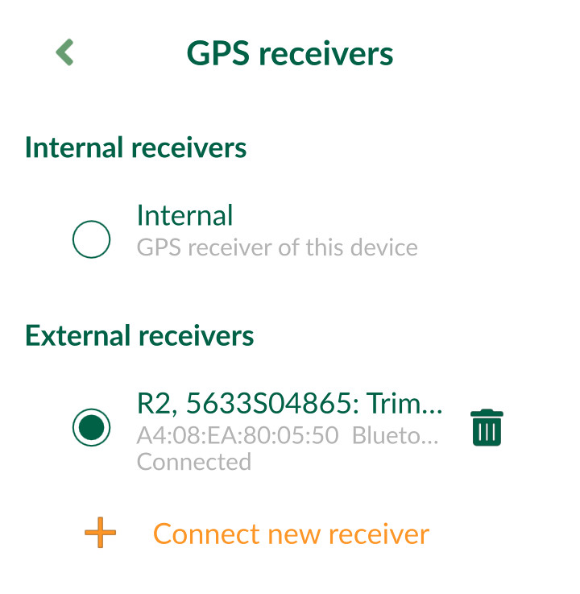

# External GPS

<!--- IMPORTANT: This permalink is referenced from Mergin Maps Input -->

[[toc]]

External GPS receivers can be connected to your mobile device via Bluetooth and used in <MobileAppName /> to achieve higher [GPS accuracy](./gps_accuracy/). 

There are several [extra position variables](../layer/position_variables/) that can be useful to record when doing the survey with external GPS, such as the GPS antenna height, GPS device name as well as metrics like horizontal, vertical or position dilution of precision (HDOP, VDOP, PDOP).

**Before you start**:
- Set up your device according to the instructions of its manufacturer. You should continue only when you are sure that the device is working and sending data.
- Make sure that your mobile device offers the functionality to pair with an external GPS device and that it communicates through a standard interface.

:::tip GPS and GNSS terminology
The term GPS, which stands for the Global Positioning System, is used in <MobileAppName /> and in this documentation in a broad sense as a synonym of the global navigation satellite systems (GNSS). We are aware that it is not exactly correct, but GPS is commonly used and understood in this context. 
If you have a device that can receive signals from other GNSS (such as BeiDou, Galileo, GLONASS), <MobileAppName /> can use them as well.
:::

## GPS antenna height
External GPS antenna is often used on a surveying pole. To obtain the correct ground elevation, it is necessary to subtract the height of GPS sensor above the ground from the measured elevation.

The height of the GPS antenna can be set in [<MobileAppName /> Settings](./input_ui/#gps-settings). If GPS antenna height is set to a non-zero value, it is also displayed next to the GPS accuracy.

:::tip
GPS antenna height can be recorded during the survey by using the [extra position variable](../layer/position_variables/) `@position_gps_antenna_height` as a [default value](../layer/settingup_forms_settings/#default-values).
:::

## External GPS on Android
In Android, there are two ways how to use an external GPS device in <MobileAppName />:
- directly through the app as an external receiver
- connecting GPS receiver to your mobile device using an app that will provide mock location

It is strongly recommended to use the direct connection in <MobileAppName />. It is easier, quicker, provides more data, such as HDOP and fix quality. The app will report which device is used and take care of reconnecting in case of lost connection. Using mock location should be used only when it is not possible to connect the GPS receiver directly via <MobileAppName />.

### How to connect external GPS receiver in Android via Mergin Maps Input (recommended)
1. Connect the GPS receiver to your mobile device via Bluetooth.
2. Open <MobileAppName /> and navigate **Select GPS receiver** in Settings:

3. Tap on **Connect new receiver** in GPS receivers panel:

4. Choose your GPS receiver from the list of Bluetooth devices. You might be asked to pair your device during this process.

5. You can now switch between internal and external receivers:

### How to connect external GPS receiver in Android via mock location
:::warning
Mock location should be only used if you are unable to connect the external GPS directly in <MobileAppName />.
:::

External GPS can be connected and configured in Android to provide mock location using GPS apps (e.g. [Bluetooth GPS](https://play.google.com/store/apps/details?id=de.pilablu.gpsconnector) or apps from specific GPS manufacturers) as a source of GPS signal. <MobileAppName /> and other apps in your device will get the GPS position from the external GPS. 

:::tip
GPS manufacturer's apps often provide a setup for a NTRIP client, through which you are able to receive GPS corrections and achieve centimetre level accuracy.
:::

To enable **Allow mock locations** in Android:
- enable **Developer options**, which are hidden by default:
  - On newer Android versions, go to **Android Settings** > **About phone** and scroll down to find the **Build number**. Tap the build number 7 times. A message appears with a count-down until you **become a developer**.
  - On older Android versions, the developer settings can be made visible under the **Android Settings** > **Applications** > **Development**.
- Once you have the developers option enabled, go to **System** > **Advanced** > **Developer options** > **Select mock location app** and select your GPS app.

The mock location will be used by <MobileAppName /> automatically as if received from the internal receiver.

## External GPS on iOS

Direct connection via <MobileAppName /> is not possible on iOS devices. External GPS can be connected to your iOS device via Bluetooth. Depending on the GPS manufacturer, there may be a custom app, which then provides position to your iOS device. <MobileAppName /> sees this as an internal GPS receiver automatically, without additional configuration.

## External GPS troubleshooting
If you encounter issues with external GPS in <MobileAppName />, make sure that:
- your Bluetooth is turned on
- GPS is paired with your mobile device
- your GPS receiver is turned on, has battery and is sending data in NMEA format, which is readable by <MobileAppName />
- remove the device in <MobileAppName />, and add it again from <MobileAppName />

## List of known supported GPS devices
External GPS functionality depends on the manufacturer and on the specific model of your GPS device. These devices are currently known to work well:

| Manufacturer | Model | Android | iOS |
|---|---|---|---|
| Carlson | Carlson Brx7 | yes (mock location) | unknown |
| Carlson | Carlson xML2 | yes (mock location) | unknown |
| Emlid | Emlid Reach RX | yes | no |
| Emlid | Emlid Reach RS+ | yes | no |
| Emlid | Emlid Reach M+ | yes | no |
| Garmin | GLO 2 | yes | yes |
| Juniper Systems | Geode GNS3 | yes | yes |
| Leica | Leica FLX100| yes (mock location) | no |
| Leica | Leica FLX100 plus| yes (mock location) | yes*|
| Leica | Leica Zeno GG04plus| yes (mock location) | yes* |
| <NoSpellcheck id="marXact" /> | UNI-GR1| yes | no |
| Trimble | Trimble Catalyst | yes (mock location) | unknown |
| Trimble | Trimble R1 | yes (mock location) | unknown |
| Trimble | Trimble R2 | yes (mock location) | unknown |

- **Carlson Brx7**,  **Carlson xML2** - through [Carlson Layout](https://www.carlsonsw.com/product/carlson-layout) which will set a mock location in Android.
- **Emlid Reach RX**, **Emlid Reach RS+**, **Emlid Reach M+** - directly via Bluetooth connection, has an internal NTRIP client to receive corrections. Possible to set a mock location and connect the receiver via Bluetooth using [GPS Connector](https://play.google.com/store/apps/details?id=de.pilablu.gpsconnector) or WiFi using [Lebefure NTRIP Client](https://play.google.com/store/apps/details?id=com.lefebure.ntripclient). Android only.
- **Geode GNS3** - through *Geode Connect* app on [Android](https://play.google.com/store/apps/details?id=com.juniper.geode2a&hl=en_NZ&gl=US) or [iOS](https://apps.apple.com/us/app/geode-connect/id1446098695), which also acts as an NTRIP client and sends corrections to the device.
- **Leica FLX100**, **Leica FLX100 plus**, **Leica Zeno GG04plus** - through *Leica Zeno Connect* app on [Android](https://play.google.com/store/apps/details?id=com.leica.zenoconnect&hl=en&gl=US) which also acts as a NTRIP client and sends the corrections to the device. The app will set a mock location in Android. It is also possible to connect directly via Bluetooth (even multiple phones can be connected at once), but if no phone has Zeno app running, there will be no corrections available. 
   \* *Leica Zeno Connect* is also available on [iOS](https://apps.apple.com/us/app/zeno-connect/id1310344749). It is known to support **Leica FLX100 plus** and **Leica Zeno GG04plus**.  However, on iOS, the vertical accuracy information is not transferred to <MobileAppName /> through *Leica Zeno Connect*. <MobileAppName /> will not display the correct value of the vertical accuracy.
- **Trimble R1**, **Trimble R2**, **Trimble Catalyst** - through [*Trimble Mobile Manager* app](https://play.google.com/store/apps/details?id=com.trimble.trimblemobilemanager) which also acts as a NTRIP client and sends the corrections to the device. The app will set a mock location in Android.

**Did you use a GPS that is not in this list?** <GitHubRepo id="MerginMaps/docs/issues/124" desc="Share your experiences with us!" />
