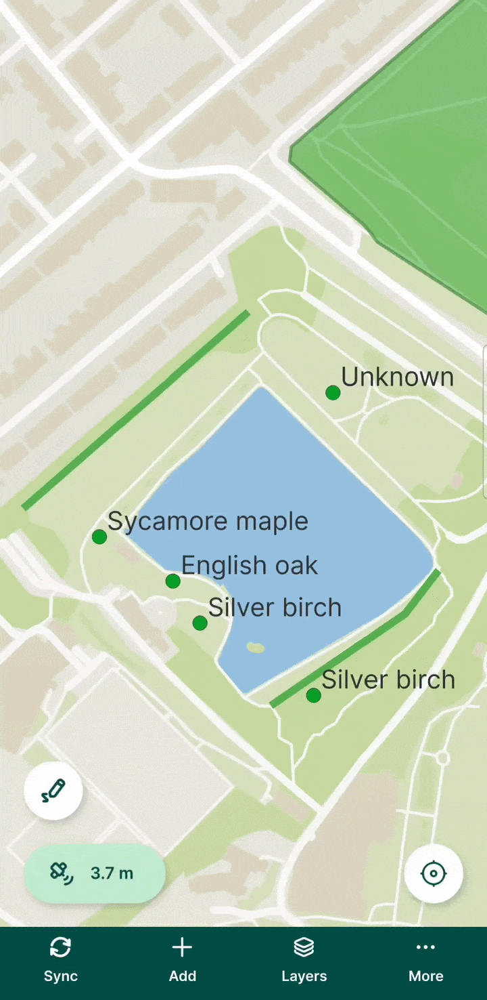
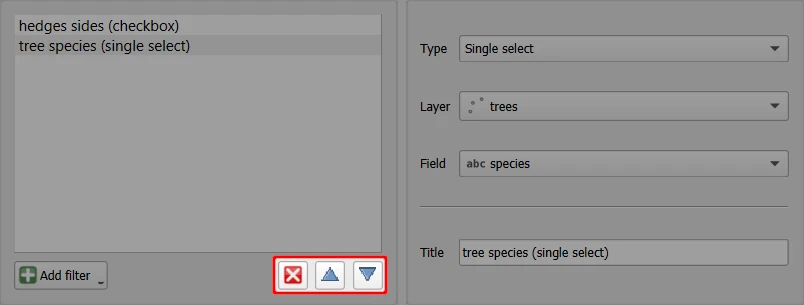
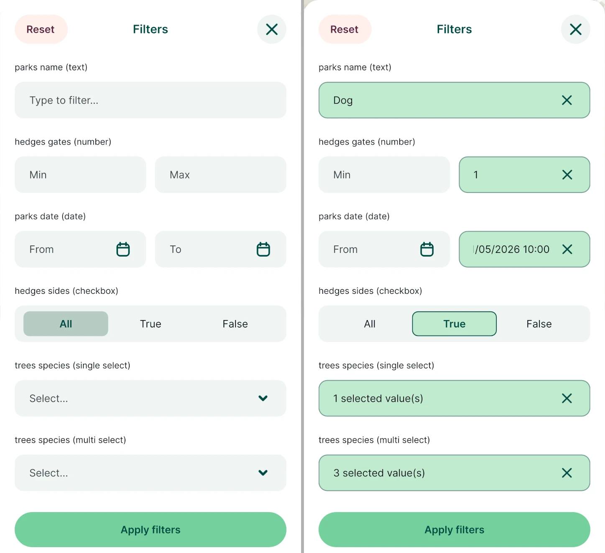
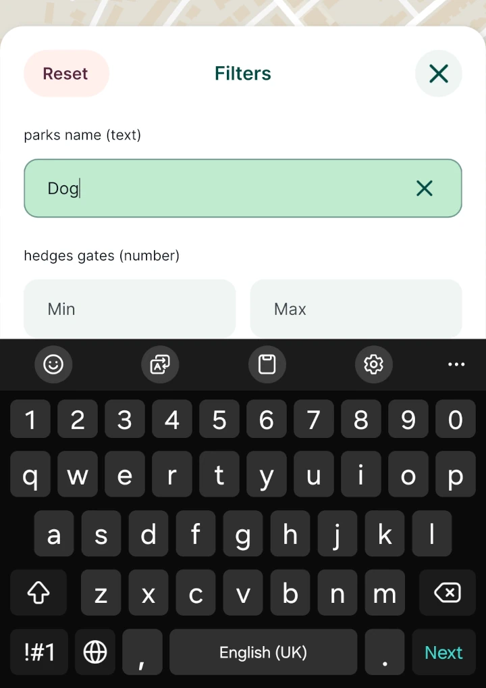
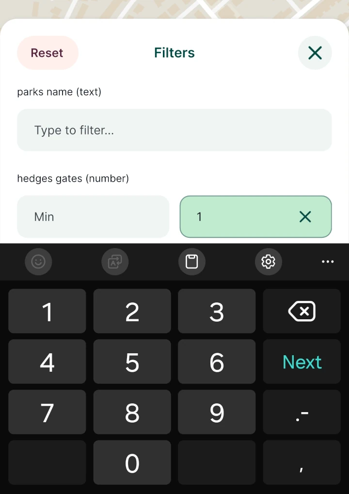
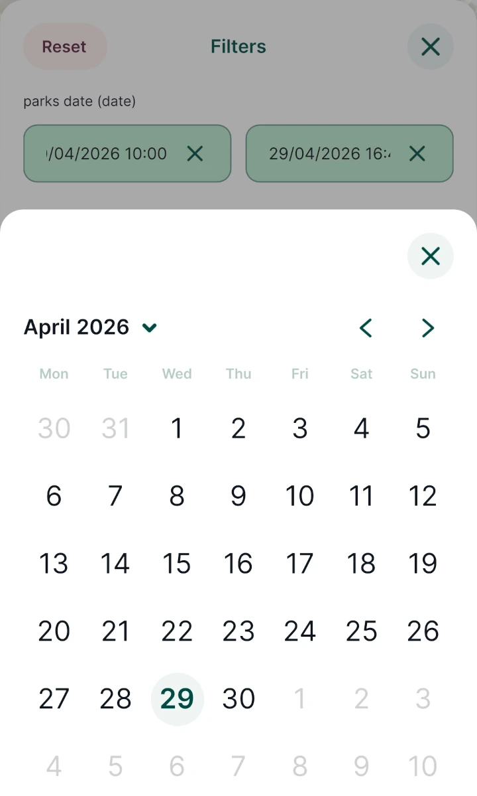
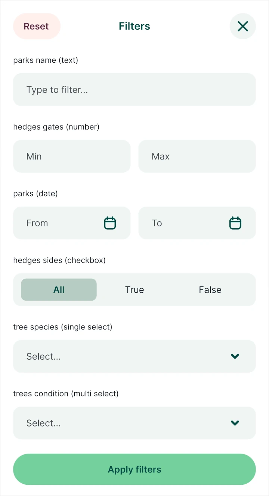
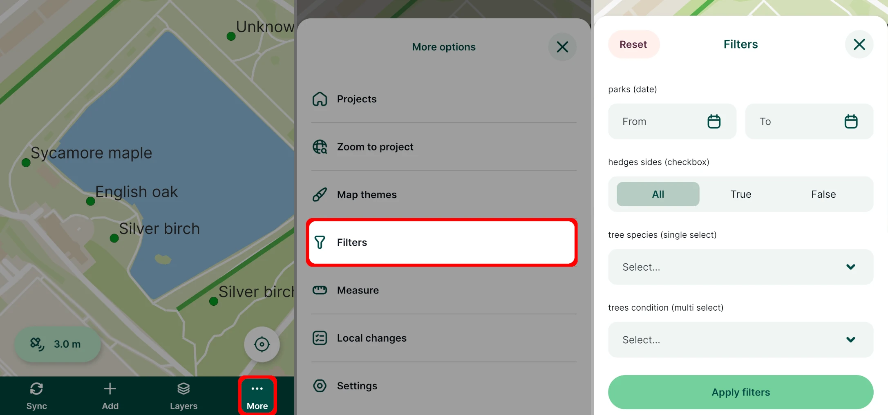
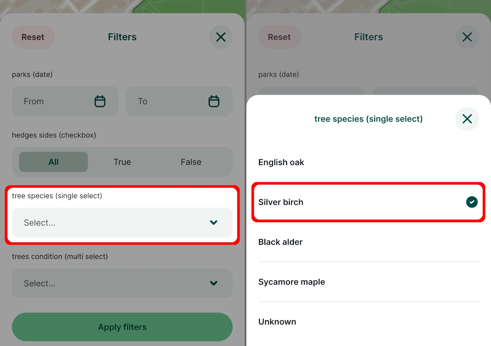
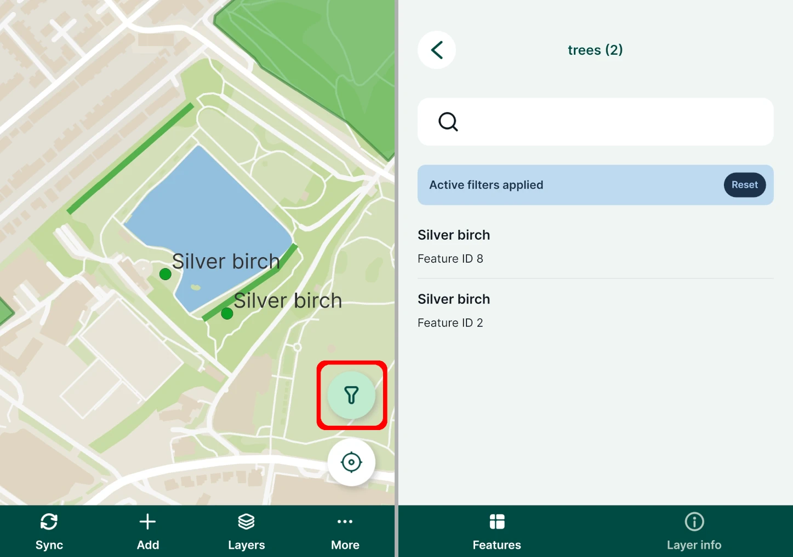

# Filtering Features in Mergin Maps Mobile App
[[toc]]

Custom filters can be added to the <MobileAppNameShort /> to easily filter features displayed on the map as well as in the [survey layers](../layers/#browsing-features).

::: tip Example project available
You can explore filtering by cloning our public project <MerginMapsProject id="documentation/filtering" />
:::

::: warning Feature filtering blog
You can read about this feature also on our blog <MainDomainNameLink id="blog/from-wishlist-to-app-feature-filtering-is-live" desc="From wishlist to app: Feature filtering is live"/>.
:::

## Enable and define filtering in QGIS
Filters can be enabled and defined in QGIS in **Project Properties** for GeoPackage layers.

::: tip Plugin upgrade
If you do not see the **Filtering** option in the **Project properties**, check for [plugin upgrades](../../setup/install-mergin-maps-plugin-for-qgis/#plugin-upgrade).
:::

Check the :heavy_check_mark: **Enable filtering** option in the <MainPlatformName /> tab, click on the **Add filter** button and select a filter type from the list. The list of available [filter types](#filter-types) and their properties can be found below.

Then, define the filter:
   - **Type** - the filter type
   - **Layer** - choose from the project's GeoPackage layers
   - **Field** - choose from the fields of the layer. Only fields with data types compatible with the selected filter type are offered.
   - **Title** - the name of the filter, which will be displayed in the <MobileAppNameShort />
   
   

You can add as many filters as you need by using the **Add filter** button.

The order of filters can be changed by selecting a filter and using the **Up** and **Down** buttons. To remove a filter, select it and click the **Remove** button.

Don't forget to save your project and synchronise changes so that you can use the filters in the <MobileAppNameShort />.

### Filter types
Here is an overview of available filter types.

#### Text

The text filter can be used to find all features where the selected field contains the entered text. 

Type in a word, a part of the word or a number into the filter and **Apply filters** to see the results.

Available for text and number field types.

This filter uses the same logic as the SQL expression `"field" ILIKE '%input%'`. 

#### Number
The number filter provides *from* and *to* number inputs. 

Enter a minimum, a maximum value (or both) to filter features based on the values of the selected field.

Available for text and number field types.

This filter uses the same logic as the SQL expression `"field" >= 'input_from' AND "field" <= 'input_to'`. 

#### Date
**Date** filter provides *from* and *to* date (calendar) inputs. 

Available for date field types configured with the [Date and time widget](../../layer/date-time/).

Results are filtered based on SQL expression `"field" >= 'input_from' AND "field" <= 'input_to'`. 

#### Boolean
**Boolean** filter provides a toggle between *all*, *true* and *false* values. Available for Boolean, text and integer field types configured with the [Checkbox widget](../../layer/checkbox/).

Results are filtered based on SQL expression `"field" == 'input'`. 

#### Single select
**Single select** filter provides a drop-down menu of field values. One value can be selected at once. The results are filtered based on SQL expression `"field" == 'input'`. Available for all field types. Note that Value relations with *multiple selections* are currently **not** supported.

#### Multi select
**Multi select** filter provides a drop-down menu of field values. Multiple values can be selected at once. The results are filtered based on SQL expression `"field" IN ('input')`. Available for all field types. Note that Value relations with *multiple selections* are currently **not** supported.

In the <MobileAppNameShort />, the filters look like this:

 

## Filtering features in the mobile app
Filters defined in [<MainPlatformName /> project in QGIS](#enable-and-define-filtering-in-qgis) can be used in the <MobileAppNameShort />. You can filter features across multiple layers by entering or selecting values in corresponding filters. The filtering affects both the map display and the feature browsing list. 

Filters do not stay saved when the app is restarted.

Here is an example of how filtering works:

1. Tap the **More** button to open **Filters** defined in the project

   Filtering has to be enabled in the [QGIS project](#enable-and-define-filtering-in-qgis), otherwise this option is not displayed.
   

2. Enter or select values in the filters. You can use more filters at once.

   Here, we will use a *Single select* filter on the *trees* layer and select a *tree species* value from the list.

   Tap on the **Apply filters** button to confirm the filtering.
  

3. With active filters, only features that match the criteria are displayed on the map as well as when [browsing features](../layers/#layers-legend-and-features).

   You can use the active **Filters** button to quickly access filters.
  
