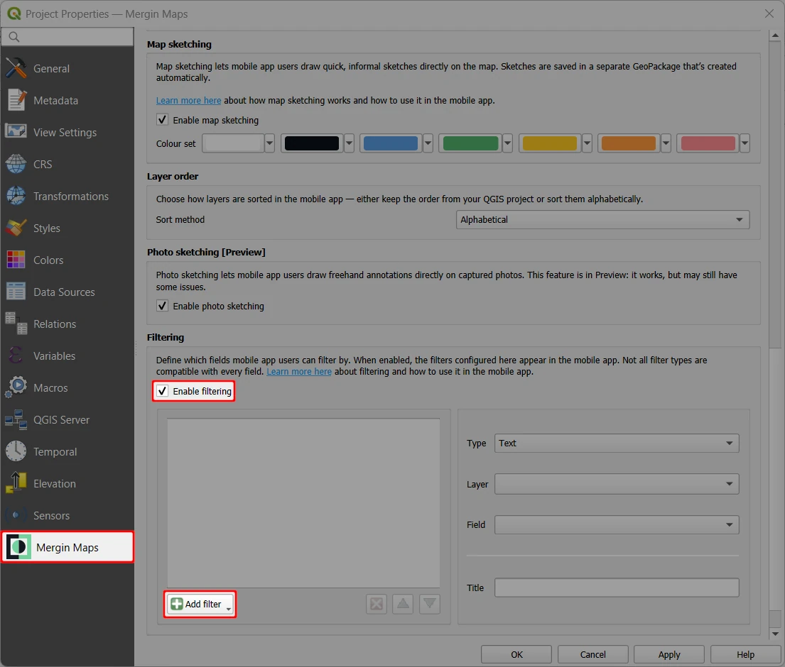

# Filtering Features in Mergin Maps mobile app
[[toc]]

Custom filters can be added to the <MobileAppNameShort /> to easily filter features displayed on the map as well as in the [survey layers](../layers/#browsing-features).

## Enable features filtering
Features filtering needs to be enabled in QGIS

1. Open your <MainPlatformName /> project in QGIS and navigate to **Project** > **Properties** 

2. In the <MainPlatformName /> tab, check the **Enable map sketching** option.

   ::: tip Plugin upgrade
   If you do not see this option in the **Project properties**, check for [plugin upgrades](../../setup/install-mergin-maps-plugin-for-qgis/#plugin-upgrade).
   :::

3. Click on the **Add filter** button and select a filter type from the list.
   
   
4. Define the filter:
   - **Type** 
   
5. Save the changes and synchronise your project

## Filtering features in the mobile app
