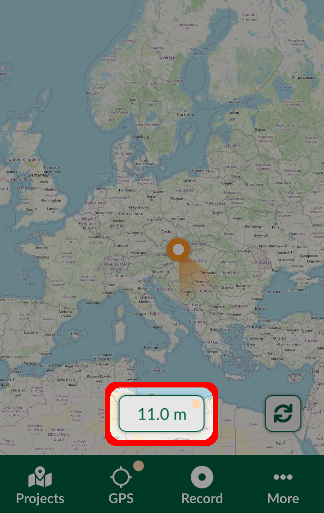

# GPS Accuracy

Your GPS accuracy depends on several parameters, such as:
- Your device
- View of the clear sky

When recording a point, it is essential to be aware of the limitations of your GPS accuracy at the time of recording. A warning will appear, if your accuracy is outside the GPS accuracy threshold. The warning also displays the accuracy radius.

Tapping the GPS accuracy tab opens the GPS info panel, which contains information about the horizontal and vertical accuracy, as well as number of satellites in use.

If you'd like to have  a better accuracy, you can wait for your device to acquire a better GPS signal. Alternatively, you can connect your device to an [external GPS](./external_gps.md).

To get rid of this warning, you can increase your **Accuracy threshold**#gps-settings in [Settings](./input_ui.md#gps-settings).
