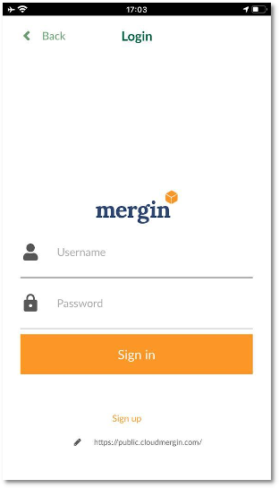
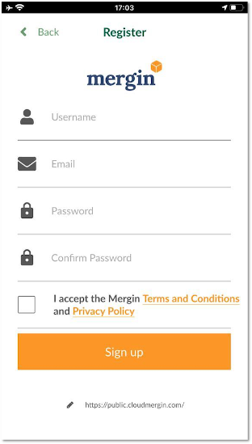
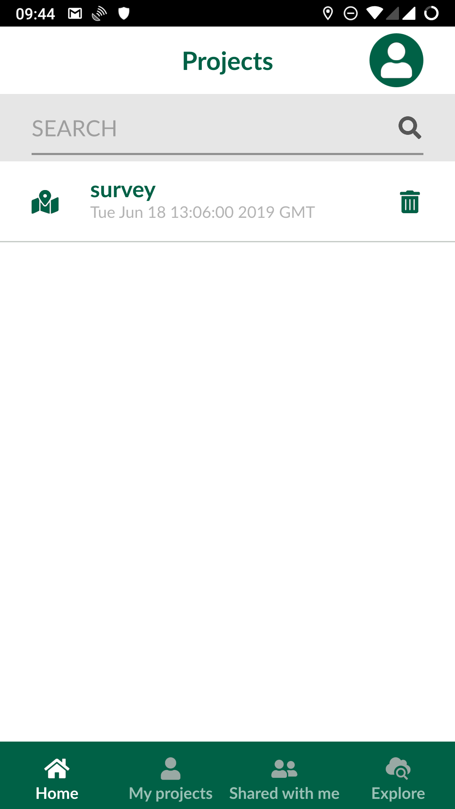
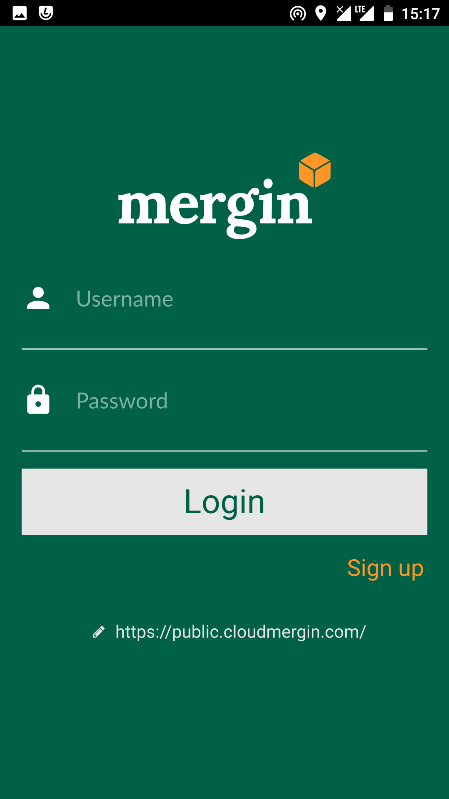
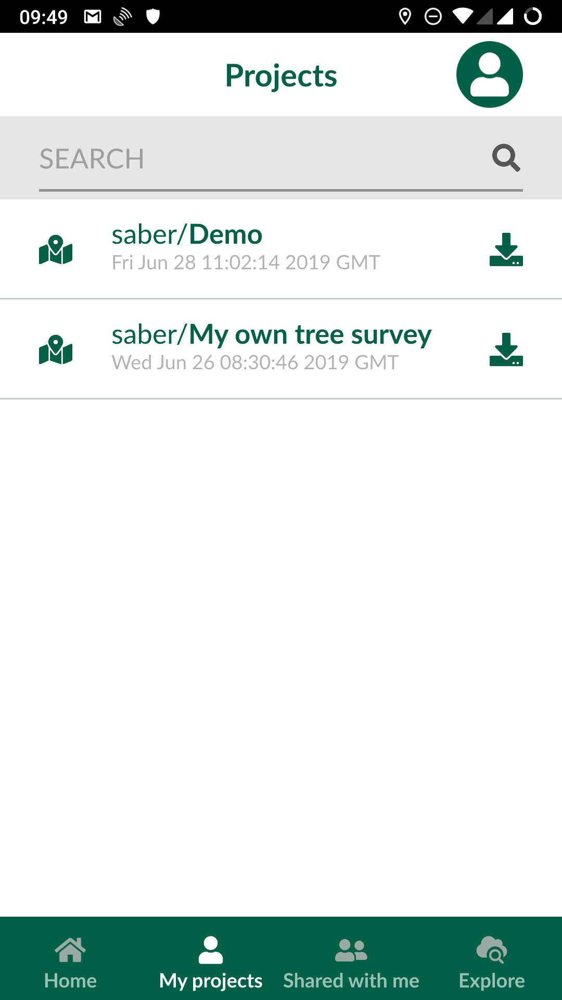
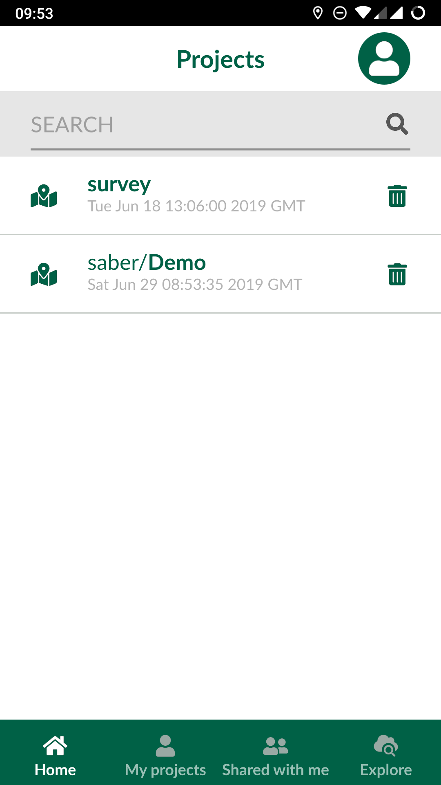
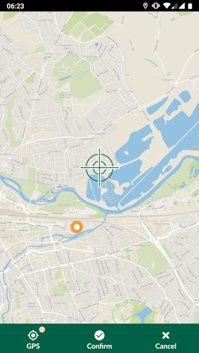
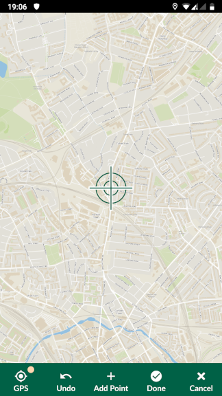
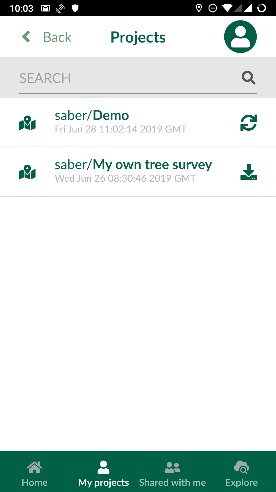

# Features

## Registration from Input

To be able to transfer your data to your mobile/tablet device, share your project and track changes, you will need to register to the <MainDomainNameLink /> . You can sign up to the service from the <MainDomainNameLink id="register" desc="web" /> or alternatively from within the app.

- Launch the Input app from your mobile/tablet device
- Select **Home**
- On the top right of the screen, select the icon for profile/account
- In the new page, select **Sign up**
	
- Fill in the form for registration and select **Sign up**
	
- You will receive an email to activate your account. You can follow the instructions in the mail to verify your account (optional)
- You can sign in to your Mergin account

## Accessing projects
You can install Input from Google Play Store. Once you open the application for the first time, it will take you to **Home** screen. This screen displays all the projects stored locally (under /sdcard/INPUT folder).

To access your projects or those shared with you through Mergin, select **My projects** or **Shared with me**  tabs respectively. You will need your log in details to sign in to Mergin:

Once logged in, you can download your project to work on it locally by pressing download button to the right of the project:

The project will be available for loading in Input after you download it locally. Select **Home** and you should be able to see your downloaded project:

Selecting a project under **Home** will open it in INPUT.

## Adding/editing features

To add a feature, select the record button from the lower panel. When you tap on the record button, it will list all the layers, you can edit. In Input, you have two modes to capture feature:

  - GPS location or streaming (if you are capturing lines/areas)
  - Free hand: by adding points or nodes to lines or areas

### Capturing points

If your survey layer is a point layer, it will show a cross-hair at your GPS location. You can confirm the location by pressing **Confirm**. Alternatively, you can move the map to another location. The point below the cross-hair will be used as the recorded location. You can move back to your location, by pressing **GPS**.

### Capturing lines or areas

If your survey layer is a line or area, the panel at the bottom changes to a figure similar to the one below:

You can:

- Use **Add point** to define the shape of your line or area manually by navigating through the map
- If you want to **stream** the GPS to shape your line or area, press and hold **GPS** button on the bottom left corner.

Once finished, press **Done**. If your feature is an area, it will join the last point to the first point to close the shape.

## Viewing/deleting existing data
You can view the existing data by tapping on them on the map. It will open a preview panel (according to Display settings in QGIS - see project preparation section). To edit the form related to an existing feature, you can press the pencil within the preview panel.

For point layers, you can also change the location (geometry) of your layer, by pressing **Edit geometry**. Similar to capturing a new point, a map will appear with a cross-hair at your GPS location. You can adjust the location of the cross-hair by panning the map and press **Confirm**.

If you want to delete the item, you can press the recycle bin from the lower panel in the form edit.

## Synchronisation of data/ projects
You can upload your changes through the Mergin service, once you have network connectivity. Select Project from the lower panel and then tap on **My projects** (or **Shared with me** if you have write access to the shared project). Input should automatically flag changed projects with a synchronise icon.

Pressing sync button to the right of the project will send the updated data to the Mergin service. Similarly, if a project and its data has been updated through the Mergin service, you will be notified to synchronise the changes to your local copy.