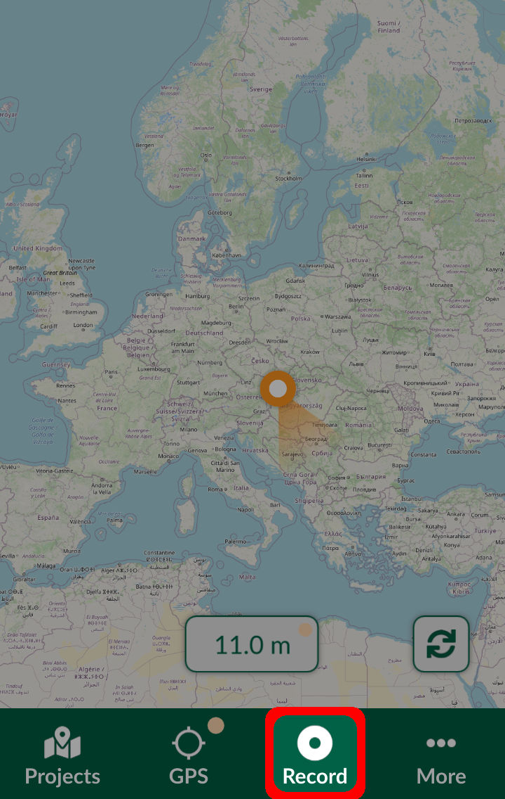
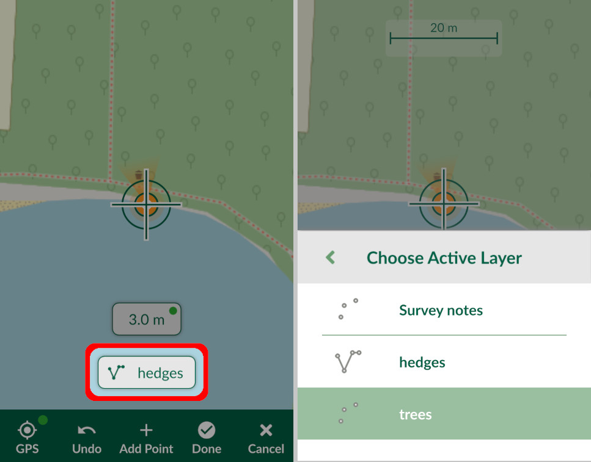
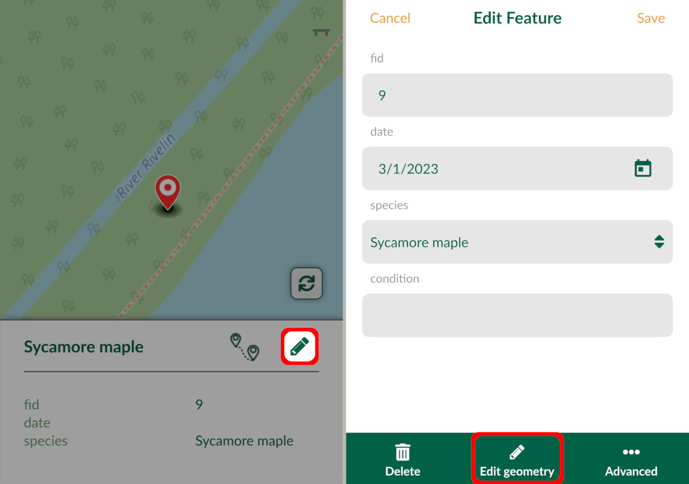
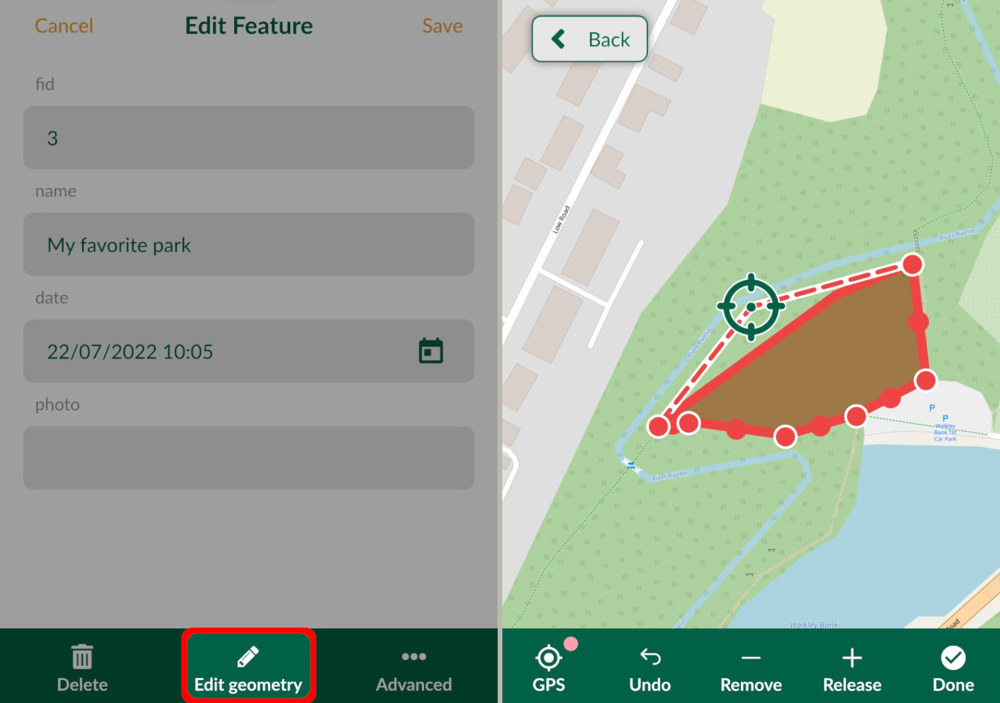
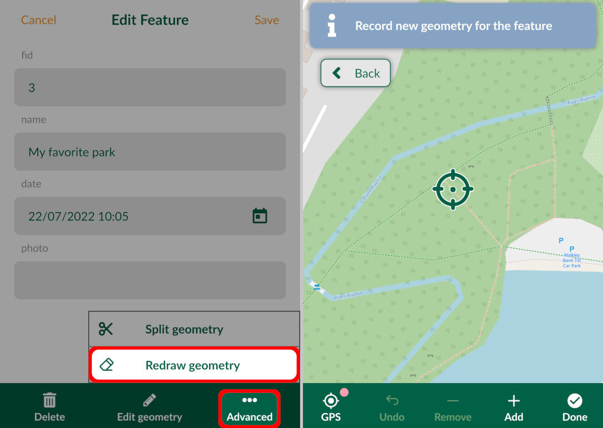
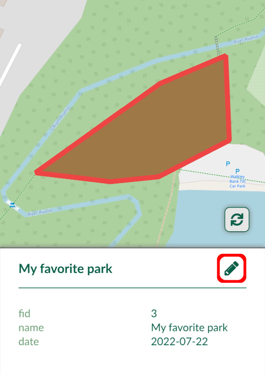
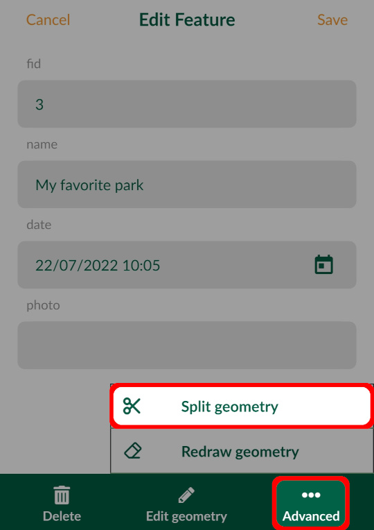
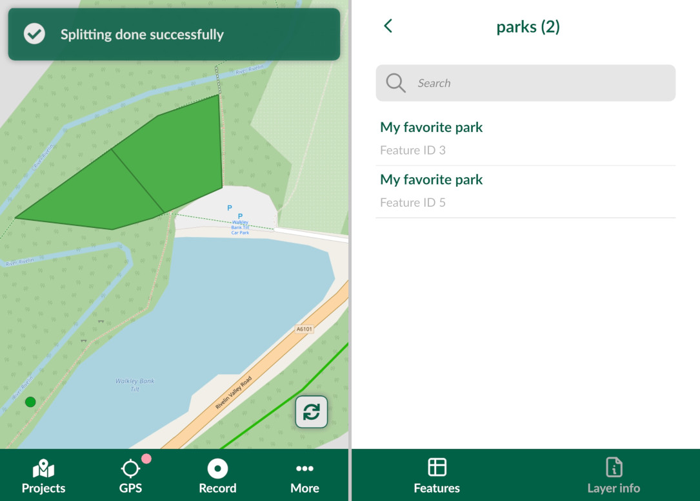

# How to Add, Edit, Delete Features

[[toc]]

::: tip
If you are new to <MobileAppName />, follow our [tutorials](../tutorials/capturing-first-data/) to get familiar with the app.
:::

Adding, editing and deleting features in the <MobileAppName /> is possible in <MainPlatformNameLink /> projects where you have [write permission](../manage/permissions/).

To be able to transfer your data to your mobile/tablet device, share your project and track changes, you will need to [sign up to Mergin Maps](../setup/sign-up-to-mergin-maps/).

## Adding features
In the <MobileAppNameShort />, open a [project](./input_ui/#projects) you want to use.

To survey new features, tap the **Record** button on the bottom panel to enter the **recording mode**.

 

::: warning
If current [GPS accuracy](./gps_accuracy/) falls below the accuracy threshold, you will get a warning about low position accuracy. Accuracy thresholds can be changed in [Settings](./input_ui/#gps-settings).
:::

The crosshairs you will see on your map will be used as the recorded location. You can change the position of your point by pinching and dragging the background map. If you want to recenter the map to your current position, tap the **GPS** button.

Surveyed features are added to the active layer, which is shown just above the bottom panel. You can change the active layer by tapping on it and selecting one from the list of editable layers in the project.

Once the geometry of a feature is recorded, a form will open and you will be able to record the values of attributes. 

:::tip
Attribute forms can be set up in QGIS. For more details, see [Setting Up Form Widgets](../layer/settingup_forms/) and [Advanced Form Configuration](../layer/settingup_forms_settings/).
:::

### Capture points
To capture a new point feature, simply tap **Add** on the bottom panel while in the [recording mode](#adding-features). A form will open where you can fill in the attributes.

### Capture lines or areas
There are two methods of capturing lines and areas: adding vertices one by one or using the *streaming mode* to capture features based on your position.

#### Adding points to survey vertices of lines or areas
Lines and areas can be captured by adding vertices one by one. When you are in the [**recording**](#adding-features) mode and your active layer is a line or polygon, you will see line and areas editing tools in the bottom panel.

Tap **Add** to capture vertices of your line or area. If you want to change the position of the last vertex, tap **Remove**, move the vertex to the correct place and  **Release** it. **Undo** can be used to revert last changes.

Once the survey of the feature is completed, tap **Done** and fill in the form.

#### Streaming mode to survey lines or areas
Lines and areas can be also captured automatically based on your position. Make sure you are in the [**recording**](#adding-features) mode and that your active layer is a line or polygon.

To turn on the streaming mode, long press the **GPS** button. To turn it off, long press the **GPS** button again.

Once you are finished, tap **Done**. If you are capturing an area, the shape will be automatically closed by connecting the last and the first vertex.

You can change how often you want to capture a vertex in **Line rec. interval** in [**Settings**](./input_ui/#streaming-mode-and-recording-settings). The interval can be defined as time elapsed in seconds or as distance travelled in metres.

:::tip
The recording interval can be defined also in metres as distance travelled.
:::

### Add non-spatial features
[Non-spatial features](../layer/working_with_nonspatial_data/) can also be added using <MobileAppName />. If you are using a non-spatial table for [value relations](../layer/settingup_forms/#value-relation) you can add and edit values in the app.

1. Tap the **More** button and navigate to **Layers**
   

2. Choose the non-spatial layer and tap **Add feature**
   
   
3. Fill in the attributes.

## Editing features
Spatial and non-spatial features can be browsed, edited and deleted in the [Layers](./layers/) panel in <MobileAppName />. Tap on the **Layers** in the **More** tab and select a layer to see the features it contains. 

Spatial features can be selected also on the map. Tap on a feature and press the edit button. Now you can change the attributes in the form. To edit the geometry of a feature, tap **Edit geometry** in the bottom panel.

To edit geometry of a point feature simply adjust the location by panning the map or use **GPS** in the same manner as when adding new features. Once you are happy with your changes, press **Done**.

### Edit geometry of lines or areas

It is also possible to edit the geometry of lines and areas. Tap on a line or polygon feature and press the **Edit** button. Then select **Edit geometry**.

The vertices of the feature will be highlighted and you can move or remove them as needed. Press **Done** to confirm your changes.

### Redraw geometry of lines or areas
The existing geometry of lines and areas can also be redrawn.

In the feature's form, tap the **Advanced** button and select the **Redraw geometry** option. Now you can record the new geometry using the tools in the bottom panel.

### Split geometry of lines or areas
Lines and areas can be split into two or more new features that will keep the same attributes as the original feature.

To split geometry of a feature:
1. Tap on a feature and press the edit button.

2. Tap **Advanced** and select **Split geometry**

3. Create the splitting line by adding points. When finished, tap **Done**

4. In this case, two individual features are created. Both have the same attributes, except for `Feature ID` (one feature keeps the original id, the other gets a new one).

## Snapping features

Snapping can be enabled in your <MainPlatformName /> project to make the field survey easier. [How to Set Up Snapping](../gis/snapping/) will guide you through the snapping options.

If snapping is enabled, the crosshairs will turn purple and snap to vertices (left) or segments (right) of existing features when capturing new features or editing existing features.

## Deleting features
If you want to delete the feature, tap on it and press the edit button. Here you have the option to **Delete** the selected feature.

## Synchronise changes
Don't forget to upload your changes to <MainPlatformNameLink />!

Synchronisation in <MobileAppName /> can be done automatically or manually by pressing the sync button. For more details visit [Synchronisation in Input](./autosync/).

:::tip
[Behind Data Synchronisation](../manage/synchronisation/) contains more information about the synchronisation process in general.

If needed, some files (for example photos) can be excluded from the synchronisation. You can read more about this option in [Selective Synchronisation](../manage/selective_sync/).
:::
