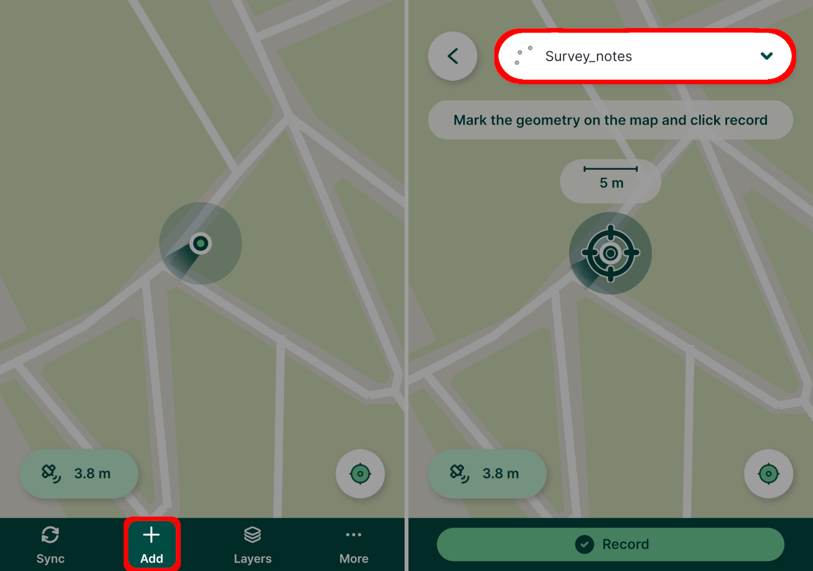
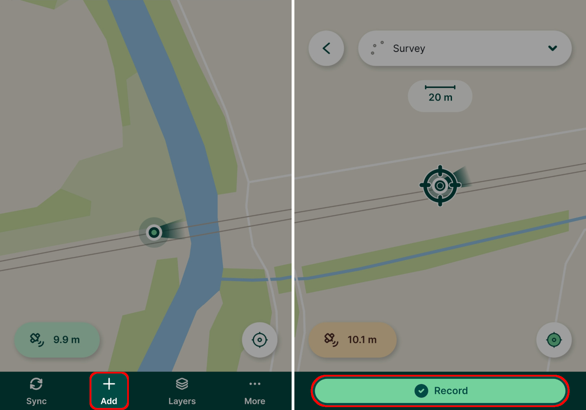
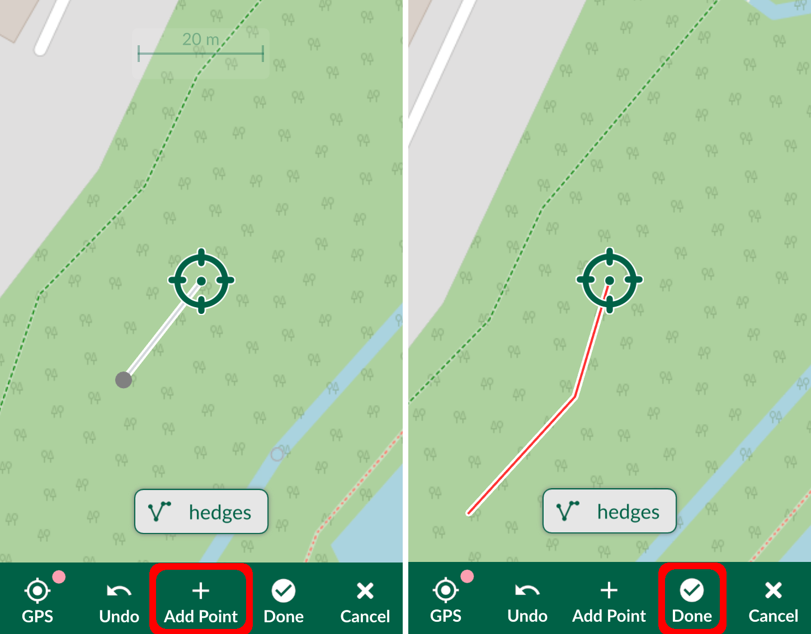

# How to Add, Edit, Delete Features

[[toc]]

::: tip
If you are new to <MobileAppName />, follow our [tutorials](../tutorials/capturing-first-data/) to get familiar with the app.
:::

Open a project you want to work with in <MobileAppName />. This can be a project you own or a project that is shared with you, in which case you need to have [write permission](../manage/permissions/#project-permissions) to add or edit features.

::: tip
To be able to transfer your data to your mobile/tablet device, share your project and track changes, you will need to [sign up to Mergin Maps](../setup/sign-up-to-mergin-maps/).
:::

## Add features
To add a feature, tap the **Record** button from the bottom panel. 

::: warning
A warning will appear when [GPS accuracy](./gps_accuracy/) falls below a threshold. Accuracy thresholds can be changed in **Settings**.
:::

Surveyed features are added to the active layer, which is shown just above the bottom panel. You can change the active layer by tapping on it and selecting one from the list of editable layers in the project.

### Capture points
The cross hairs you will see on your map will be used as the recorded location. You can change the position of your point by pinching and dragging the background map. If you want to recenter the map to your current position, tap the **GPS** button. 

To capture your point, press **Add Point**. A form will open where you can fill in the attributes.

### Capture lines or areas
There are two methods of capturing lines and areas:
  - using **Add point** to capture vertices of your line or area
  - pressing **GPS** to capture vertices based on your location. You can set how often you want to capture a vertex in **Line rec. interval** in [**Settings**](./input_ui/#gps-2).

Once you are finished, press **Done**. If your feature is an area, the shape will be automatically closed by connecting the last and the first vertex. 

## Edit or delete features
Tap on a feature and press the edit button.

Now you can change the attributes in the form and modify the shape of the feature using **Edit geometry**. Adjust the location by panning the map or use **GPS** in the same manner as when adding new features. Once you are happy with your changes, press **Save**.

If you want to delete the feature, press the **Delete** button.

## Synchronise changes
Don't forget to upload your changes to Mergin Maps! 
Select **Projects** in the bottom panel, open the **Home** tab and press the **sync** button to send the updated data to the cloud.

