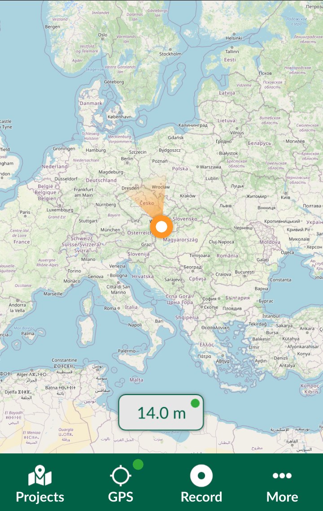
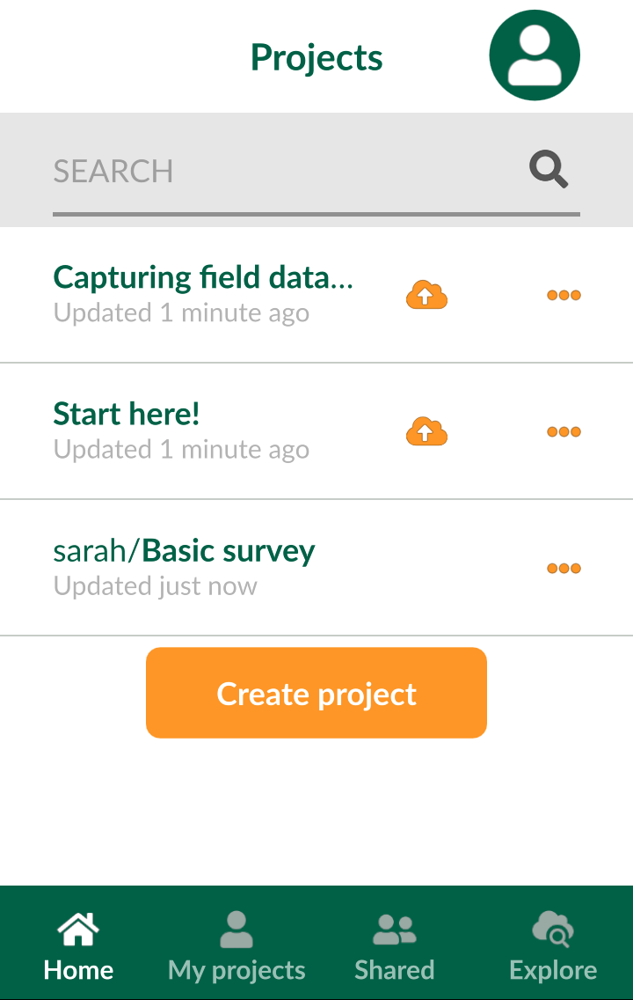
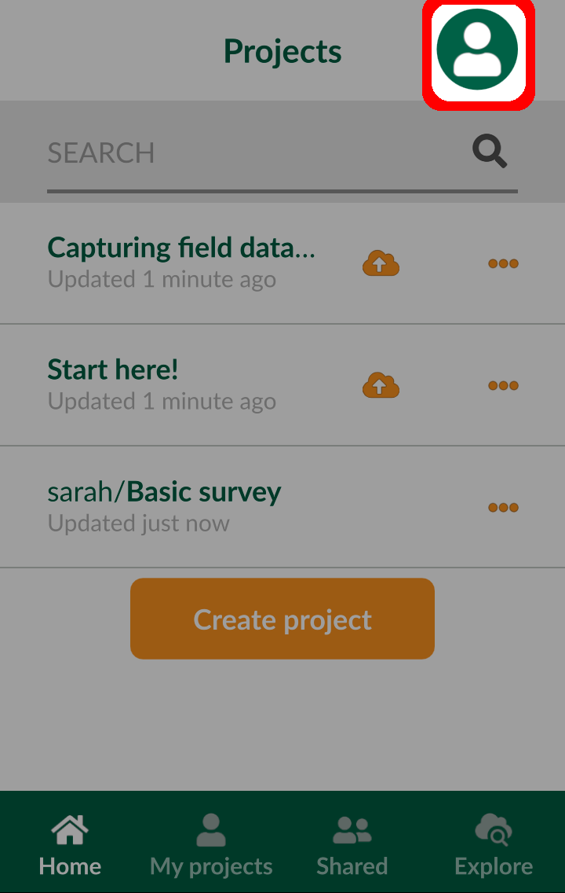
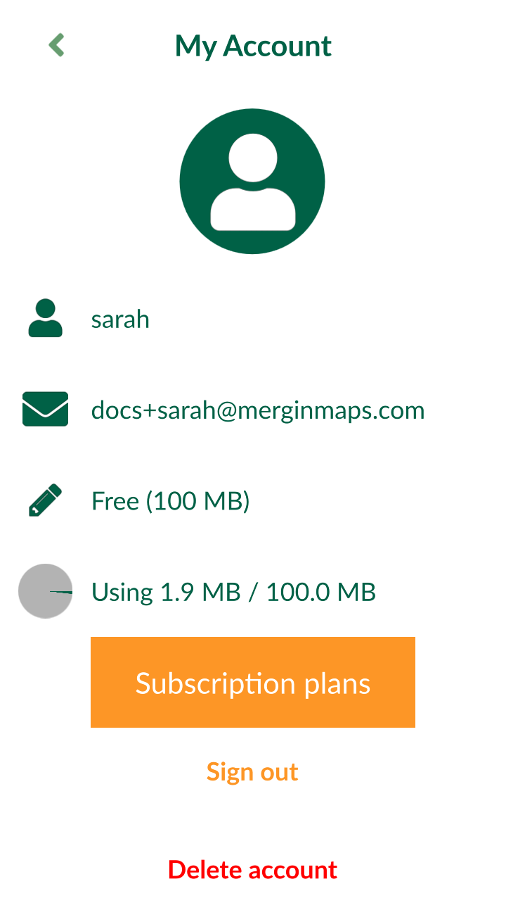
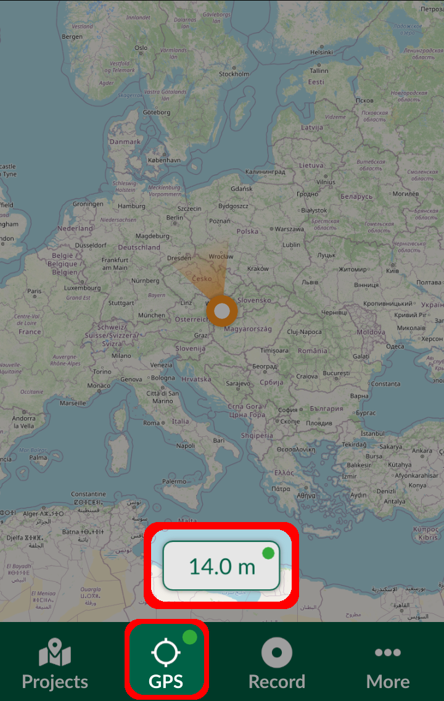
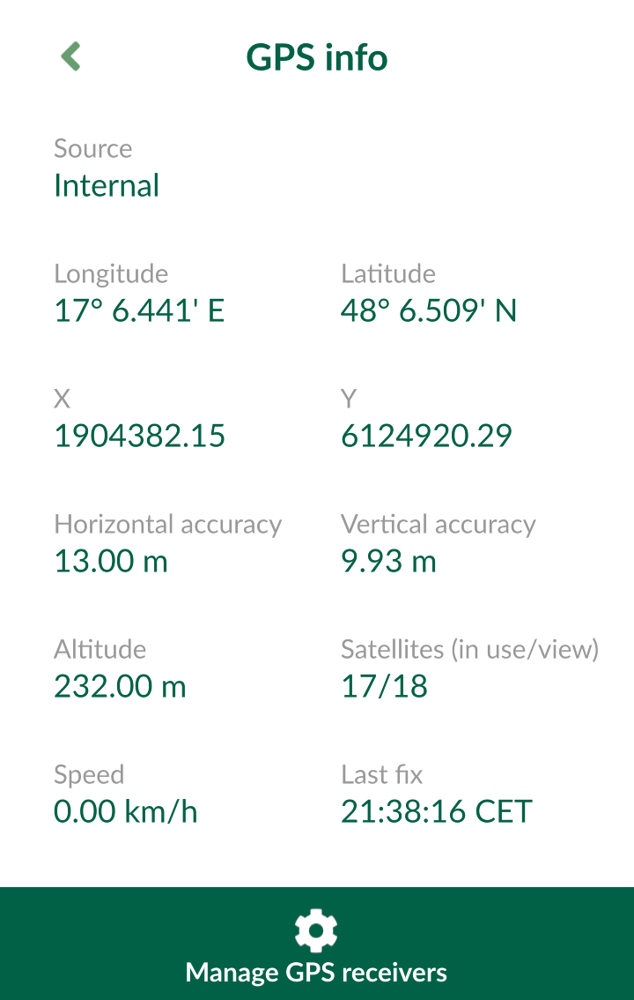
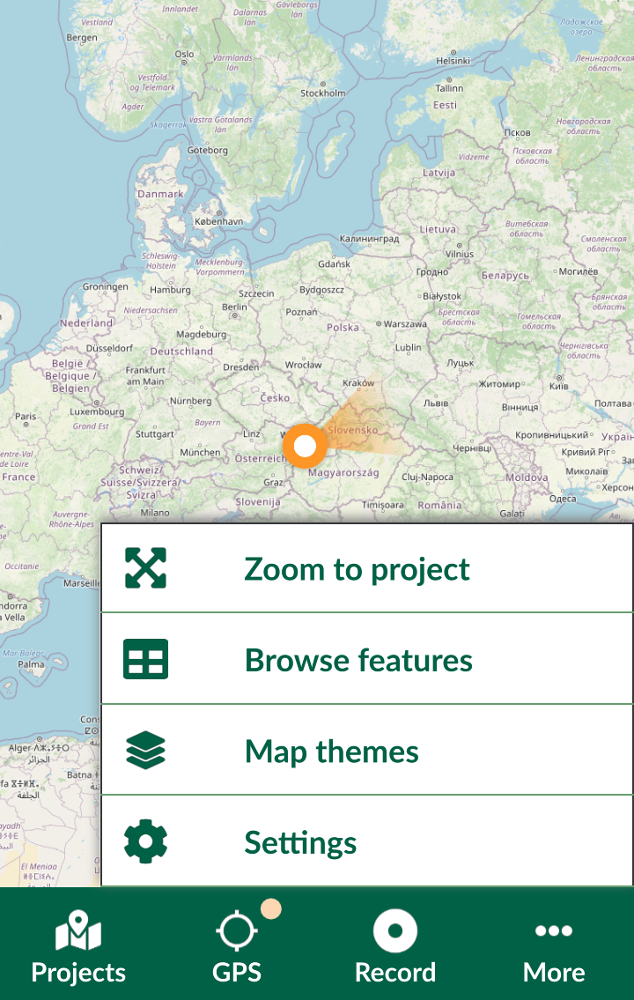
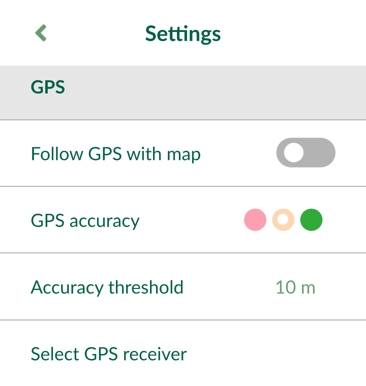
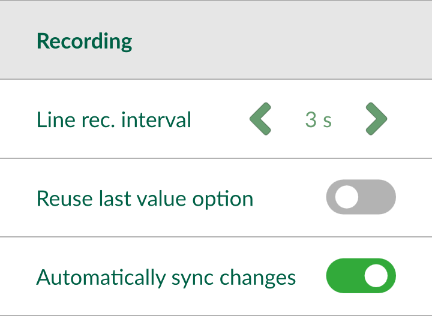

# Mergin Maps Input Interface
[[toc]]

Below is a description of various items within the user interface. 

The map can be moved by dragging around and zoomed in/out by pinching open/close.

There are four tabs available in the bottom navigation panel: [Projects](#projects), [GPS](#gps), [Record](#record) and [More](#zoom-to-project-browse-features-map-themes-settings).

## Projects
**Projects** tab is where you can create a new project, upload it to the cloud, synchronise changes, or remove a local project from your device.
- **Home**: a list of all downloaded projects on your device. Only downloaded projects can be opened in the app.
- **My projects**: projects created by you and hosted on the <MainPlatformName /> service
- **Shared with me**: projects on the <MainPlatformName /> service shared with you by other users
- **Explore**: a full list of public projects by others on the <MainPlatformName /> service

 

### Mergin Maps account
To [sign up to <MainPlatformName />](../setup/sign-up-to-mergin-maps/#from-mergin-maps-input), sign in and access your profile information, select the icon on the top right of the **Projects** screen.

**My Account** contains the overview of your profile and your storage use. **Sign out** if you want to switch to a different account. 

<Badge text="Since Input 1.5.2" type="tip"/> it is also possible to delete your <MainPlatformName /> account within the app.

:::danger
Be careful! If you delete your account, you will lose access to your <MainPlatformName /> projects both on the mobile device and on the server.
:::

## GPS
Tapping the GPS button centres the map to your current position. 

Pressing and holding the GPS button turns on / turns off the GPS auto-centre mode.

GPS signal colour on the map denotes the accuracy threshold set by the user within the <MobileAppName /> in [GPS settings](#gps-settings). GPS accuracy is displayed at the bottom of the map. 

 

Tapping the GPS accuracy tab opens the GPS info panel:
- **Source**: internal GPS of the mobile device or external GPS receiver connected via Bluetooth
- **Longitude, Latitude**: current position
- **X, Y**: current position in project's coordinate reference system
- **Horizontal** and **Vertical accuracy** of the GPS position
- **Altitude**: ellipsoidal height
- **Satellites (in use/view)**: number of satellites
- **Speed**
- **Last fix**: time of the last received GPS position

 

## Record
**Record tab** is where you can [survey new features](./input_features/).
 

The active layer currently used for survey is displayed above the bottom navigation panel. Tapping on it opens a list of all editable layers in the project.

## Synchronisation
The sync button can be used to synchronise changes. If automatic synchronisation of changes is allowed, this button will indicate that synchronisation is in progress.

Pressing and holding the sync button opens the Project status window.

## Zoom to project, Browse features, Map themes, Settings
**More** tab contains a list of additional options, such as:
- **Zoom to project**: a shortcut to zoom to the extent of all visible layers within the project. The project extent can be set during [project preparation QGIS](../gis/features/#project-extent).
- **Local changes**: see changes yet to be synchronised 
- **Browse features**: [browse features](../gis/search_data.md) and search in the project's layers
- **Map themes**: a list of map themes [set up in a QGIS project](../gis/setup_themes/)
- **Settings**: GPS and recording settings along with references to help, privacy policy, terms of service and diagnostic log

### GPS settings
- **Follow GPS with map**: if toggled on, the map will pan so the GPS point can be seen on the map
- **GPS accuracy**: shows the current GPS accuracy based on the *Accuracy threshold* using traffic light system. Green stands for GPS accuracy within the threshold, orange for GPS accuracy outside the threshold and red for no GPS position fix available.
- **Accuracy threshold**: value used to display GPS accuracy colours
- **Select GPS receiver**: option to switch between internal GPS and external GPS receiver connected via Bluetooth. See [External GPS](./external_gps/) for detailed steps.

### Recording settings
- **Line rec. interval** the interval at which the GPS location is used as vertices when streaming GPS position for capturing lines
- **Reuse last value option** if used, last entered values of selected attributes will be automatically filled in when creating a new feature.
- **Automatically sync changes** if used, local changes will be synchronised automatically.

