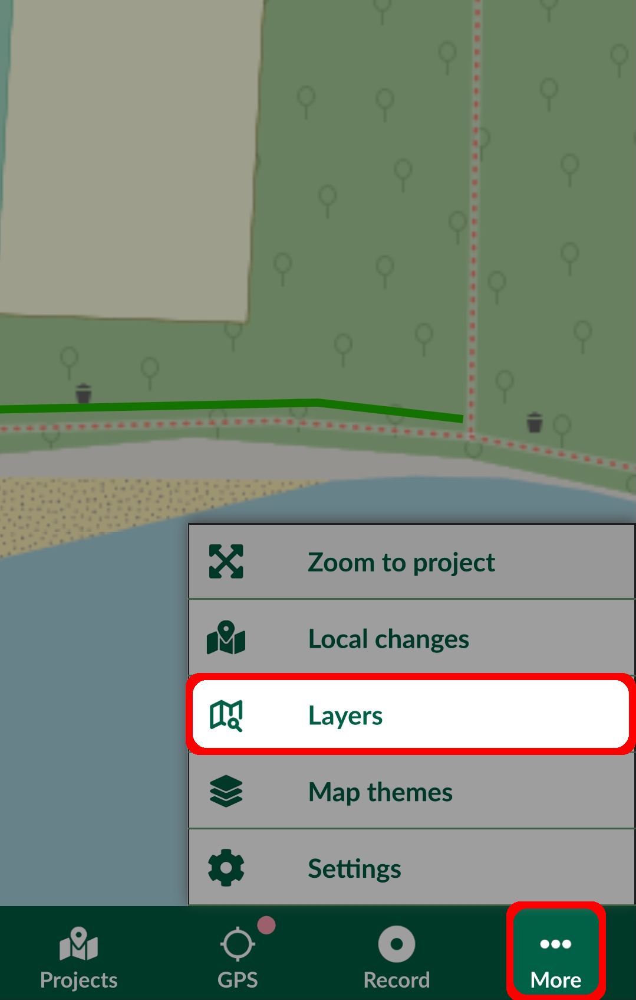
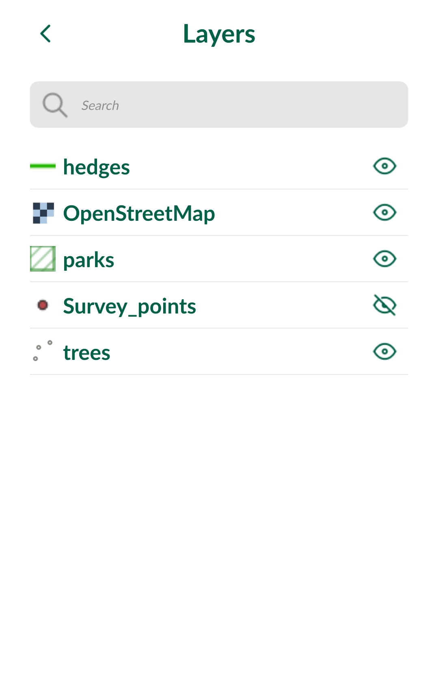
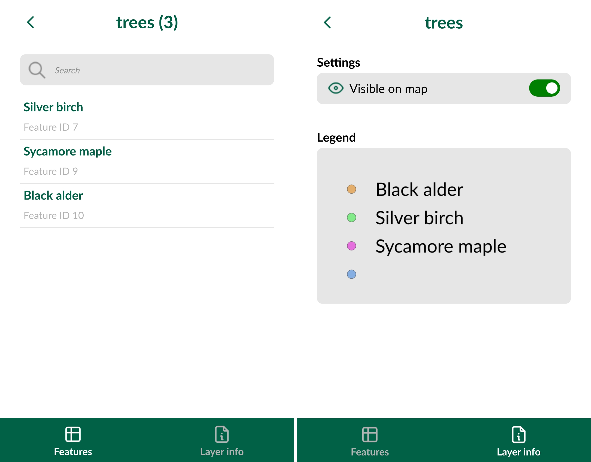

# Layers in Mergin Maps Input
<SinceBadge type="App" version="1.9.0" />
[[toc]]

**Layers** panel provides an overview of layers and features in your <MainPlatformNameLink /> project in <MobileAppName />, as well as the option to turn the visibility of specific layers on/off or to see a layer's legend.

## Layers visibility

Tap **Layers** in the **More** tab to open a list of layers in the project.

The visibility of layers on the map can be easily turned on and off by tapping the eye icon next to the layer's name.

## Layers legend and features
Select a layer in the **Layers** panel to browse features and [search for attributes values](../../gis/search_data/#searching-for-values-in-mergin-maps-input). Tap on the record to zoom to the feature on the map and display its form.

Swipe right or tap **Layer info** to see the layer's legend and to toggle on/off its visibility on the map.

