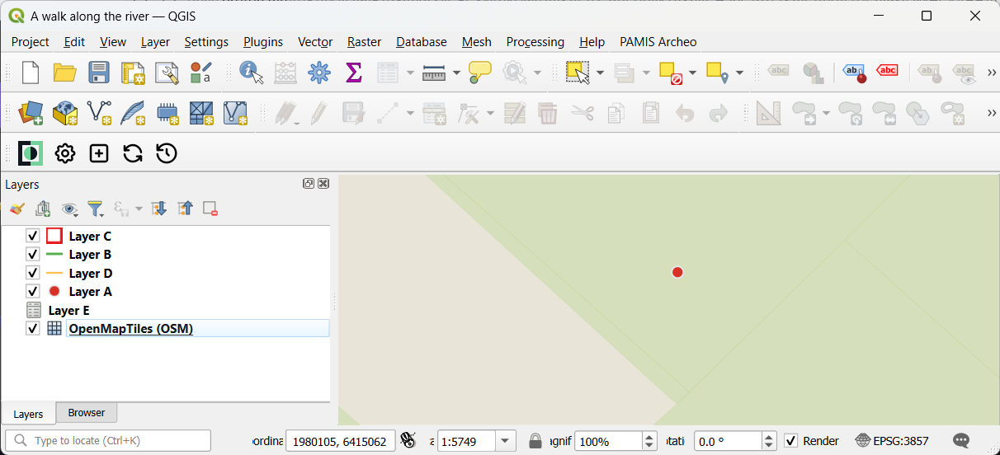
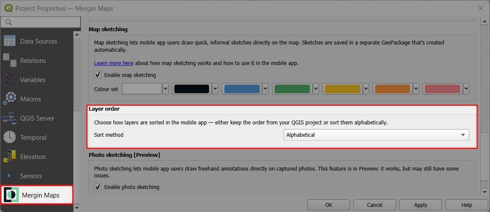

# Layers in Mergin Maps Mobile App
[[toc]]

The **Layers** button is located in the bottom navigation panel. 

It provides the overview of layers and features in your <MainPlatformNameLink /> project in <MobileAppName />, as well as the option to turn the visibility of specific layers on/off or to see a layer's legend.

## Layers visibility

Tap **Layers** to open a list of layers in the project.

The visibility of layers on the map can be easily turned on and off by toggling the button next to the layer's name.

## Layer order
By default, layers are listed in alphabetical order. If you want to follow the layer order of the QGIS project, you can do so in the [Project properties](../../gis/features/#layer-order):

1. Open your <MainPlatformName /> project in QGIS
   

2. Navigate to **Project** > **Properties** 
   
   
3. In the <MainPlatformName /> tab, choose the sort method: *Alphabetical* or *QGIS layer order*.
   

4. **Apply** the changes, save and synchronise your project.

5. Open the project in the <MobileAppNameShort />.
   
   Depending on the setup, layers will be either listed alphabetically or based on the QGIS layer order:
   
   
   

## Layers legend and features
Select a layer in the **Layers** panel to browse features and [search for attributes values](#browsing-features). Tap on the record to zoom to the feature on the map and display its form.

Swipe right or tap **Layer info** to see the layer's legend and to toggle on/off its visibility on the map.

## Browsing features
Attribute data can be browsed in the <MobileAppNameShort /> by tapping **Layers**. 

In the **Layers** window, choose a layer or a table from the list to open the list of features.

Here, you can browse the features. The search bar can be used to shortlist matching records. The search looks up for a match in all searchable attributes values and is not case sensitive.

:::tip Sorting features and searching for field values
The way how features are sorted in the <MobileAppNameShort /> can be affected by [settings in the QGIS project](../../gis/search_data/).
:::

Tap on the record to zoom to the feature on the map and display its form.

