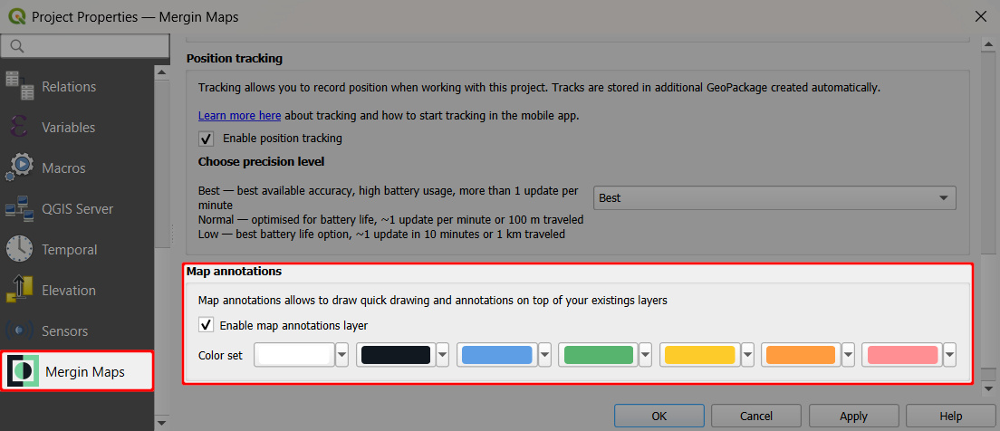
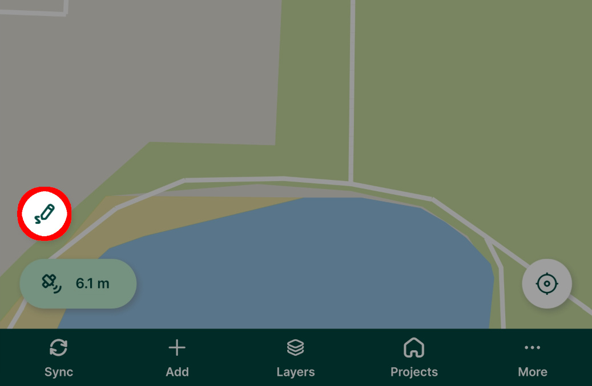
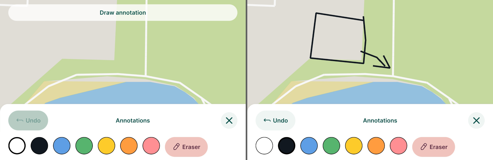
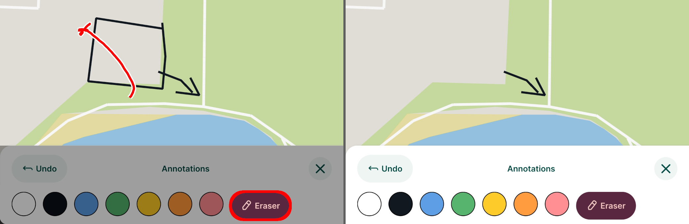
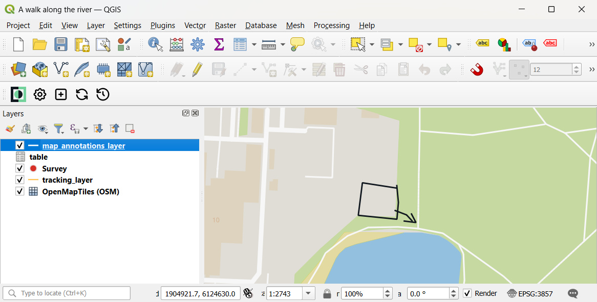

# Map Annotations in Mergin Maps Mobile App
[[toc]]

Map annotations can be used to draw something on the map, in addition to the regular field collection of [features](../mobile-features/).

## Set up map annotations in QGIS project

Map annotations need to be enabled in QGIS when [preparing your <MainPlatformName /> project](../../gis/features/#map-annotations).

1. Open your <MainPlatformName /> project in QGIS
2. Navigate to **Project** > **Properties** 
   

3. In the <MainPlatformName /> tab, check the **Enable map annotations layer** option.
   

   You can also change the colour set to define the colours that will be available in the <MobileAppNameShort />.

4. Save the changes. 

   A new layer named `map_annotations_layer` will be added to the project. This layer is used to store the annotations.

5. Save and synchronise your project!

::: tip 
If you do not see this option in the **Project properties**, check for [plugin upgrades](../../setup/install-mergin-maps-plugin-for-qgis/#plugin-upgrade).
:::

## Map annotations in the mobile app
To use map annotations in the <MobileAppNameShort />, make sure they are [enabled in the project](#set-up-map-annotations-in-qgis-project).

1. Tap the **Map annotations** button
   

2. The **Annotations** bar appears.
   - Draw your annotations on the map by freehand or using a stylus.
   
   You choose from 7 annotation colours. The colour set can be changed in the [project properties](#set-up-map-annotations-in-qgis-project) in QGIS.
   

   - Made a mistake? Use the **Eraser** button to remove your annotations.
   

4. Sync your changes to <MainPlatformNameLink />.
   
   In QGIS, the annotations will be displayed in the `map_annotations_layer`.
   

