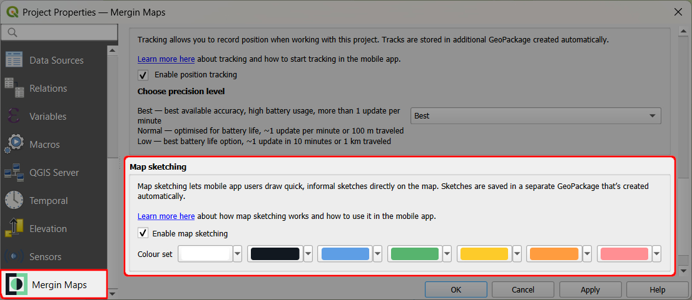
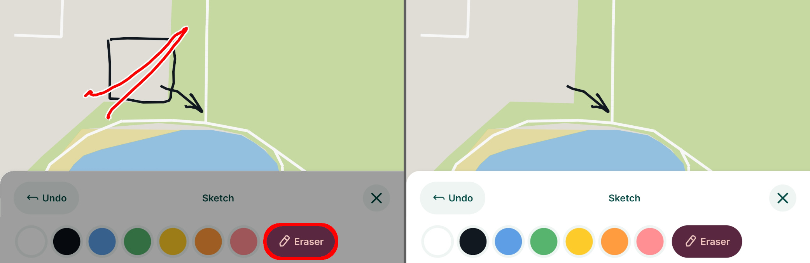

# Map Sketching
<!-- this link is used in the plugin -->

[[toc]]

Map sketches can be used to draw something on the map, in addition to the regular field collection of [features](../mobile-features/).

## Enable map sketching

Map sketching needs to be enabled in QGIS when [preparing your <MainPlatformName /> project](../../gis/features/#map-sketching).

1. Open your <MainPlatformName /> project in QGIS
2. Navigate to **Project** > **Properties** 
   

3. In the <MainPlatformName /> tab, check the **Enable map sketching** option.
   

   You can also change the colour set to define the colours that will be available in the <MobileAppNameShort />.

4. Save the changes. 

   A new layer named **Map sketches** (`map_sketches.gpkg`) will be added to the project. This layer is used to store the map sketches.

5. Save and synchronise your project!

::: tip 
If you do not see this option in the **Project properties**, check for [plugin upgrades](../../setup/install-mergin-maps-plugin-for-qgis/#plugin-upgrade).
:::

## Map sketching in the mobile app
To use map sketches in the <MobileAppNameShort />, make sure they are [enabled in the project](#enable-map-sketching).

1. Tap the **Map sketching** button
   

2. The **Sketch** bar appears.
   - Draw your sketches on the map by freehand or using a stylus. You choose from 7 annotation colours. The colour set can be changed in the [project properties](#enable-map-sketching) in QGIS.
   

   - Made a mistake? Use the **Eraser** button to remove your sketches.
   
   
   - Use the **Undo** button to revert the last changes.

4. Sync your changes to <MainPlatformNameLink />.
   
   In QGIS, the map sketches will be displayed in the **Map sketches** layer.
   

