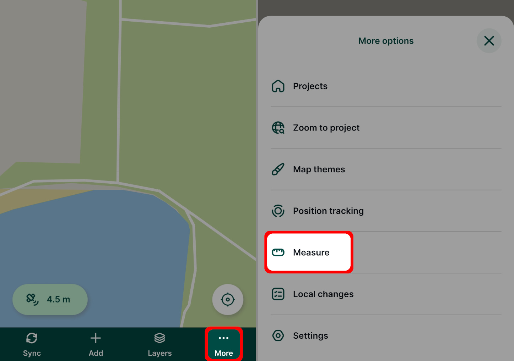
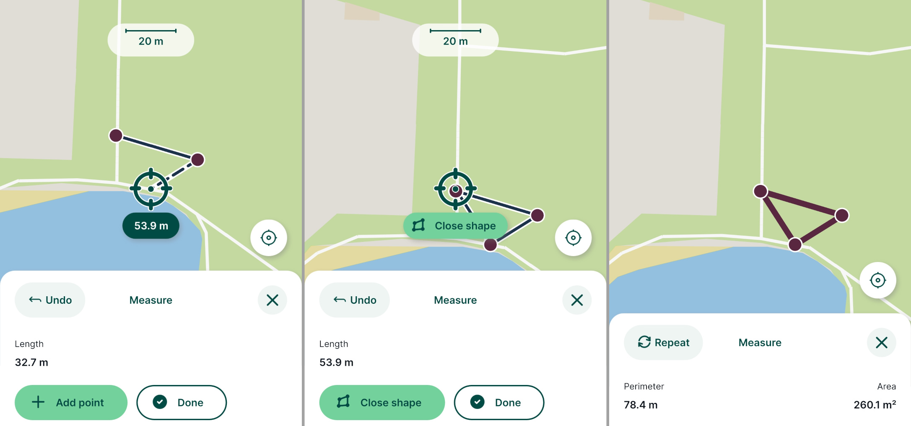
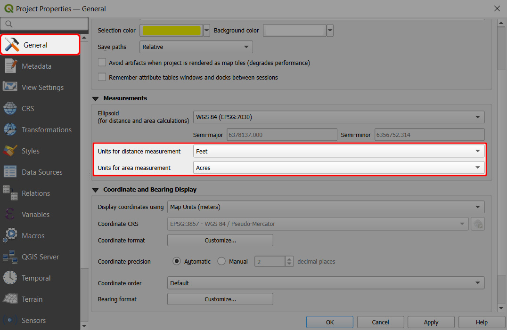
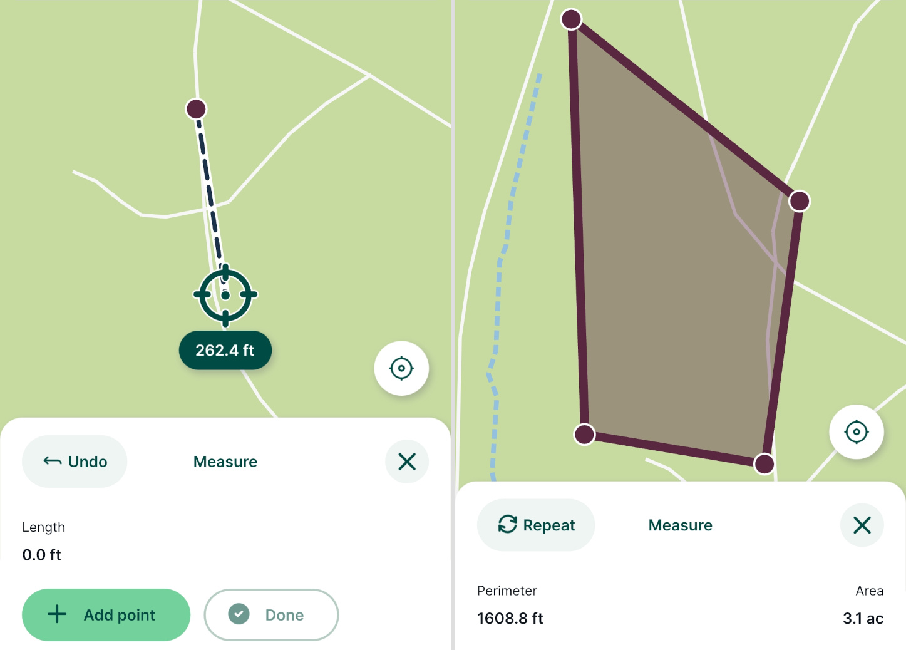

# Measurement Tools
[[toc]]

## Measure length and area in Mergin Maps mobile app
In the <MobileAppNameShort />, it is possible to measure length and area on a map window. Measurement tools use the same units as are used by the QGIS project.

To open the measurement tools, tap the **More** button in the bottom navigation panel and use the **Measure** option.
   

Use the **Add Point** button to add points along the line or area you want to measure
- The *length* between added points is displayed in the **Measure** panel.
- The current length is displayed near the crosshairs as you move them.
- Use the **Undo** button to remove the last point.
- To get the area, add the points along the shape. When you move the crosshairs close to the first point, you will see the **Close shape** option.

When finished with the measurements, tap the **Done** for length measurement or **Close shape** for area measurement. The values of *perimeter* and *area* will be displayed in the **Measure** panel.

Tap **Repeat** to start a new measurement.

Measured values are not saved.

## Changing measurement units in QGIS
Units that are used when measuring in the <MobileAppNameShort /> are defined (and can be changed) in the project in QGIS:

1. Open your <MainPlatformName /> project in QGIS
2. Navigate to the **General** tab in the **Project Properties**
3. In the **Measurements** section, change the *Units for distance measurement* and *Units for area measurement* to the units you want to use when measuring length and area in the <MobileAppNameShort />
4. Save and synchronise your project

For example, here we switched to length units to feet and area units to acres.

Now, the <MobileAppNameShort /> displays the length/the perimeter in feet and the area in acres.

