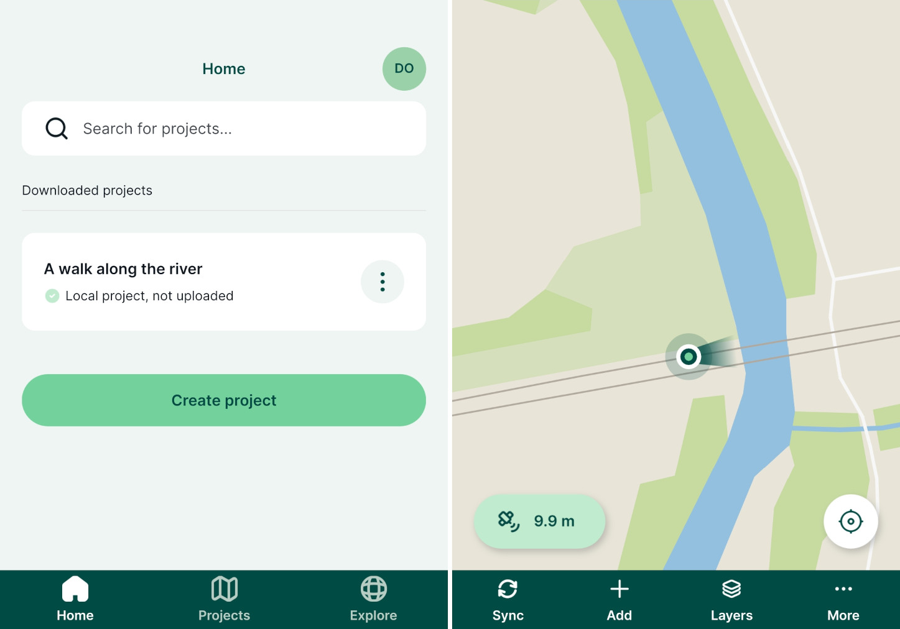
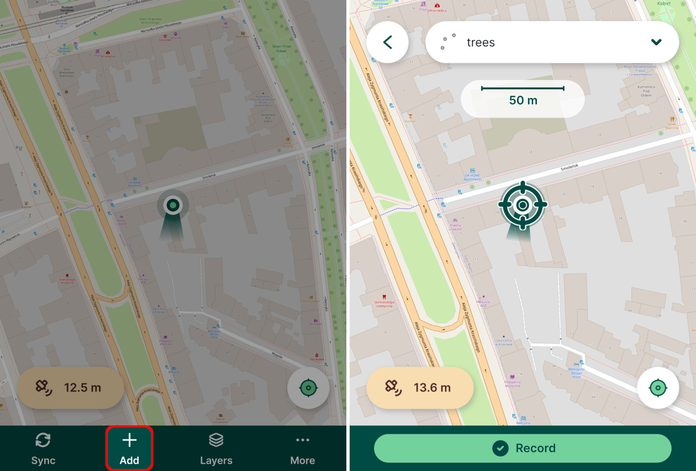
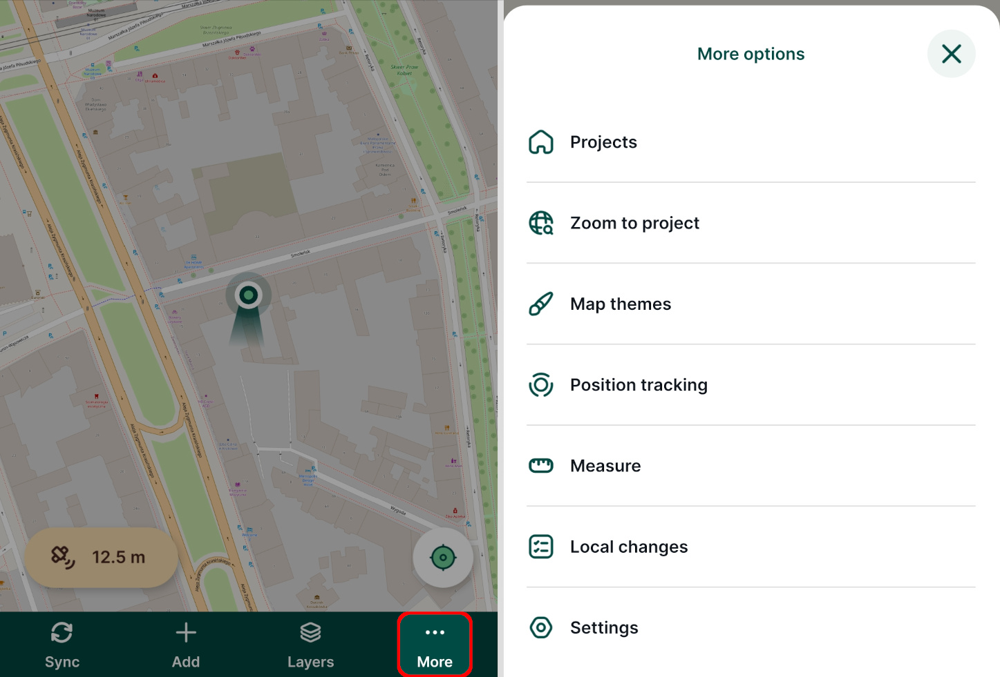
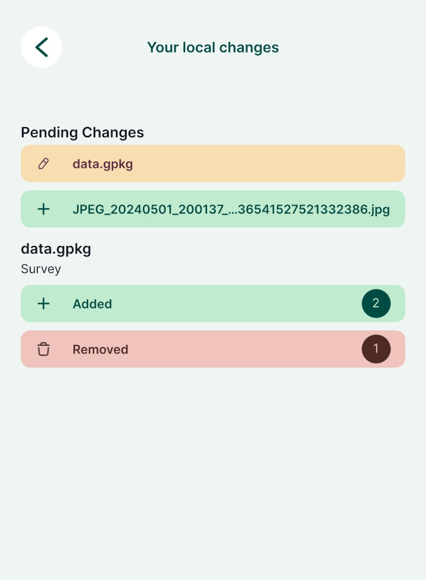
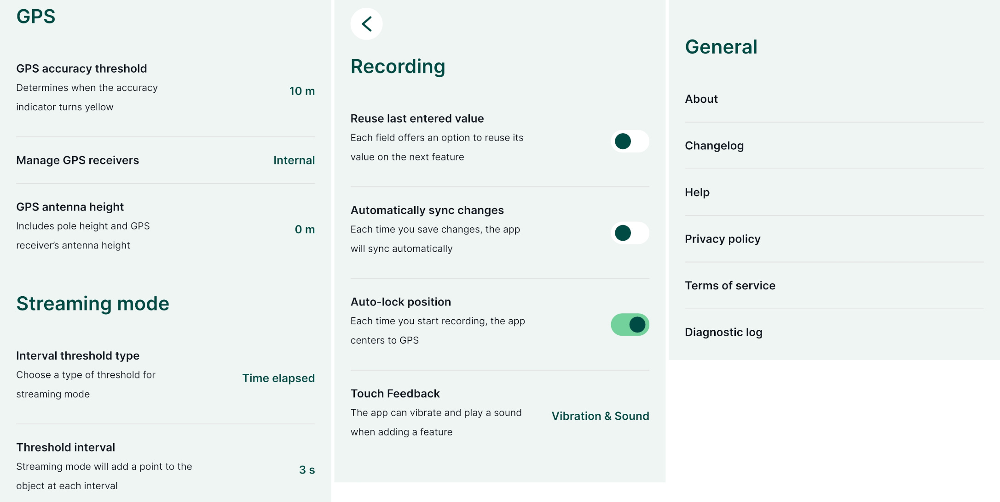

# Mergin Maps Mobile App Interface
[[toc]]

Below is a description of various items within the user interface of <MobileAppName />. 

:::tip
To get familiar with the <MobileAppNameShort />, we recommend going through our [Get Started tutorials](../../tutorials/capturing-first-data/).
:::

## Main page, projects and account details
On the main page of the <MobileAppNameShort />, there are three tabs in the bottom navigation bar:
- [**Home**](#home) contains the overview of downloaded projects
- [**Projects**](#projects) displays all projects in the current workspace available for download
- [**Explore**](#explore) includes the list of all [public](../../manage/project-advanced/#make-your-project-public-private) projects

The account icon in the right upper corner of the screen can be used to [manage the account and workspaces](#workspaces-and-mergin-maps-account) in the <MobileAppNameShort />.

### Home
In the **Home** tab, you can find the list of projects that are downloaded to your mobile device, including local projects that are yet to be synchronised to <MainPlatformNameLink />.

- Open a project by tapping on its name
- Use the **Create project** button to create a new project in the <MobileAppNameShort />. For detailed steps, go to [Create a project in Mergin Maps mobile app](../../manage/create-project/#create-a-project-in-mergin-maps-mobile-app).
- Use the button next to the project name to upload a local project to the cloud, synchronise the project, see local changes or remove the project from your device

### Projects
The **Projects** tab contains the list of all projects in your current [workspace](../../manage/workspaces/). The workspace name is displayed on the top of the screen (here: `my-team`).

- Tap the **Download** button next to the project name to download it to your mobile device
- For projects that are already downloaded to your device, you can use the button next to the project name to synchronise the project, see local changes or remove the project from your device

:::tip
If you need to download a project from another workspace, you need to [switch to this workspace in the mobile app](../../manage/workspaces/#switch-workspaces-in-mergin-maps-mobile-app) first.
:::

### Explore
In the **Explore** tab, you can browse [public](../../manage/project-advanced/#make-your-project-public-private) projects.

Use the search bar to narrow the results. Public projects can be downloaded and opened on your mobile device, however, you cannot synchronise your local changes unless you have appropriate [permissions](../../manage/permissions/).

### Workspaces and Mergin Maps account
Your <MainPlatformNameLink /> account can be accessed by tapping the icon on the top right of the main page. 

Here, you can [sign up to <MainPlatformName />](../../setup/sign-up-to-mergin-maps/#from-mergin-maps-mobile-app) or sign in if you already have a <MainPlatformNameLink /> account. If you are already logged in, you will see your account details.

- The current workspace (here: `my team`) is displayed in the **Workspaces** section. Tap on it to [switch to another workspace](../../manage/workspaces/#switch-workspaces-in-mergin-maps-mobile-app) or to [create a new workspace](../../manage/workspaces/#how-to-create-a-new-workspace).
   

- **Manage Account** is a shortcut to the <DashboardShortLink /> where you can manage your projects, workspaces and subscriptions
- **Sign out** to sign out or to switch to a different account
- **Close account** can be used to delete your account within the <MobileAppNameShort />

:::danger WARNING
Be careful! If you delete your account, you will lose access to your <MainPlatformName /> projects both on the mobile device and on the <DashboardShortLink />.
:::

## Working with a project
A project is opened by tapping its name in the [Home](#home) or in the [Projects](#projects) tab. You have to download the project in order to be able to work with it.

When a project is opened, you will see the map window. The map can be moved by dragging around and zoomed in/out by pinching open/close. Tapping on a feature displays the attributes form. 

### Current position and GPS info
To see your current position and GPS info, you have to enable location services in your mobile device.

Tapping the **location button** in the right bottom corner of the screen centres the map to your current position and keeps it centred while you are moving. If you move the map manually, the auto-centre mode turns off automatically.

 

In the left bottom corner of the screen, there is a **GPS** button that displays the GPS accuracy as reported by your mobile device. The colour of the button denotes the accuracy threshold set in [GPS settings](#gps-settings) in the <MobileAppNameShort />.

Tapping the GPS accuracy button opens the GPS info panel:
 

- **Source**: internal GPS of the mobile device or [external](../external_gps/) GPS receiver connected via Bluetooth
- **Longitude, Latitude**: current position
- **X, Y**: current position in project's coordinate reference system
- **Horizontal** and **Vertical accuracy** of the GPS position
- **Altitude**: ellipsoidal height if internal GPS is used. [External GPS](../external_gps/) devices usually return orthometric heights (ellipsoid with the geoid separation applied).
- **Satellites (in use/view)**: number of satellites
- **Speed**
- **Last fix**: time of the last received GPS position
- **GPS antenna height** that can be set in [GPS settings](#gps-settings)

### Sync
The **Sync** button can be used to synchronise changes during the field survey. 

It also indicates that synchronisation is in progress.

### Add
Tap the **Add** button to enter the *recording mode* so you are able to [survey new features](../mobile-features/). 
 

The **active layer** currently used for the survey is displayed on the top of the screen. Tap on it to choose another active layer from editable layers in the project.

:::tip
[How to Add, Edit, Delete Features](../mobile-features) will show you how to capture points, lines and polygons in <MobileAppName /> as well as how to edit their geometry and attributes.
:::

### Layers
Tap the **Layers** button to display the layers in your project. 

Here, you can toggle specific layers on and off to change their visibility on the map, see layers legend, and browse features in the layers. 

More details can be found in [Layers in Mergin Maps Mobile App](../layers/).

### More options: Zoom to project, Map themes, Position tracking, Measure, Local changes, Settings
The **More** button opens a list of additional options

- **Projects**: a short cut to the main page of the <MobileAppNameShort />
- [**Zoom to project**](../../gis/features/#project-extent): zoom to the extent of all visible layers within the project. The project extent can be set in [QGIS in Project Properties](../../gis/features/#project-extent).
- [**Map themes**](../../gis/setup_themes/): a list of map themes set up in a <MainPlatformName /> project in QGIS
- [**Position tracking**](../tracking/): to start tracking of your tracks during the field survey
- [**Measure**](../measure/): measure length or area on the map
- **Local changes**: the overview of your local changes to be synchronised
   
- **Settings**: [GPS settings](#gps-settings), [streaming mode and recording settings](#streaming-mode-and-recording-settings), and general references to information about the <MobileAppNameShort />, changelog, help, privacy policy, terms of service and [diagnostic log](../../misc/troubleshoot/#diagnostic-log-on-mergin-maps-mobile-app)
   
   
#### GPS settings
- **GPS accuracy threshold**: value used to change the colour of GPS accuracy indicator to yellow
- **Manage GPS receivers**: option to switch between internal GPS and external GPS receiver connected via Bluetooth. See [External GPS](../external_gps/) for more details.
- **GPS antenna height**: option to enter the height of a GPS antenna (e.g. when a surveying pole is used)

#### Streaming mode and recording settings
[**Streaming mode**](../mobile-features/#streaming-mode-to-survey-lines-or-areas) can be used when surveying lines or polygons to capture vertices based on the GPS location.
- **Interval threshold type**: the type of interval in streaming mode, can be set to *Time elapsed* or *Distance travelled* .
- **Threshold interval** the interval of recording vertices

**Recording** setting contains options to:
- [**Reuse last value option**](../reuse-last-values/) if used, last entered values of selected attributes will be automatically filled in when creating a new feature.
- **Automatically sync changes** if used, local changes will be synchronised automatically.

