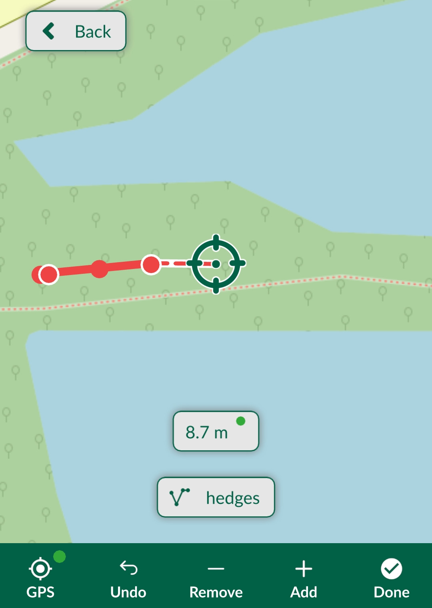
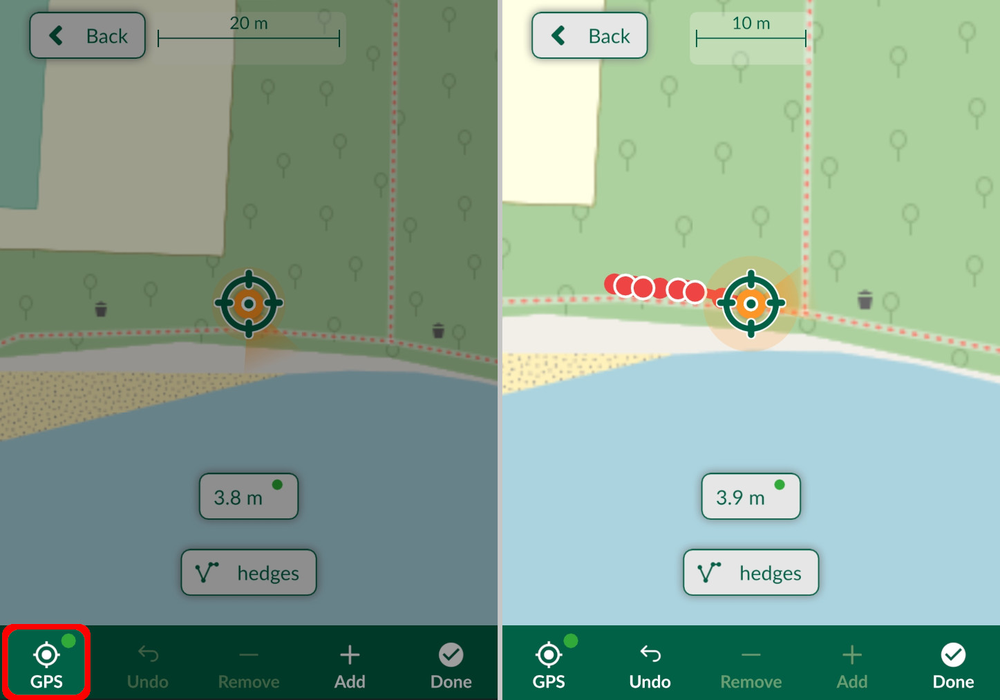
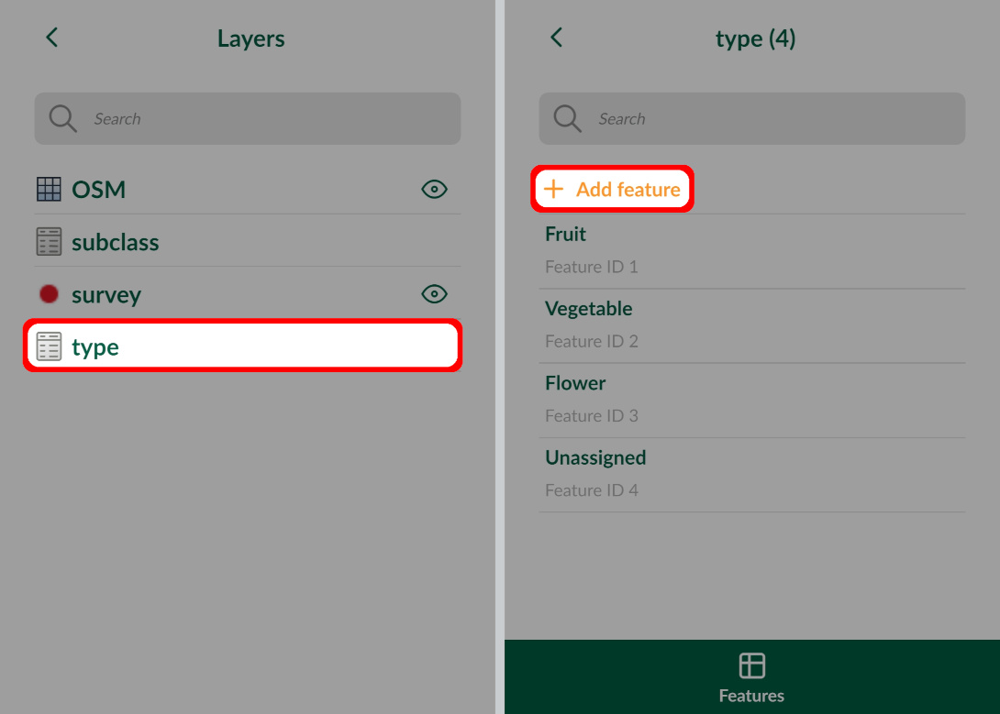
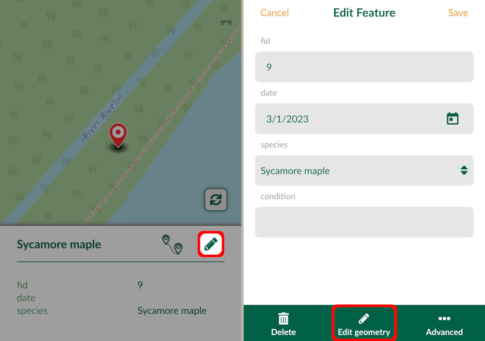
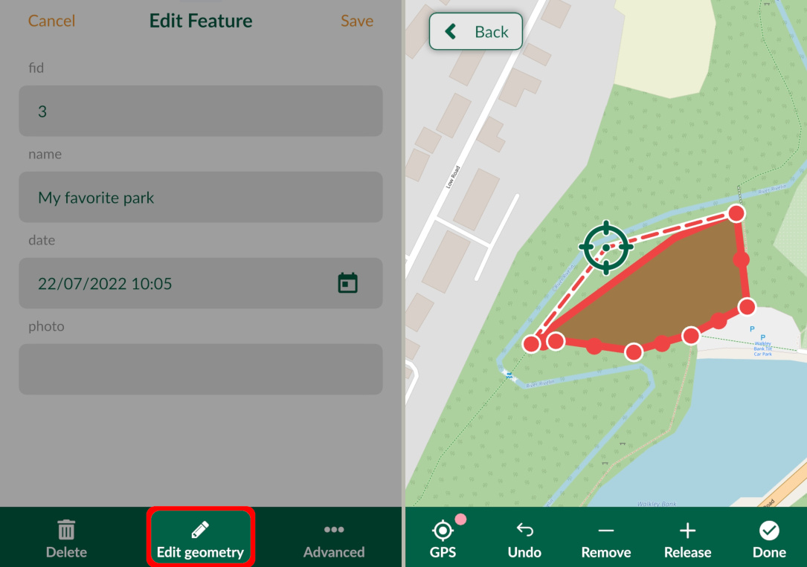
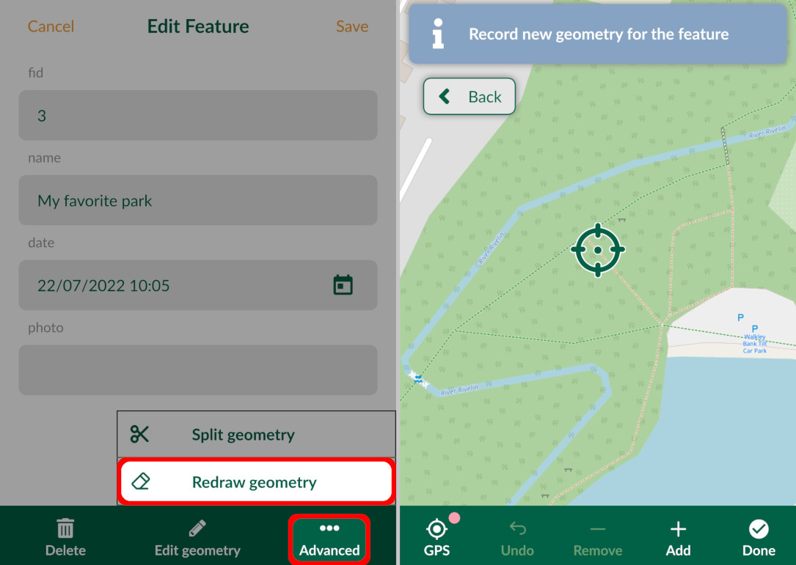
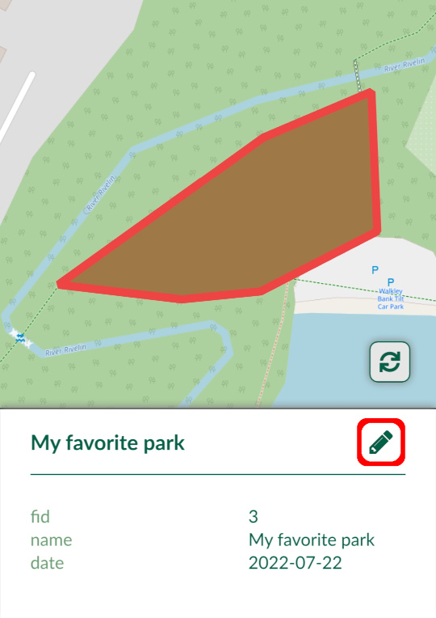
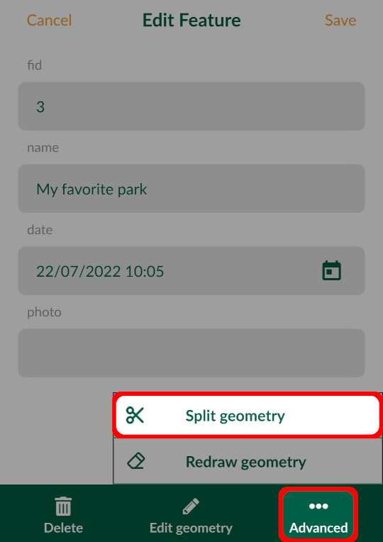
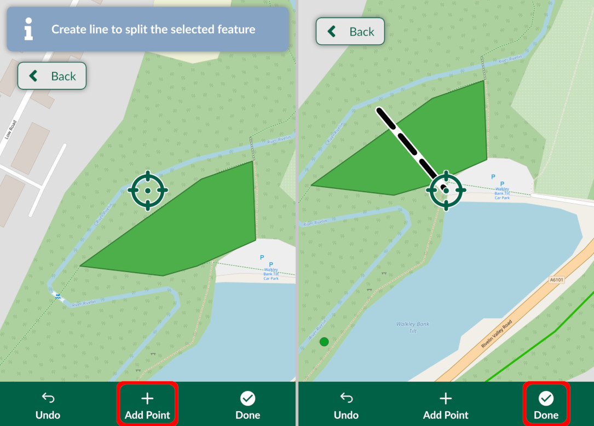
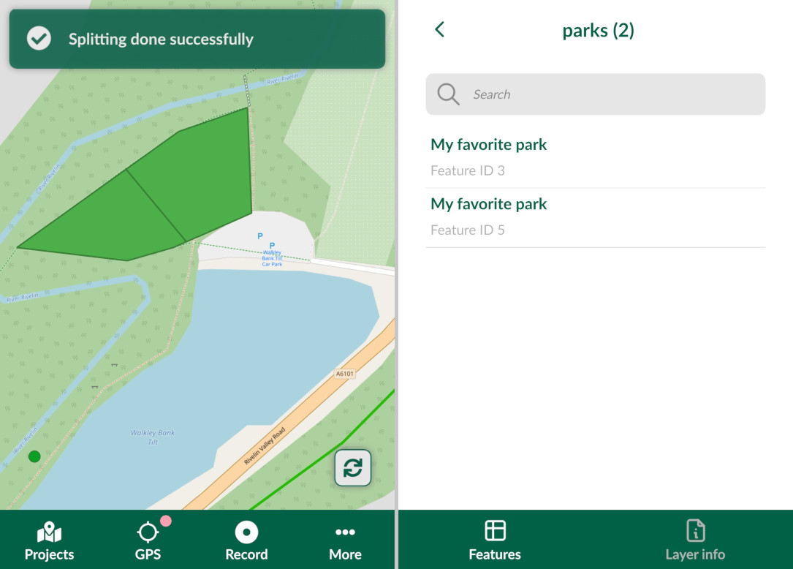

# How to Add, Edit, Delete Features

[[toc]]

The <MobileAppNameShort />  can be used to add, edit and delete features in the field by users with [writer or editor permission](../../manage/permissions/) to the <MainPlatformName /> project. Changes can be [synchronised](../autosync/) manually or automatically.

::: tip New to <MainPlatformName />?
If you are new to the <MobileAppNameShort />, it might be useful to get familiar with the [<MobileAppNameShort /> interface](../mobile-app-ui/) or to explore our [tutorials](../../tutorials/capturing-first-data/) that provide step-by-step instructions for common use cases. 
:::

## Adding features
1. In the <MobileAppNameShort />, open a [project](../mobile-app-ui/#projects) you want to use
2. Tap the **Add** button on the bottom navigation panel to enter the **recording mode**.

 

The crosshairs you will see on your map will be used as the recorded location. You can change the position of your point by pinching and dragging the background map. If you want to recenter the map to your current position, tap the **GPS** icon.

The **Active layer** is displayed on the top of the map window. This layer is used for surveying new features. To switch to a different (editable) layer, tap on the active layer and select one from the list.

The **Record button** is used to survey new features. Below, we describe recording of [points](#capture-points), [lines and areas](#capture-lines-or-areas). It is also possible to record [non-spatial](#add-non-spatial-features) features (e.g. adding a new entry to a table). Once the geometry of a feature is recorded, a form will open and you will be able to fill in the values. 

:::tip Attributes form make survey easier!
Attributes forms can be set up in QGIS to make the recording of attributes more efficient. For more details, see [Setting Up Widgets](../../layer/form-widgets/),  [Attributes Form Configuration](../../layer/form-configuration/) or [Attributes Form Layout](../../layer/form-layout/).
:::

### Capture points
To record a new point feature, tap the **Record** button (you have to be in the [recording mode](#adding-features)). 

Fill in the form as needed and tap the **Save** :heavy_check_mark: button. A point is added to the survey layer and is displayed on the map.

### Capture lines or areas
There are two methods of capturing lines and areas: adding vertices one by one or using the *streaming mode* to capture features based on your position.

#### Adding points to survey vertices of lines or areas
Lines and areas can be captured by adding vertices one by one. When you are in the [**recording**](#adding-features) mode and your active layer is a line or polygon, you will see line and areas editing tools in the bottom panel.

Tap **Add** to capture vertices of your line or area. If you want to change the position of the last vertex, tap **Remove**, move the vertex to the correct place and  **Release** it. **Undo** can be used to revert last changes.

Once the survey of the feature is completed, tap **Done** and fill in the form.

#### Streaming mode to survey lines or areas
Lines and areas can be also captured automatically based on your position. Make sure you are in the [**recording**](#adding-features) mode and that your active layer is a line or polygon.

To turn on the streaming mode, long press the **GPS** button. To turn it off, long press the **GPS** button again.

Once you are finished, tap **Done**. If you are capturing an area, the shape will be automatically closed by connecting the last and the first vertex.

You can change how often you want to capture a vertex in **Line rec. interval** in [**Settings**](../mobile-app-ui/#streaming-mode-and-recording-settings). The interval can be defined as time elapsed in seconds or as distance travelled in metres.

:::tip
The recording interval can be defined also in metres as distance travelled.
:::

### Add non-spatial features
[Non-spatial features](../../layer/non-spatial-data/) can also be added using <MobileAppName />. If you are using a non-spatial table for [value relations](../../layer/form-widgets/#value-relation) you can add and edit values in the app.

1. Tap the **More** button and navigate to **Layers**
   

2. Choose the non-spatial layer and tap **Add feature**
   
   
3. Fill in the attributes.

## Editing features
Spatial and non-spatial features can be browsed, edited and deleted in the [Layers](../layers/) panel in <MobileAppName />. Tap on the **Layers** in the **More** tab and select a layer to see the features it contains. 

Spatial features can be selected also on the map. Tap on a feature and press the edit button. Now you can change the attributes in the form. To edit the geometry of a feature, tap **Edit geometry** in the bottom panel.

To edit geometry of a point feature simply adjust the location by panning the map or use **GPS** in the same manner as when adding new features. Once you are happy with your changes, press **Done**.

### Edit geometry of lines or areas

It is also possible to edit the geometry of lines and areas. Tap on a line or polygon feature and press the **Edit** button. Then select **Edit geometry**.

The vertices of the feature will be highlighted and you can move or remove them as needed. Press **Done** to confirm your changes.

### Redraw geometry of lines or areas
The existing geometry of lines and areas can also be redrawn.

In the feature's form, tap the **Advanced** button and select the **Redraw geometry** option. Now you can record the new geometry using the tools in the bottom panel.

### Split geometry of lines or areas
Lines and areas can be split into two or more new features that will keep the same attributes as the original feature.

To split geometry of a feature:
1. Tap on a feature and press the edit button.

2. Tap **Advanced** and select **Split geometry**

3. Create the splitting line by adding points. When finished, tap **Done**

4. In this case, two individual features are created. Both have the same attributes, except for `Feature ID` (one feature keeps the original id, the other gets a new one).

## Snapping features

Snapping can be enabled in your <MainPlatformName /> project in QGIS to make the field survey easier. You can find the snapping options in [How to Set Up Snapping](../../gis/snapping/).

If snapping is enabled, the crosshairs will turn purple and snap to vertices (left) or segments (right) of existing features when capturing new features or editing existing features.

## Deleting features
To delete a feature, tap on it on the map and use the **Edit** button. Now you can delete the feature by tapping the **Delete** button. After confirming the deletion, the feature will be removed from the layer.

Until the project is synchronised to <MainPlatformNameLink />, these changes are only local. After synchronisation, they will be transferred to the cloud and can be shared with your collaborators. 

