# How to Add, Edit, Delete Features

[[toc]]

The <MobileAppNameShort />  can be used to add, edit and delete features in the field by users with [writer or editor permission](../../manage/permissions/) to the <MainPlatformName /> project. 

Until the project is synchronised to <MainPlatformNameLink />, all changes are local (stored only on your mobile device). Changes can be [synchronised](../autosync/) manually or automatically.

::: tip New to <MainPlatformName />?
If you are new to the <MobileAppNameShort />, it might be useful to get familiar with the [<MobileAppNameShort /> interface](../mobile-app-ui/) or to explore our [tutorials](../../tutorials/capturing-first-data/) that provide step-by-step instructions for common use cases. 
:::

:::warning Recording settings
The <MobileAppNameShort /> offers interesting options that can make your field survey easier and effective, such as [reuse last entered value](../reuse-last-values/), [automatic synchronisation](../autosync/#automatic-synchronisation), [auto-lock](../mobile-app-ui/#recording-settings) of your GPS position or [touch feedback](../mobile-app-ui/#recording-settings) to get a sound or vibration confirmation when adding features.

:::

## Adding features
1. In the <MobileAppNameShort />, open a [project](../mobile-app-ui/#projects) you want to use
2. Tap the **Add** button on the bottom navigation panel to enter the **recording mode**

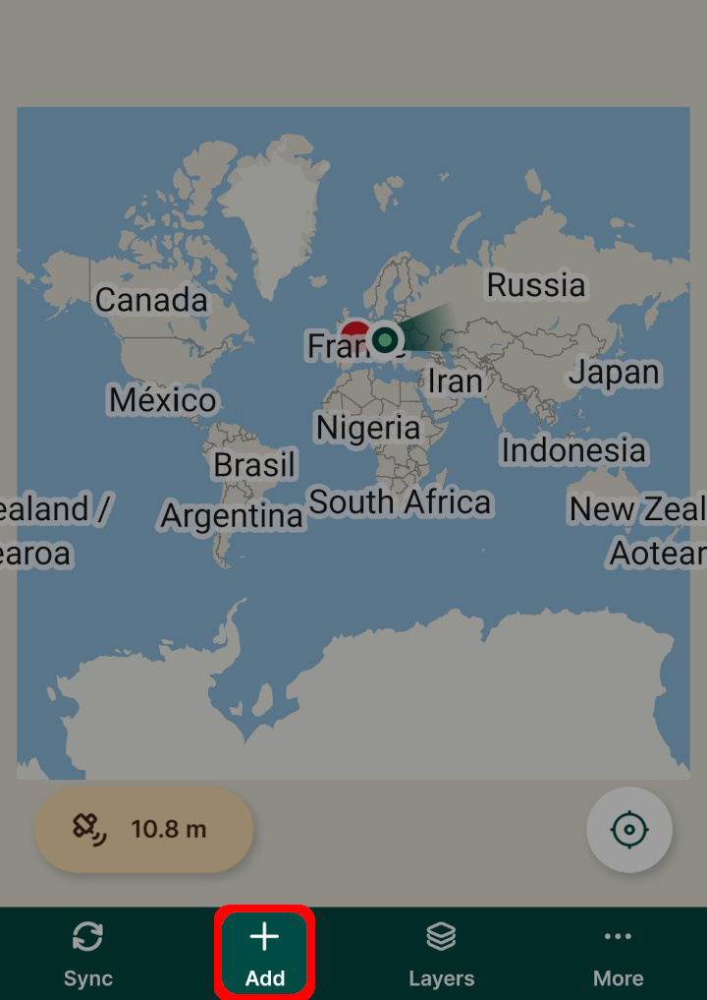 

The crosshairs you will see on your map are used as the recorded location. You can change the position of your point by pinching and dragging the background map. If you want to recenter the map to your current position, tap the **GPS** icon.

The *active layer* is displayed on the top of the map window. This layer is used for surveying new features. To switch to a different (editable) layer, tap on the active layer and select another one from the list.
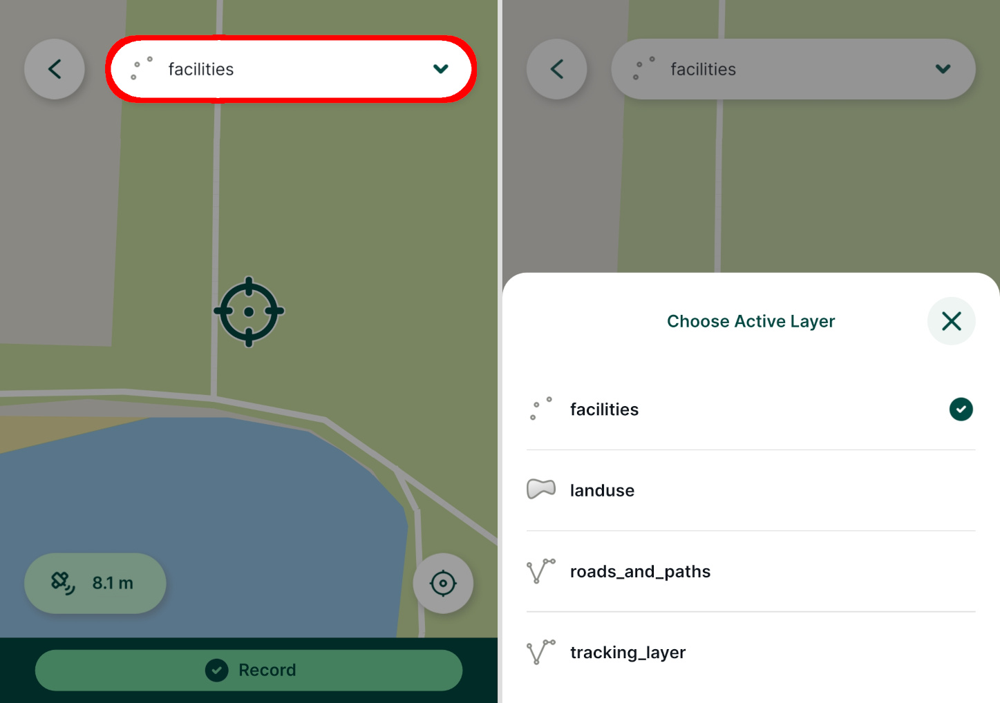

In the recording mode, the bottom panel contains tools to capture geometry depending on the geometry type of the active layer. Once the geometry is recorded, you can fill in the attributes form and save the feature.

Below, we describe capturing [point features](#capture-points), [lines and areas](#capture-lines-or-areas) as well as [non-spatial](#add-or-edit-non-spatial-features) records (e.g. adding a new entry to a table).

:::tip Attributes form make surveys easier!
Attributes forms can be set up in QGIS to make collecting data more efficient. For more details, see the [Configure Forms](../../layer/overview/) section.
:::

### Capture points
To record a new point, tap the **Record** button (you have to be in the [recording mode](#adding-features)). 

Fill in values in the form and tap the **Save** :heavy_check_mark: button. A point is added to the survey layer and is displayed on the map.

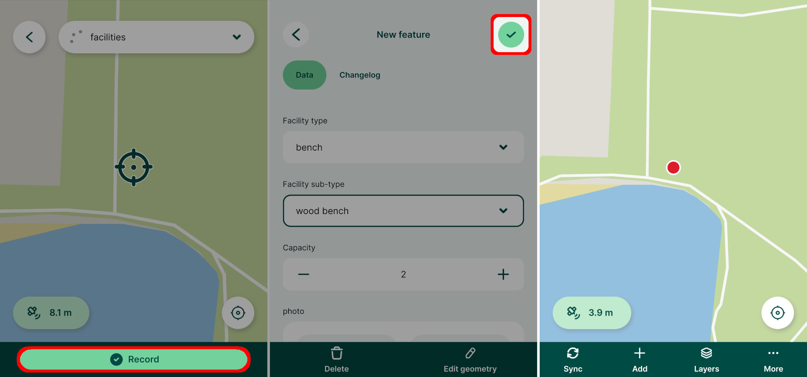

If you are using a layer with the MultiPoint geometry type, you have the option to **Add** parts as well as **Remove** and **Undo** button to modify them while recording the feature. MultiPoint feature can also be recorded by using the [*streaming mode*](#streaming-mode).

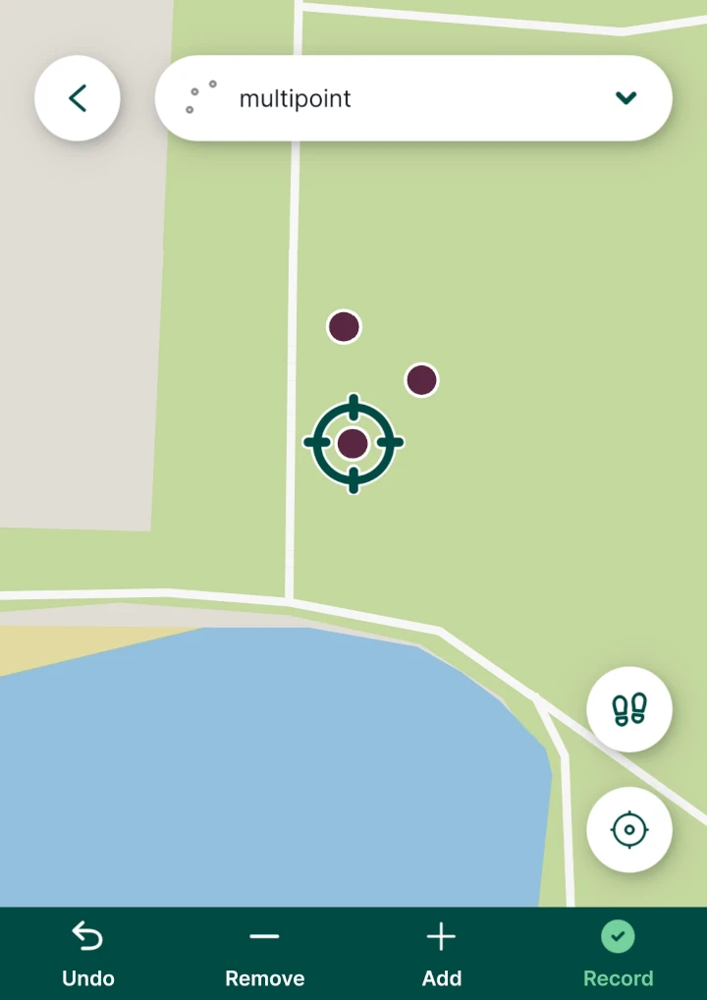

### Capture lines or areas
Lines and polygons can be captured by adding vertices one by one or by using the [*streaming mode*](#streaming-mode).

In the [**recording**](#adding-features) mode tap **Add** to capture vertices of your line or area. If you want to change the position of the last vertex, tap **Remove** and move the vertex to the correct place. **Undo** can be used to revert last changes.

Once the survey of the feature is completed, tap **Record** and fill in the form.
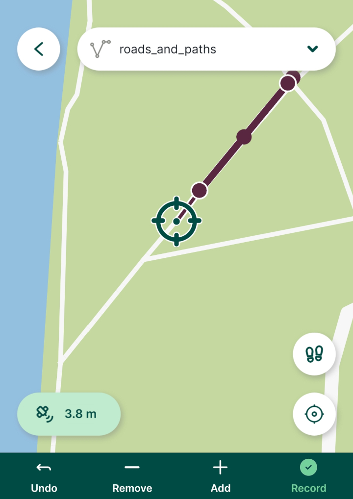

When using layers with multipart geometry types, parts of features can be added by tapping the **More options** button and selecting the **Add part** option.

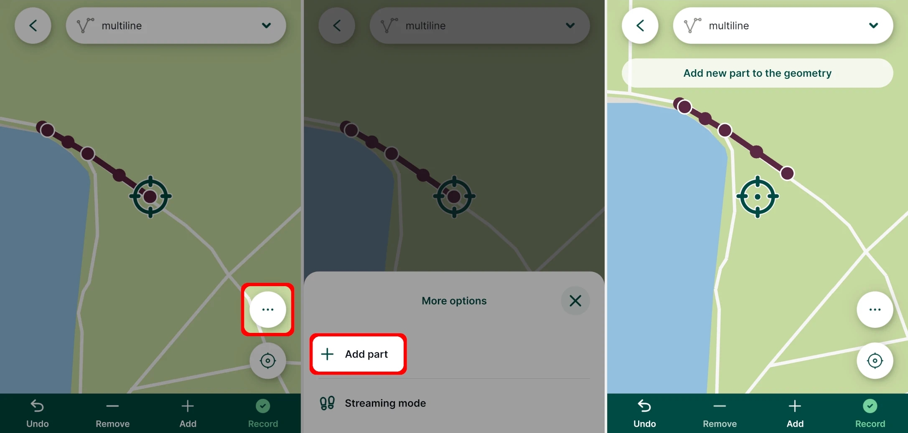

### Streaming mode
Features can also be captured automatically based on your position. Streaming is not available for layers with *Point* geometry.

Here is a video tutorial:
<YouTube id="069-fXNqyJY" title="Streaming mode" />

Tap the **streaming** button while in the [**recording**](#adding-features) mode and **Start streaming mode**. 

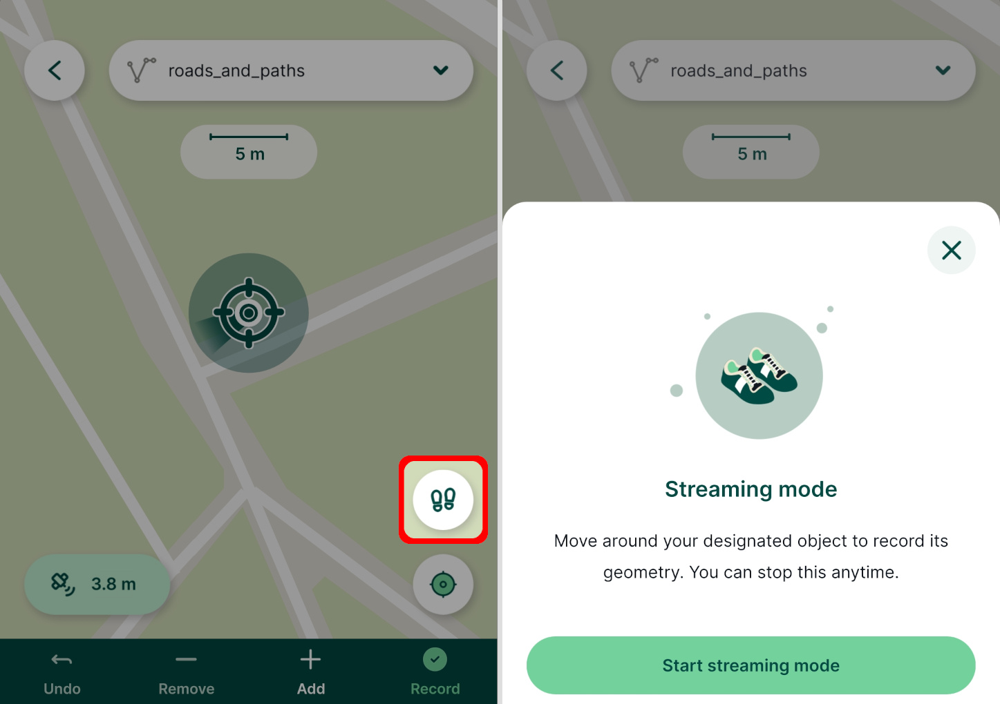

For layers with multipart geometry, the **streaming** option can be found in **More options**:
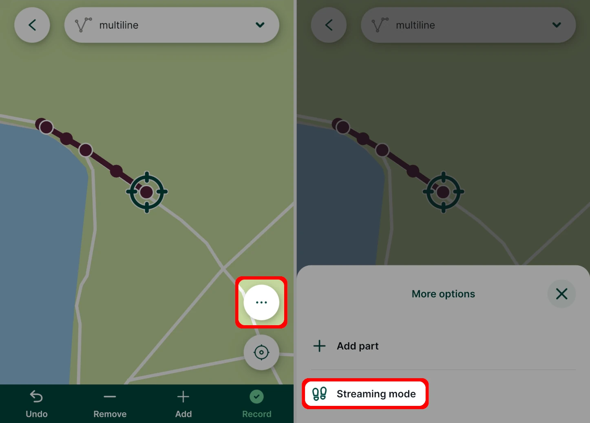

The vertices will be added automatically as you walk along the feature. 

To stop the streaming mode, tap the **streaming** button and then **Stop streaming mode**.

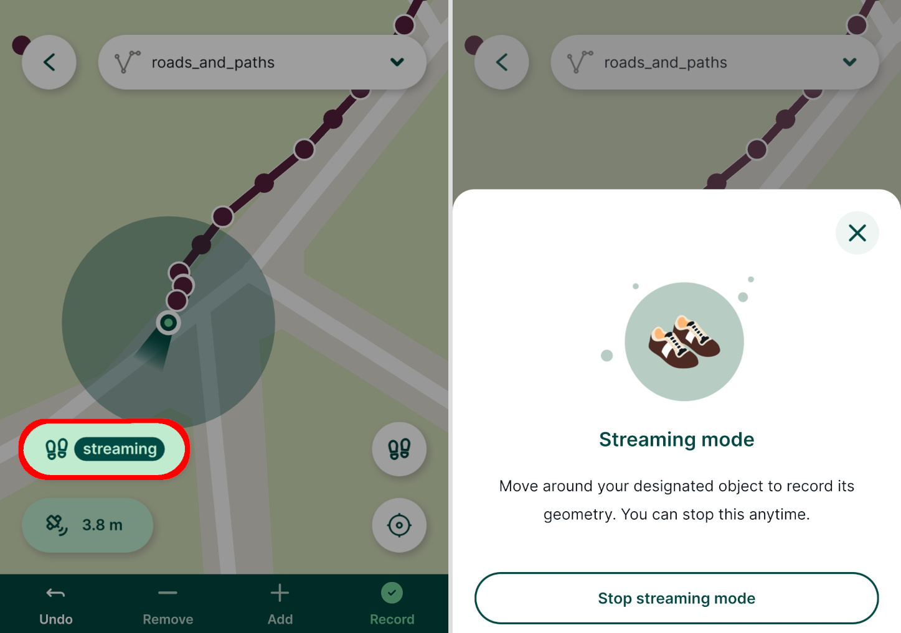

Once you finish surveying the feature, tap the **Record** button. If you are capturing an area, the shape will be automatically closed by connecting the last and the first vertex.

:::tip Threshold intervals for streaming mode
It is possible to set the **Threshold interval**, i.e. how often you want to capture a vertex when streaming, in [**Settings**](../mobile-app-ui/#streaming-mode-settings) of the <MobileAppNameShort />. The interval can be defined as *time elapsed* in seconds or as *distance travelled* in metres.
:::

## Editing features
Tap a feature on the map or *tap and hold* to select one from multiple overlaying features to display the form.

Use the **Edit** button to open the attributes form for editing. To edit the geometry of a feature, tap the **Edit geometry** button.

Once you are finished with your changes, use the **Save** :heavy_check_mark: button.

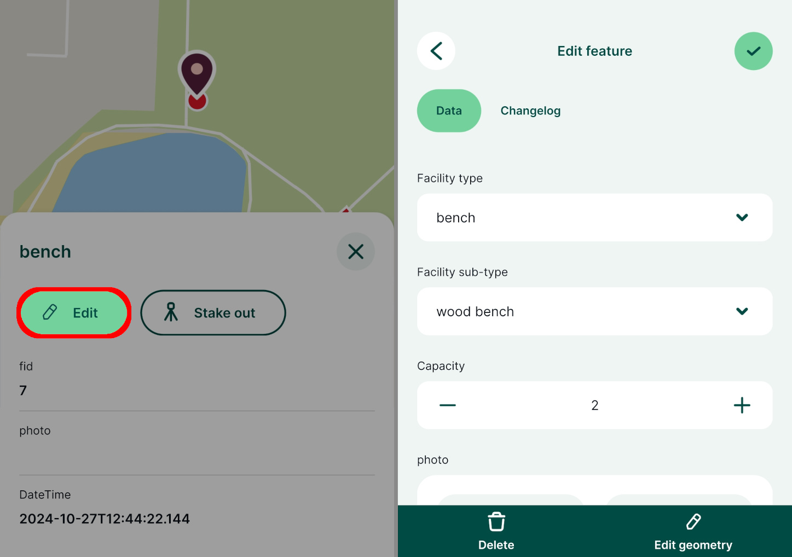

Features can also be browsed, edited and deleted through the [Layers](../layers/) panel. Layers that are set as [read-only](../../gis/enable_digitising/) in the project properties cannot be edited.
- Tap the **Layers** button in the bottom navigation panel and select a layer to see the list of features it contains. 
- Select a feature from the list in the **Layers** panel to display its form and edit the values or geometry. 

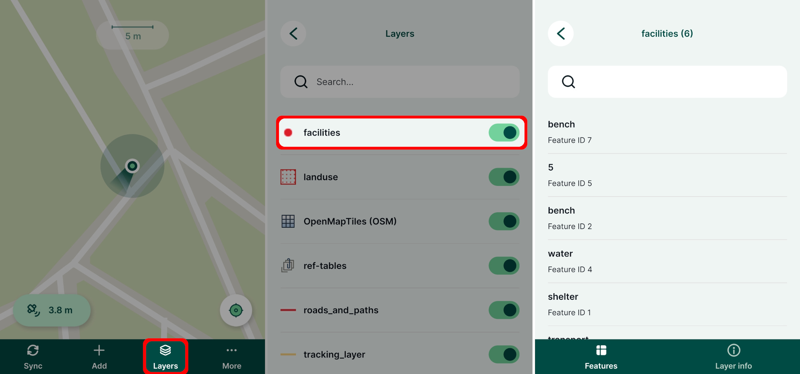

### Editing geometry
There are multiple options of editing the geometry of features depending on the geometry type of the survey layer: editing the vertices, [redrawing](#redraw-geometry) or [splitting](#split-geometry-of-lines-or-areas) features.

To edit geometry of a point feature simply adjust the location in the same manner as when [adding new features](#capture-points).

Layers with MultiPoint, lines and polygon geometries offer more options. Tap a feature, press the **Edit** button and then use **Edit geometry**. The vertices of the feature will be highlighted. You can move, **Release** or **Remove** them as needed. Tap the **Record** button to save the modified geometry.

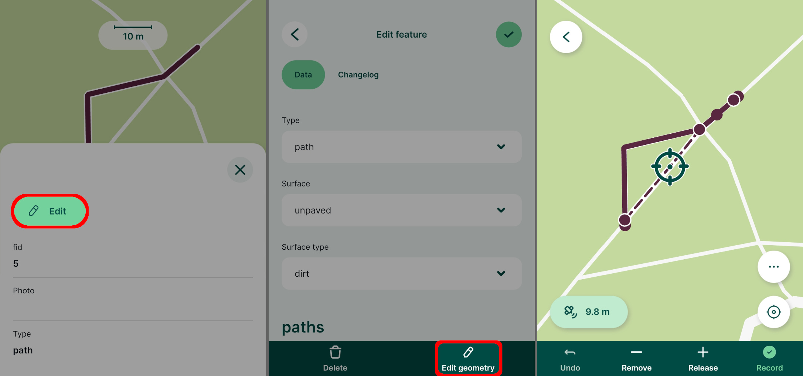

### Adding part of multipart geometry
Parts can be added to features from survey layers with multipart geometry type (MultiPoint, MultiLine, MultiPolygon) while editing geometry.

Tap the **More option** button while editing geometry and use the **Add part** option.

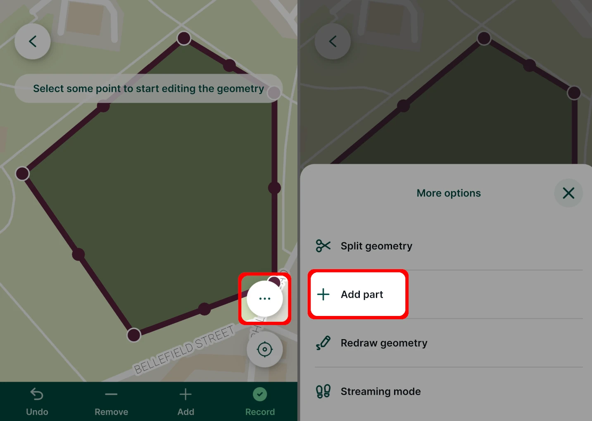

Capture the part by using the editing tools and **Record** your changes. The part is added to the geometry of the feature.

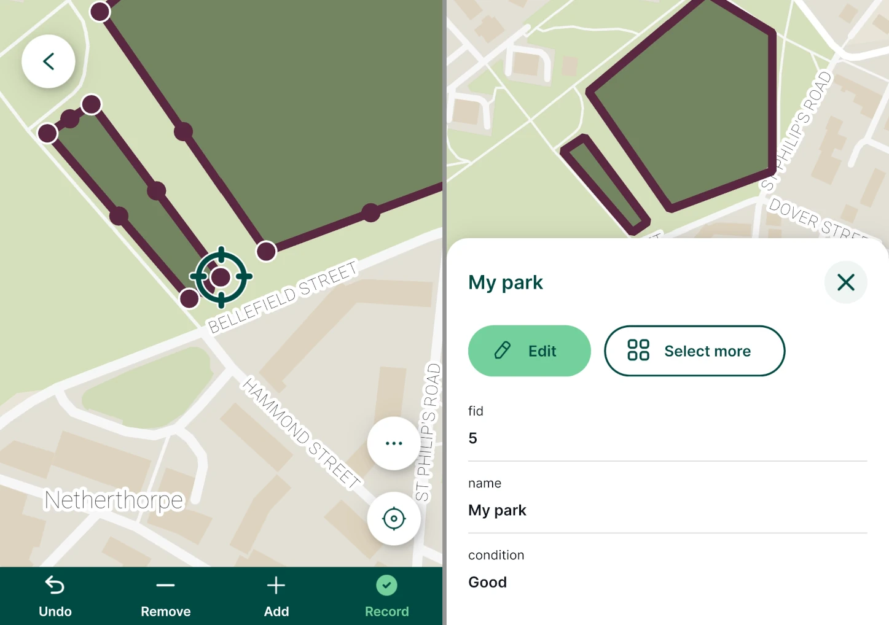

### Using streaming mode to edit geometry
The [streaming mode](#streaming-mode) can be also used while editing features with compatible geometry type. Tap the **More option** button and use the **Streaming mode**. 

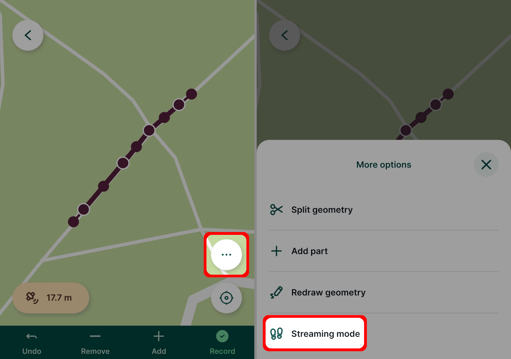

### Redraw geometry
The existing geometry of lines, areas and MultiPoint geometry can also be redrawn.

Tap the **More option** button and select the **Redraw geometry** option. 

Capture the new geometry of the feature using the editing tools or streaming and use the **Record** button to save your changes.

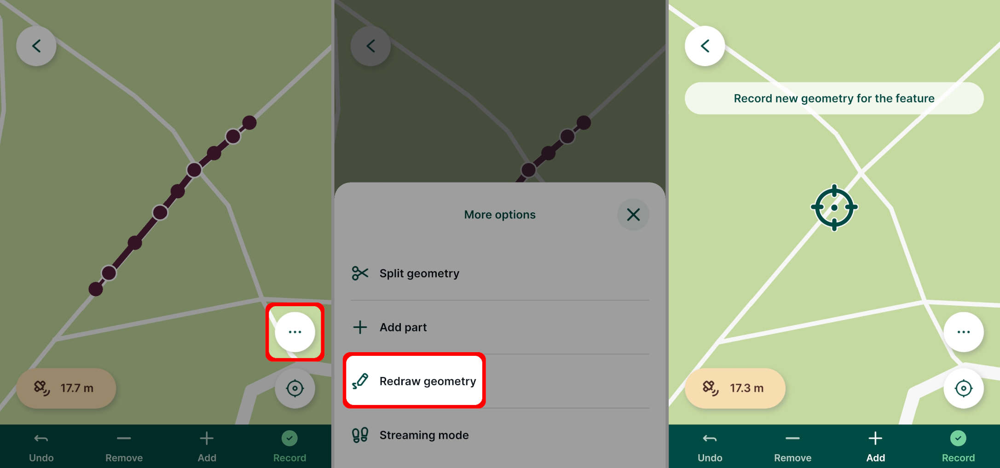

### Split geometry of lines or areas
Lines and areas can be split into two or more new features that will keep the same attributes as the original feature.

Tap the **More option** button and select the **Split geometry** option. Create the splitting line by using the **Add point** button. 

When finished, tap **Done**.
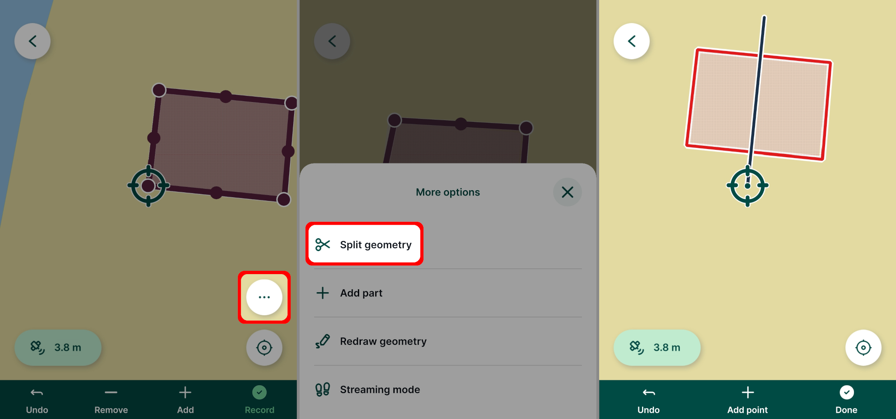

In this case, two individual features are created. Both have the same attributes, except for `Feature ID` (one feature keeps the original id, the other gets a new one).
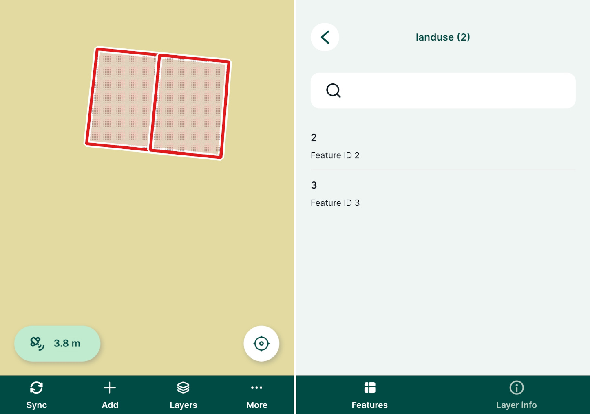

## Multi-features editing

Attributes of multiple features from the same layer can be edited at once.
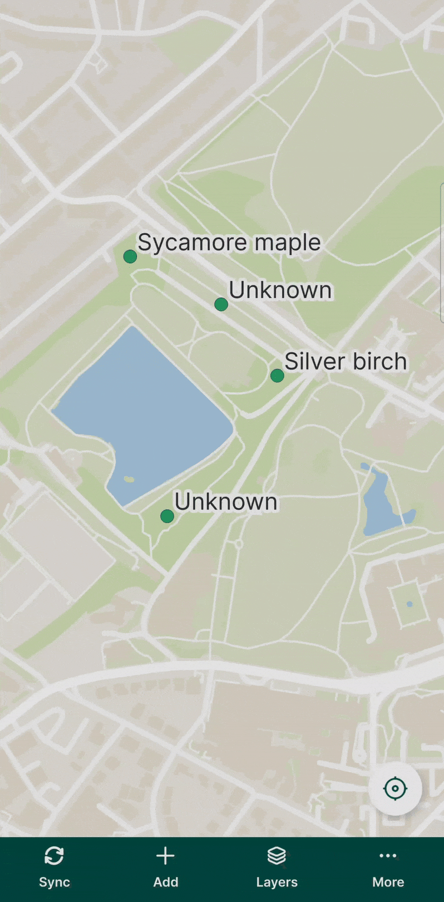

1. Tap on a feature on the map and select the **Select more** option.

   Depending on your mobile device, you may need to use a button next to **Edit** to display this option.
   

2. Select all features that should be edited. 

3. In the attributes form, enter the new values of attributes and **Save**.

   All selected features have been modified at once.

## Snapping features

Snapping can be enabled in your <MainPlatformName /> project in QGIS to make the field survey easier. You can find the snapping options in [How to Set Up Snapping](../../gis/snapping/).

If snapping is enabled, the crosshairs will turn purple and snap to vertices (left) or segments (right) of existing features when capturing new features or editing existing features.
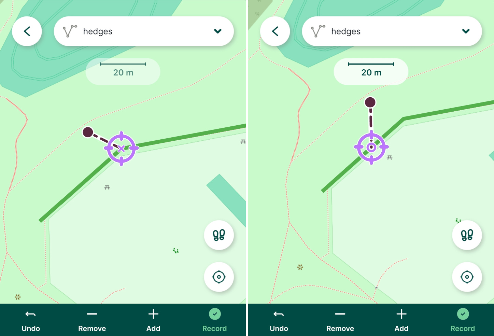

## Add or edit non-spatial features
Non-spatial features, such as tables for [value relations](../../layer/value-select/#value-relation), can also be added or edited in the <MobileAppNameShort />.

1. Tap the **Layers** button and select the layer you want to edit
   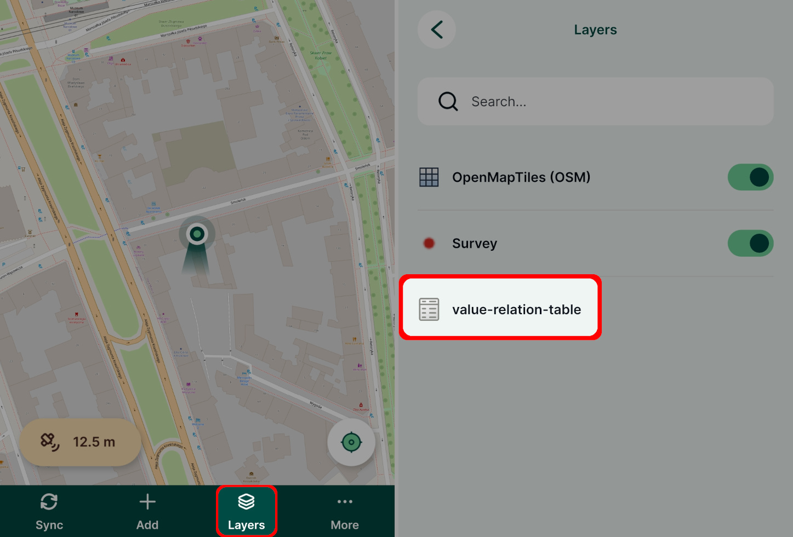

2. Tap an existing feature to change it or tap the **Add feature** button to create a new feature
   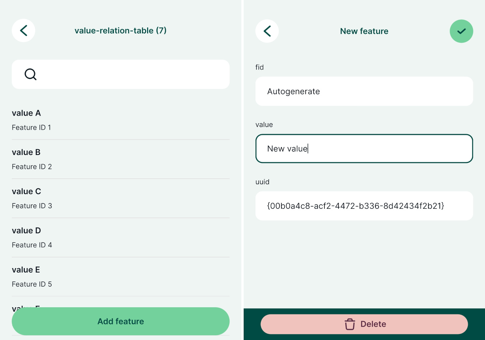
   
3. Fill in the attributes and **Save** :heavy_check_mark: the changes

## Avoid polygons overlap
In QGIS, you can set the option to avoid overlapping for polygons. This setting is stored in the <MainPlatformName /> project and used when editing features both in QGIS and the <MobileAppNameShort />.

See [How to Avoid Polygons Overlap](../../gis/avoid-overlap/) for more details.

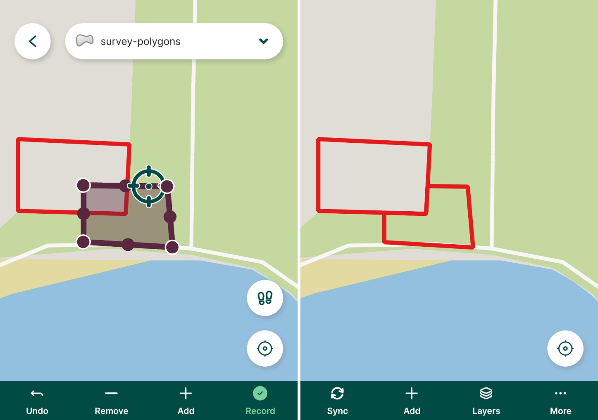

## Deleting features

1. Tap on a feature on the map or find it through [**Layers**](../../field/layers/)
2. Use the **Edit** button to open the attributes form
3. Tap the **Delete** button and confirm the deletion

After confirming that you want to delete the feature, it will be removed from the layer.

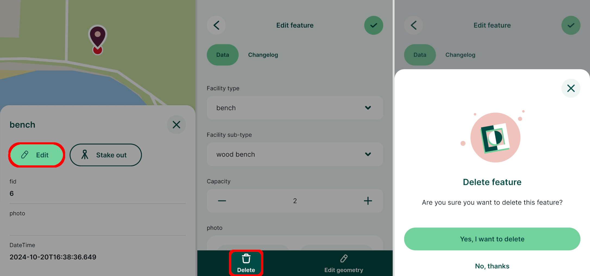

### Multi-features deleting
Multiple features can be deleted at once:

1. Select one of the features you want to delete and use the **Select more** button.

   Depending on your mobile device, you may need to use a button next to **Edit** to display this option.

2. Select all features that should be deleted on the map

3. Use the **Delete** button to delete all selected features at once

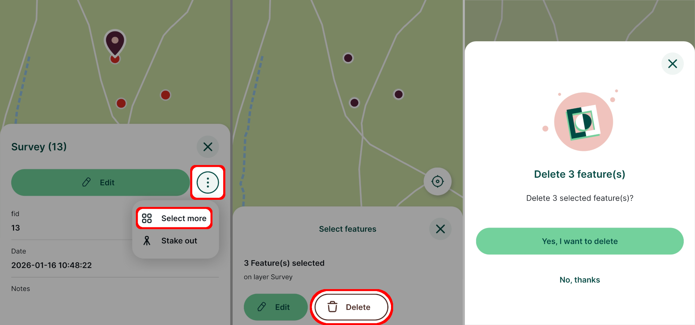

