# Adding Features

[[toc]]

The <MobileAppNameShort />  can be used to add, edit and delete features in the field by users with [writer or editor permission](../../manage/permissions/) to the <MainPlatformName /> project. 

Until the project is synchronised to <MainPlatformNameLink />, all changes are local (stored only on your mobile device). Changes can be [synchronised](../autosync/) manually or automatically.

::: tip New to <MainPlatformName />?
If you are new to the <MobileAppNameShort />, it might be useful to get familiar with the [<MobileAppNameShort /> interface](../mobile-app-ui/) or to explore our [tutorials](../../tutorials/capturing-first-data/) that provide step-by-step instructions for common use cases. 
:::

:::warning Recording settings
The <MobileAppNameShort /> offers interesting options that can make your field survey easier and effective, such as [reuse last entered value](../reuse-last-values/), [automatic synchronisation](../autosync/#automatic-synchronisation), [auto-lock](../mobile-app-ui/#recording-settings) of your GPS position or [touch feedback](../mobile-app-ui/#recording-settings) to get a sound or vibration confirmation when adding features.

:::

1. In the <MobileAppNameShort />, open a [project](../mobile-app-ui/#projects) you want to use
2. Tap the **Add** button on the bottom navigation panel to enter the **recording mode**

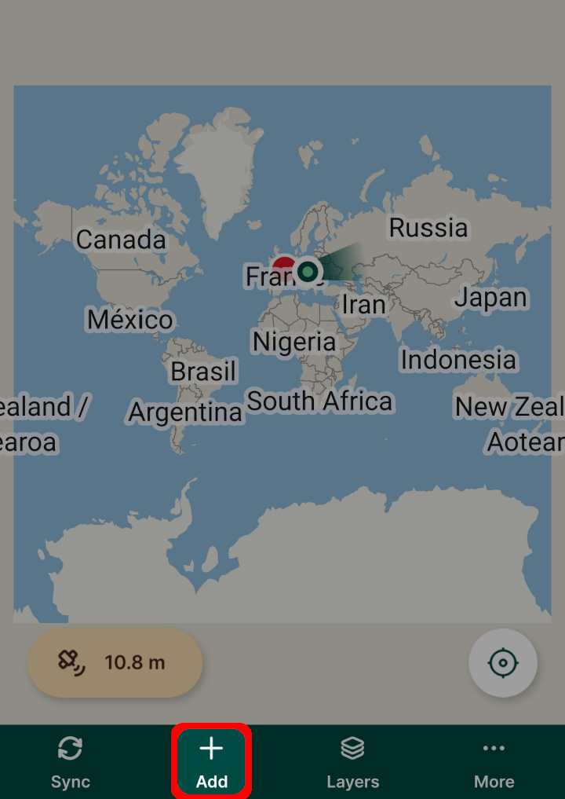 

The crosshairs you will see on your map are used as the recorded location. You can change the position of your point by pinching and dragging the background map. If you want to recenter the map to your current position, tap the **GPS** icon.

The *active layer* is displayed on the top of the map window. This layer is used for surveying new features. To switch to a different (editable) layer, tap on the active layer and select another one from the list.
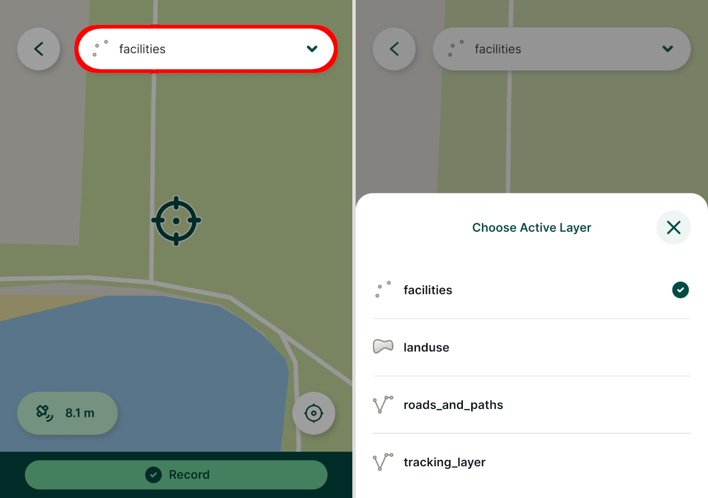

In the recording mode, the bottom panel contains tools to capture geometry depending on the geometry type of the active layer. Once the geometry is recorded, you can fill in the attributes form and save the feature.

Below, we describe capturing [point features](#capture-points), [lines and areas](#capture-lines-or-areas) as well as [non-spatial](#add-or-edit-non-spatial-features) records (e.g. adding a new entry to a table).

:::tip Attributes form make surveys easier!
Attributes forms can be set up in QGIS to make collecting data more efficient. For more details, see the [Configure Forms](../../layer/overview/) section.
:::

## Capture points
To record a new point, tap the **Record** button (you have to be in the [recording mode](#adding-features)). 

Fill in values in the form and tap the **Save** :heavy_check_mark: button. A point is added to the survey layer and is displayed on the map.

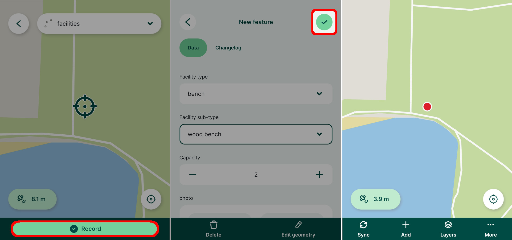

If you are using a layer with the MultiPoint geometry type, you have the option to **Add** parts as well as **Remove** and **Undo** button to modify them while recording the feature. MultiPoint feature can also be recorded by using the [*streaming mode*](#streaming-mode).

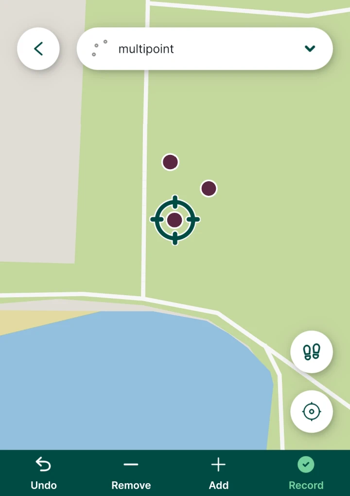

## Capture lines or areas
Lines and polygons can be captured by adding vertices one by one or by using the [*streaming mode*](#streaming-mode).

In the [**recording**](#adding-features) mode tap **Add** to capture vertices of your line or area. If you want to change the position of the last vertex, tap **Remove** and move the vertex to the correct place. **Undo** can be used to revert last changes.

Once the survey of the feature is completed, tap **Record** and fill in the form.
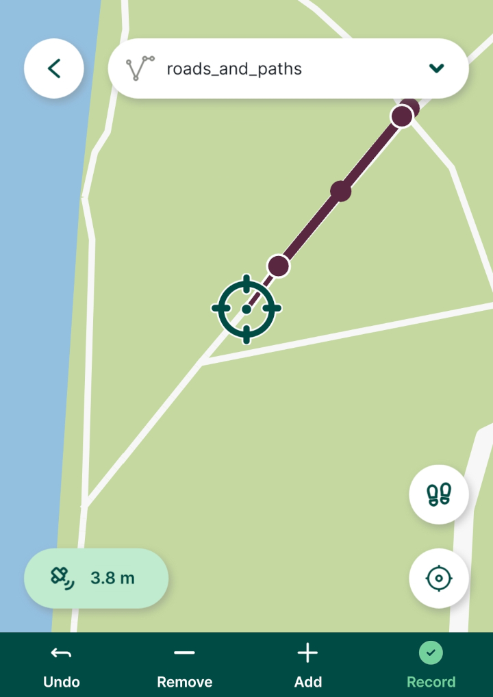

When using layers with multipart geometry types, parts of features can be added by tapping the **More options** button and selecting the **Add part** option.

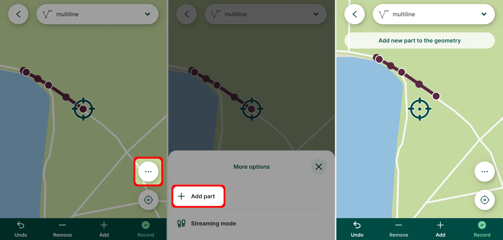

## Streaming mode
Features can also be captured automatically based on your position. Streaming is not available for layers with *Point* geometry.

Here is a video tutorial:
<YouTube id="069-fXNqyJY" title="Streaming mode" />

Tap the **streaming** button while in the [**recording**](#adding-features) mode and **Start streaming mode**. 

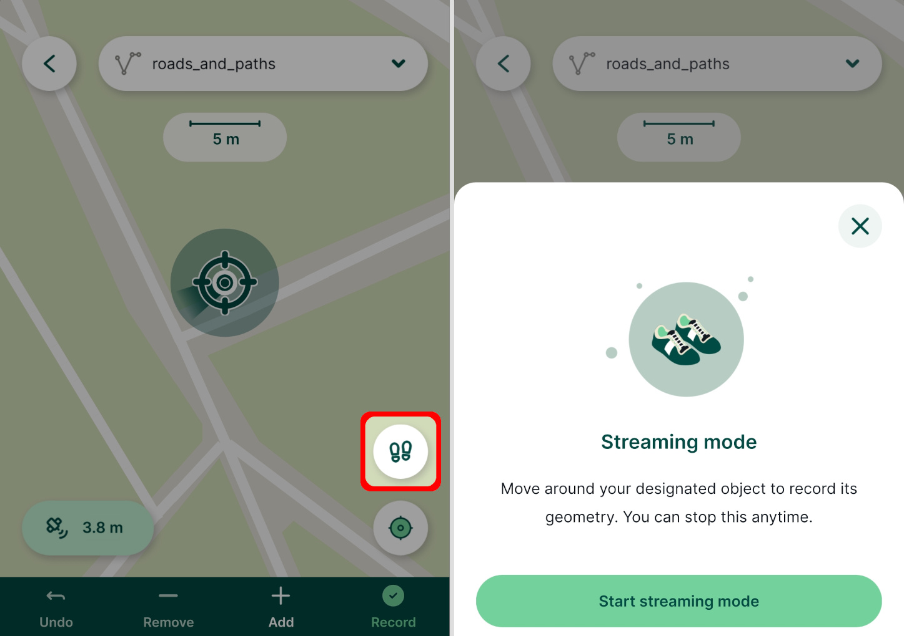

For layers with multipart geometry, the **streaming** option can be found in **More options**:
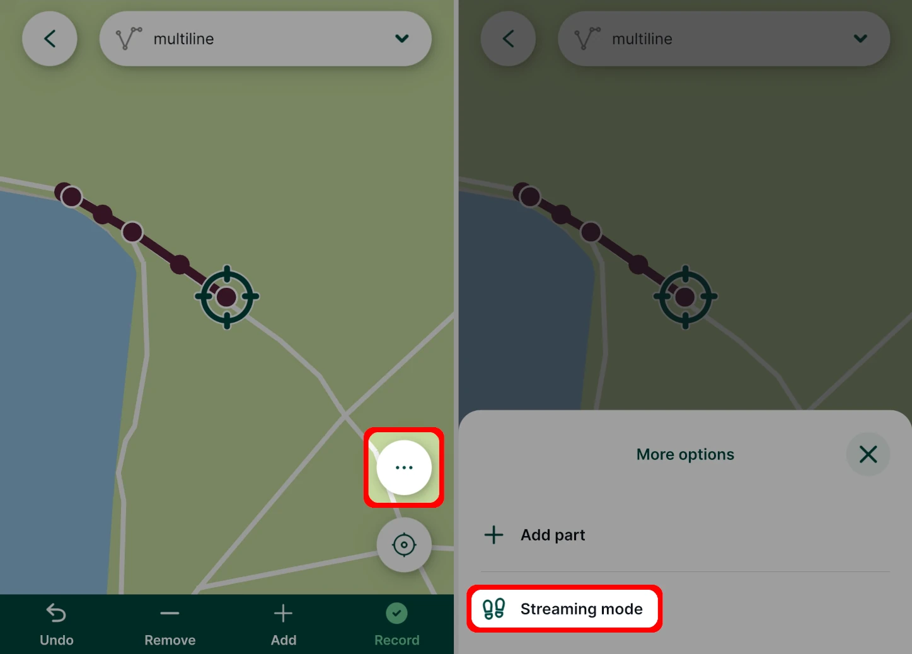

The vertices will be added automatically as you walk along the feature. 

To stop the streaming mode, tap the **streaming** button and then **Stop streaming mode**.

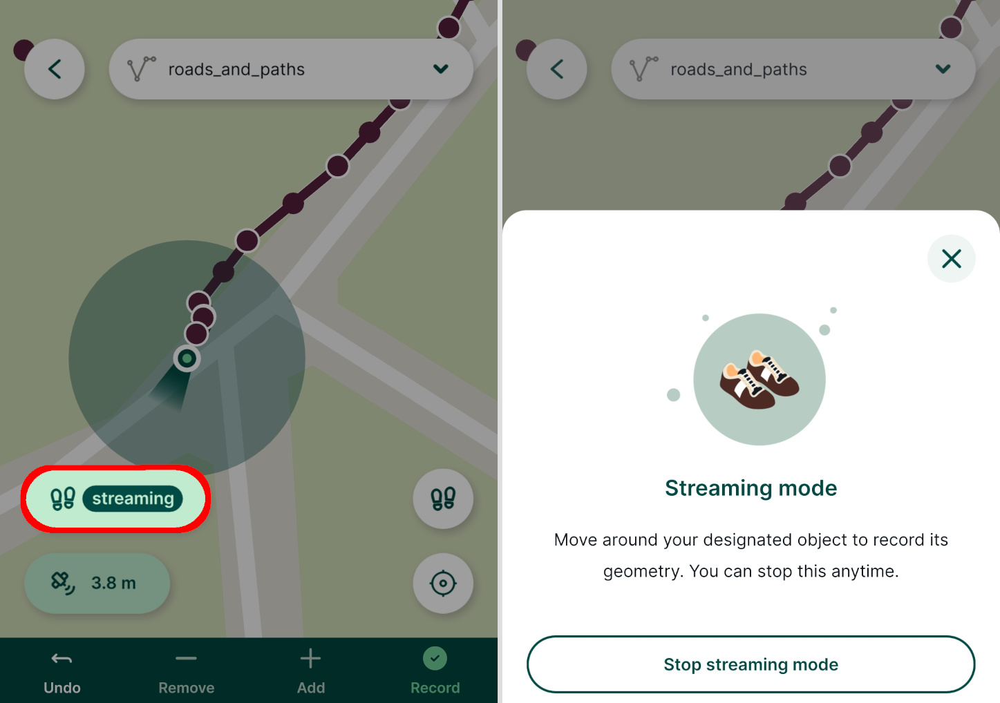

Once you finish surveying the feature, tap the **Record** button. If you are capturing an area, the shape will be automatically closed by connecting the last and the first vertex.

:::tip Threshold intervals for streaming mode
It is possible to set the **Threshold interval**, i.e. how often you want to capture a vertex when streaming, in [**Settings**](../mobile-app-ui/#streaming-mode-settings) of the <MobileAppNameShort />. The interval can be defined as *time elapsed* in seconds or as *distance travelled* in metres.
:::

## Add non-spatial features
Non-spatial features, such as tables for [value relations](../../layer/value-select/#value-relation), can also be added or edited in the <MobileAppNameShort />.

1. Tap the **Layers** button and select the layer you want to edit
   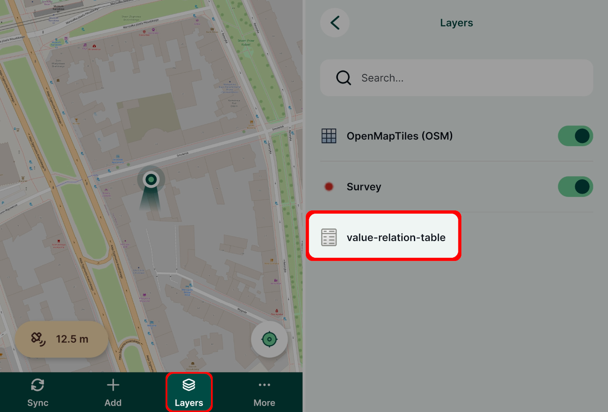

2. Tap an existing feature to change it or tap the **Add feature** button to create a new feature
   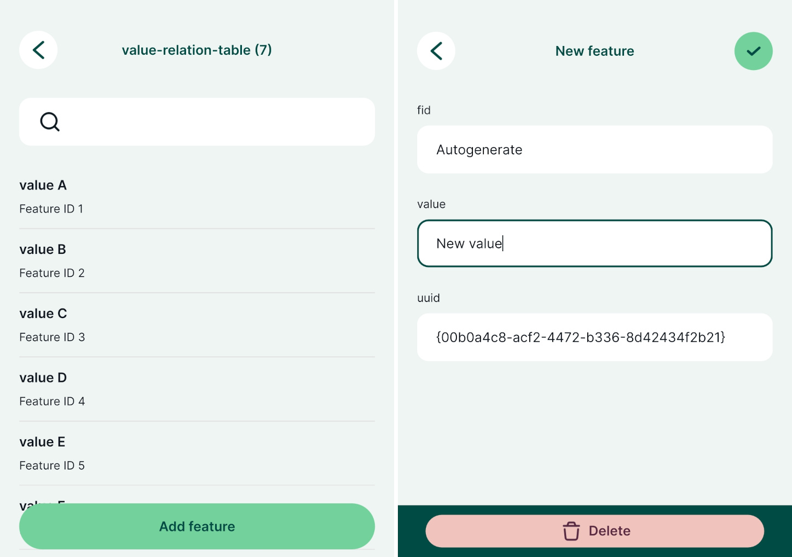
   
3. Fill in the attributes and **Save** :heavy_check_mark: the changes
