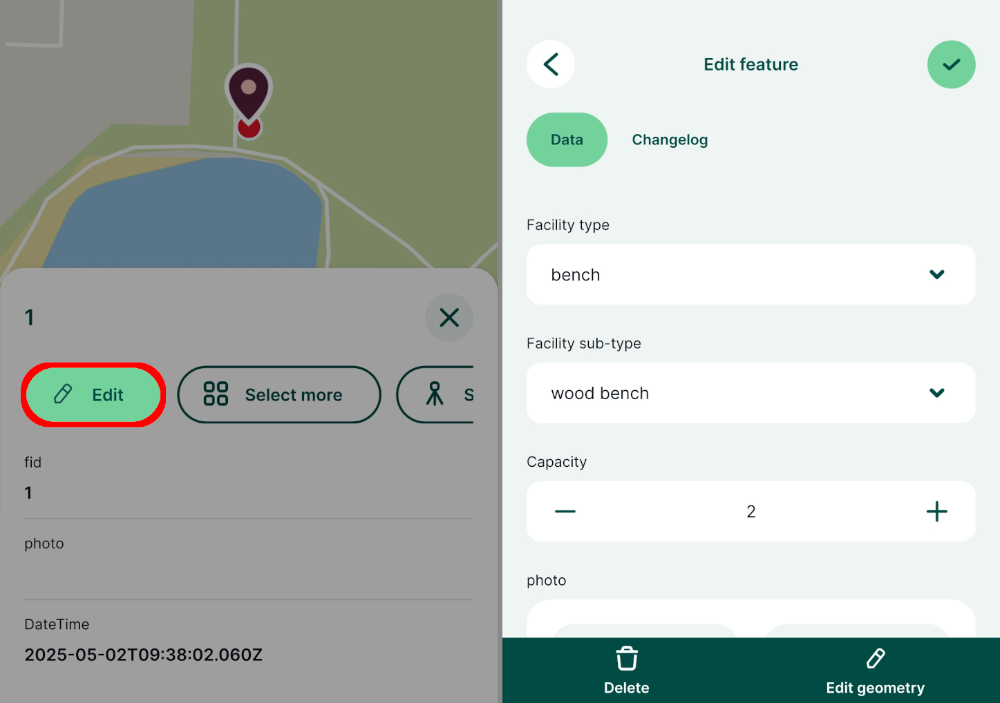

# How to Add, Edit, Delete Features

[[toc]]

The <MobileAppNameShort />  can be used to add, edit and delete features in the field by users with [writer or editor permission](../../manage/permissions/) to the <MainPlatformName /> project. 

Until the project is synchronised to <MainPlatformNameLink />, all changes are local (stored only on your mobile device). Changes can be [synchronised](../autosync/) manually or automatically.

::: tip New to <MainPlatformName />?
If you are new to the <MobileAppNameShort />, it might be useful to get familiar with the [<MobileAppNameShort /> interface](../mobile-app-ui/) or to explore our [tutorials](../../tutorials/capturing-first-data/) that provide step-by-step instructions for common use cases. 
:::

## Adding features
1. In the <MobileAppNameShort />, open a [project](../mobile-app-ui/#projects) you want to use
2. Tap the **Add** button on the bottom navigation panel to enter the **recording mode**

 

The crosshairs you will see on your map are used as the recorded location. You can change the position of your point by pinching and dragging the background map. If you want to recenter the map to your current position, tap the **GPS** icon.

The *active layer* is displayed on the top of the map window. This layer is used for surveying new features. To switch to a different (editable) layer, tap on the active layer and select another one from the list.

In the recording mode, the bottom panel contains tools to capture geometry. Once the geometry is recorded, you can fill in the attributes form and save the feature.

Below, we describe capturing [point features](#capture-points), [lines and areas](#capture-lines-or-areas) as well as [non-spatial](#add-or-edit-non-spatial-features) records (e.g. adding a new entry to a table).

:::tip Attributes form make surveys easier!
Attributes forms can be set up in QGIS to make collecting data more efficient. For more details, see [Setting Up Widgets](../../layer/form-widgets/),  [Attributes Form Configuration](../../layer/form-configuration/) or [Attributes Form Layout](../../layer/form-layout/).
:::

### Capture points
To record a new point feature, tap the **Record** button (you have to be in the [recording mode](#adding-features)). 

Fill in the form as needed and tap the **Save** :heavy_check_mark: button. A point is added to the survey layer and is displayed on the map.

### Capture lines or areas
There are two methods of capturing lines and areas: [adding vertices](#adding-points-to-survey-vertices-of-lines-or-areas) one by one or using the [*streaming mode*](#streaming-mode-to-survey-lines-or-areas) to capture features based on your position.

#### Adding points to survey vertices of lines or areas
Lines and areas can be captured by adding vertices one by one. When you are in the [**recording**](#adding-features) mode and your active layer is a line or polygon, you will see line and areas editing tools in the bottom panel.

Tap **Add** to capture vertices of your line or area. If you want to change the position of the last vertex, tap **Remove** and move the vertex to the correct place. **Undo** can be used to revert last changes.

Once the survey of the feature is completed, tap **Record** and fill in the form.

#### Streaming mode to survey lines or areas
Lines and areas can be also captured automatically based on your position. Make sure you are in the [**recording**](#adding-features) mode and that your active layer is a line or polygon.

Tap the **streaming** button and then **Start streaming mode**.

The vertices will be added automatically as you walk along the feature. 

To stop the streaming mode, tap the **streaming** button and then **Stop streaming mode**.

Once you finish surveying the feature, tap the **Record** button. If you are capturing an area, the shape will be automatically closed by connecting the last and the first vertex.

:::tip Threshold intervals for streaming mode
It is possible to set the **Threshold interval**, i.e. how often you want to capture a vertex when streaming, in [**Settings**](../mobile-app-ui/#streaming-mode-and-recording-settings) of the <MobileAppNameShort />. The interval can be defined as *time elapsed* in seconds or as *distance travelled* in metres.
:::

## Editing features
Features can be browsed, edited and deleted through the [Layers](../layers/) panel in the <MobileAppNameShort />. Note that layers that are set as [read-only](../../gis/enable_digitising/) in the project properties cannot be edited.

Tap the **Layers** button in the bottom navigation panel and select a layer to see the list of features it contains. 

To edit the attributes or geometry of a feature, select it from the list in the **Layers** panel. It is also possible to simply tap a feature on the map or *tap and hold* to select one from multiple overlaying features.

Use the **Edit** button to open the attributes form. Here you can change the values of attributes as needed. To edit the geometry of a feature, tap the **Edit geometry** button.

To edit geometry of a point feature simply adjust the location in the same manner as when [adding new features](#capture-points). 

Once you are finished with your changes, tap the **Save** :heavy_check_mark: button.

### Edit geometry of lines or areas
There are multiple options when it comes to editing the geometry of lines and polygons: editing the vertices, [redrawing](#redraw-geometry-of-lines-or-areas) or [splitting](#split-geometry-of-lines-or-areas) features.

Tap a line or polygon feature, press the **Edit** button and then use **Edit geometry**. The vertices of the feature will be highlighted. You can move, release or remove them as needed. Tap the **Record** button to save the modified geometry.

The [streaming mode](#streaming-mode-to-survey-lines-or-areas) can be also used while editing lines or areas. Tap the **More option** button and use the **Streaming mode**. 

### Redraw geometry of lines or areas
The existing geometry of lines and areas can also be redrawn completely.

Tap the **More option** button and select the **Redraw geometry** option. 

Capture the new geometry of the feature using the editing tools or streaming and use the **Record** button to save your changes.

### Split geometry of lines or areas
Lines and areas can be split into two or more new features that will keep the same attributes as the original feature.

Tap the **More option** button and select the **Split geometry** option. Create the splitting line by using the **Add point** button. 

When finished, tap **Done**.

In this case, two individual features are created. Both have the same attributes, except for `Feature ID` (one feature keeps the original id, the other gets a new one).

## Multi-features editing

Attributes of multiple features from the same layer can be edited at once.

1. Tap on a feature on the map and select the **Select more** option.
   

2. Select all features that should be edited. 

3. In the attributes form, enter the new values of attributes and **Save**.

   All selected features have been modified at once.

## Snapping features

Snapping can be enabled in your <MainPlatformName /> project in QGIS to make the field survey easier. You can find the snapping options in [How to Set Up Snapping](../../gis/snapping/).

If snapping is enabled, the crosshairs will turn purple and snap to vertices (left) or segments (right) of existing features when capturing new features or editing existing features.

## Add or edit non-spatial features
[Non-spatial features](../../layer/non-spatial-data/), such as tables for [value relations](../../layer/form-widgets/#value-relation), can also be added or edited in the <MobileAppNameShort />.

1. Tap the **Layers** button and select the layer you want to edit
   

2. Tap an existing feature to change it or tap the **Add feature** button to create a new feature
   
   
3. Fill in the attributes and **Save** :heavy_check_mark: the changes

## Deleting features

1. Tap on a feature on the map or find it through [**Layers**](../../field/layers/)
2. Use the **Edit** button to open the attributes form
3. Tap the **Delete** button and confirm the deletion

After confirming that you want to delete the feature, it will be removed from the layer.

