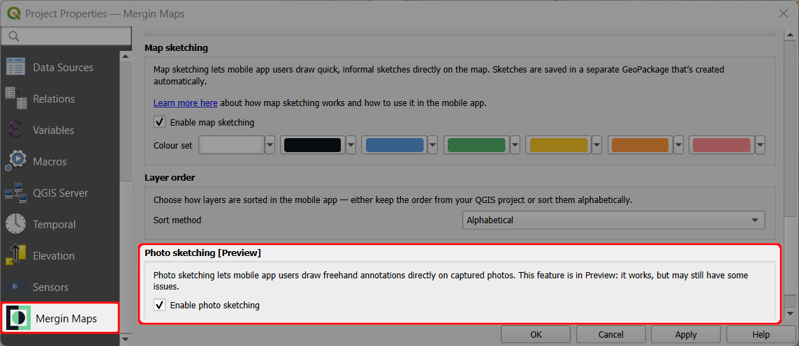
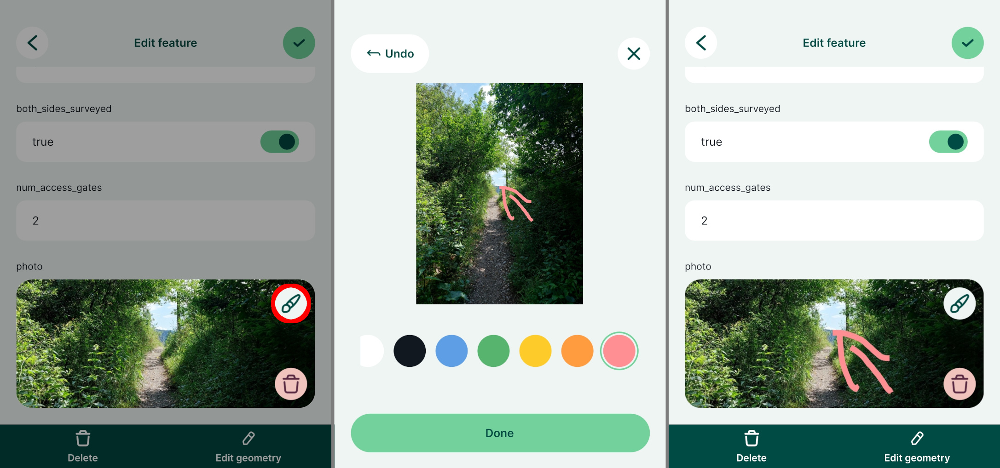

# Photo Sketching

[[toc]]

Photo sketches can be used to annotate photos or pictures added to a feature, in addition to the regular field collection of [features](../mobile-features/) or [photos](../../layer/photos/).

:::warning Preview feature
Photo sketching is a feature in preview. While it works for most devices and setups, you may encounter some issues.
:::

## Enable photo sketching

<SinceBadge type="Plugin" version="2025.3.4" />

Photo sketching is disabled by default. To use it, it needs to be enabled in QGIS when [preparing your <MainPlatformName /> project](../../gis/features/#photo-sketching).

1. Open your <MainPlatformName /> project in QGIS
2. Navigate to **Project** > **Properties** 
   

3. In the <MainPlatformName /> tab, check the **Enable photo sketching** option and **Apply** the changes.
   

5. Save and synchronise your project!

::: tip 
If you do not see this option in the **Project properties**, check for [plugin upgrades](../../setup/install-mergin-maps-plugin-for-qgis/#plugin-upgrade).
:::

## Photo sketching in the mobile app
To use photo sketching in the <MobileAppNameShort />, make sure it is [enabled in the project](#enable-photo-sketching).

1. Open a form with a [photo widget](../../layer/photos/) for editing and tap the **Photo sketching** button.
   - Draw your sketches on the photo by freehand or using a stylus. You choose from 7 annotation colours.
   - Use the **Undo** button to revert the last changes.
    
   

2. Use the **Done** button to finish sketching. The picture with sketches will be displayed in the form.

3. Save and synchronise the changes. A copy of the original picture with the sketches will be saved to <MainPlatformName />. 

