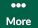
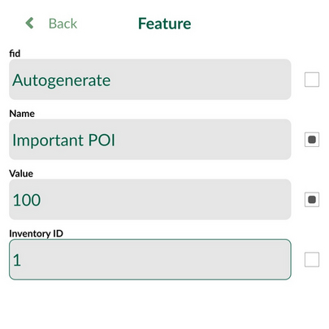

# How to Reuse Last Entered Values

Reusing last entered values of selected attributes can make digitising of similar features in <MobileAppName /> faster. When attributes are marked for reuse, the values from the last feature are already entered when a new feature is created.

## Reuse last value option

To allow this functionality, follow these steps:

 - Open your project from the home screen
 - Click on three dots to open a menu and navigate to **Settings**

 - Toggle on `Reuse last value option`

 - Go back to map
 - Click **Record** and create a new feature
 - In the form you will see checkboxes next to attributes. Here, we have three editable attributes (besides `fid`). Check the attributes, which values you want to reuse in features you will create next. In our case, we checked the `Name` and `Value`. **Save** the feature.

 - When creating another feature, the checked attributes in the form will contain the values from the previous feature.

You can use the `Reuse last value option` across multiple layers. <MobileAppName /> will remember attributes for each layer separately.

This feature was inspired by QGIS functionality called *Reuse last entered attribute values*.
