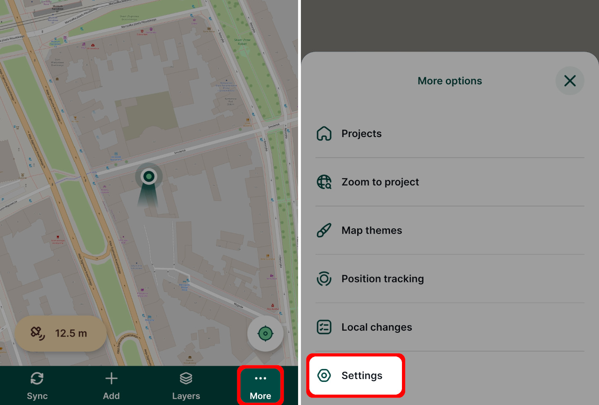
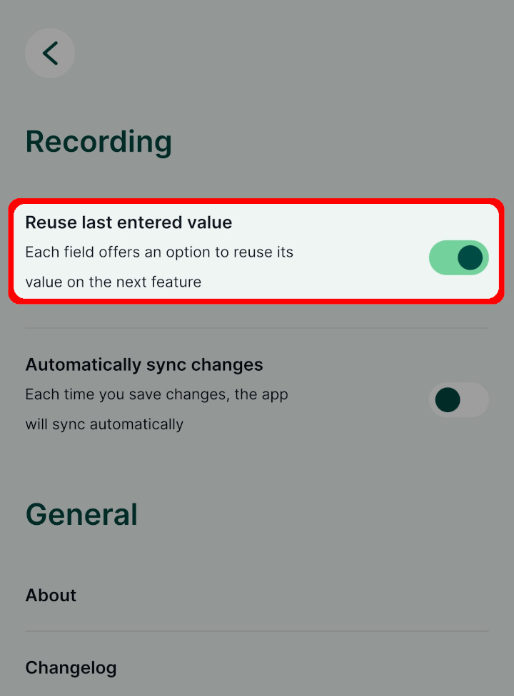
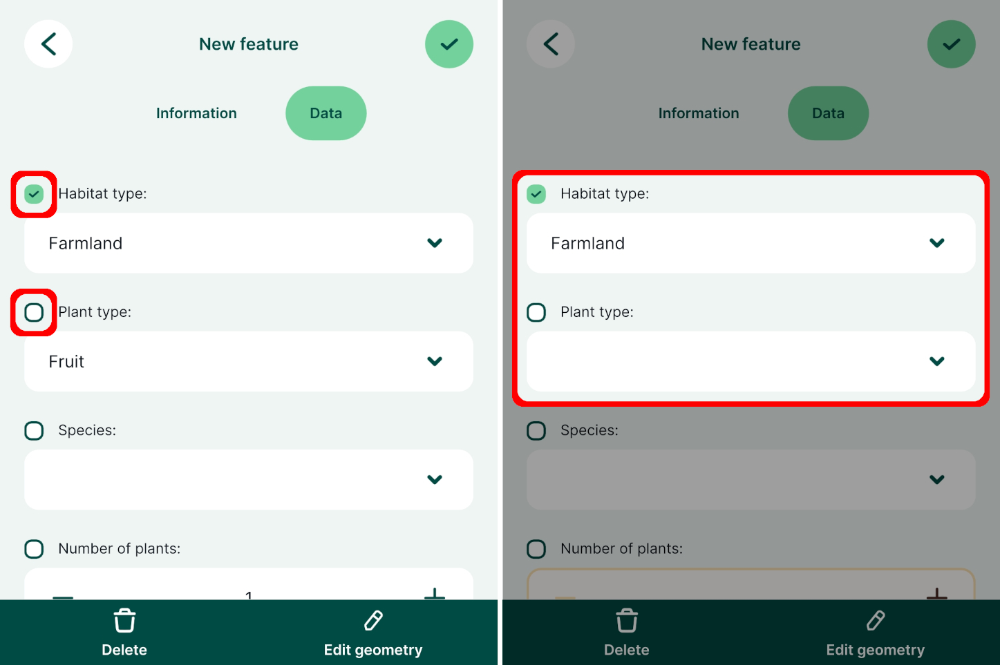
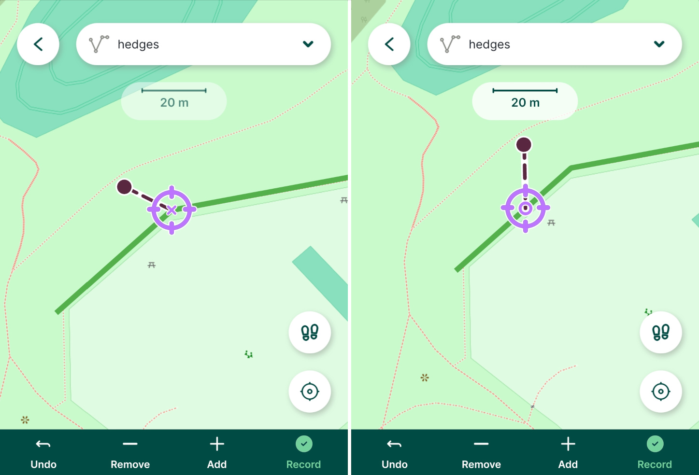
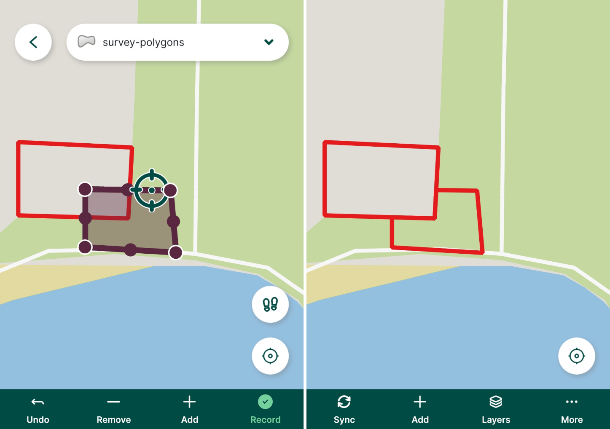

# Editing Options
[[toc]]

## Reuse last value option

Reusing last entered values of selected attributes can make digitising of similar features in the <MobileAppNameShort /> faster. When attributes are marked for reuse, the values from the last feature are already entered when a new feature is created.

To allow this functionality, follow these steps:

1. Open your <MainPlatformNameLink /> project in the <MobileAppNameShort />

2. Click on three dots to open a menu and navigate to **Settings**

   

3. Toggle on the `Reuse last entered value` option

4. Go back to the map. When capturing a new feature, there will be check boxes next to attributes in the form. 

   Select the attributes which values you want to reuse (here, we checked the `Habitat type`) and **Save** the feature.

   When recording another feature in this survey layer, the checked attributes in the form will contain the value that was entered in the last created feature.

You can use the `Reuse last value option` across multiple layers. The <MobileAppNameShort /> will remember attributes for each layer separately.

This feature was inspired by QGIS functionality called *Reuse last entered attribute values*.

## Snapping features

Snapping can be enabled in your <MainPlatformName /> project in QGIS to make the field survey easier. You can find the snapping options in [How to Set Up Snapping](../../gis/snapping/).

If snapping is enabled, the crosshairs will turn purple and snap to vertices (left) or segments (right) of existing features when capturing new features or editing existing features.

## Avoid polygons overlap
In QGIS, you can set the option to avoid overlapping for polygons. This setting is stored in the <MainPlatformName /> project and used when editing features both in QGIS and the <MobileAppNameShort />.

See [How to Avoid Polygons Overlap](../../gis/avoid-overlap/) for more details.

