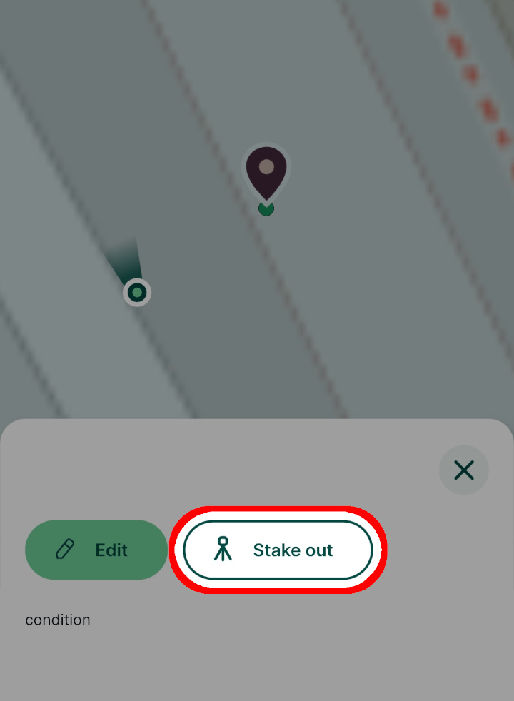
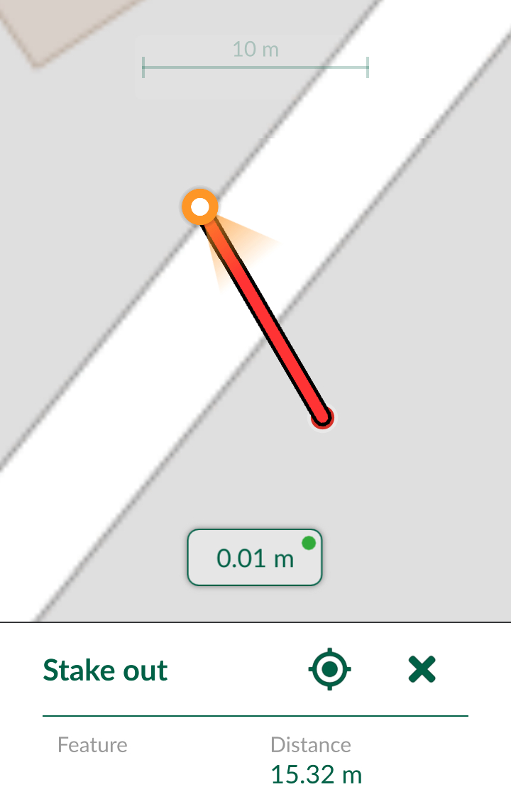
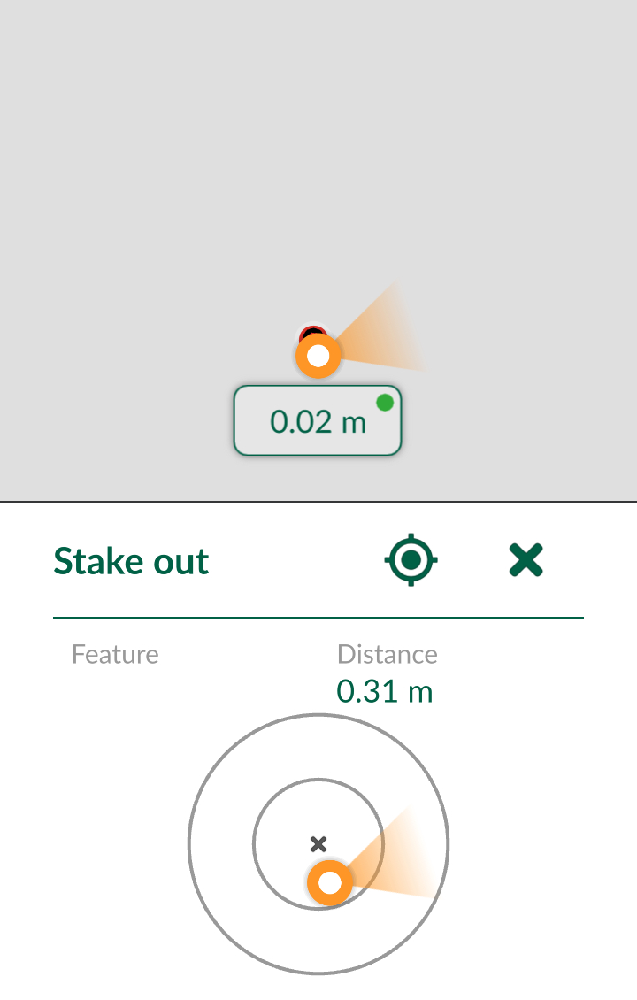
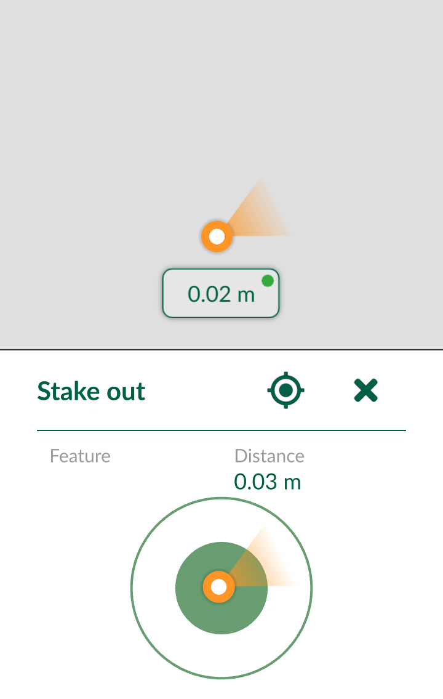
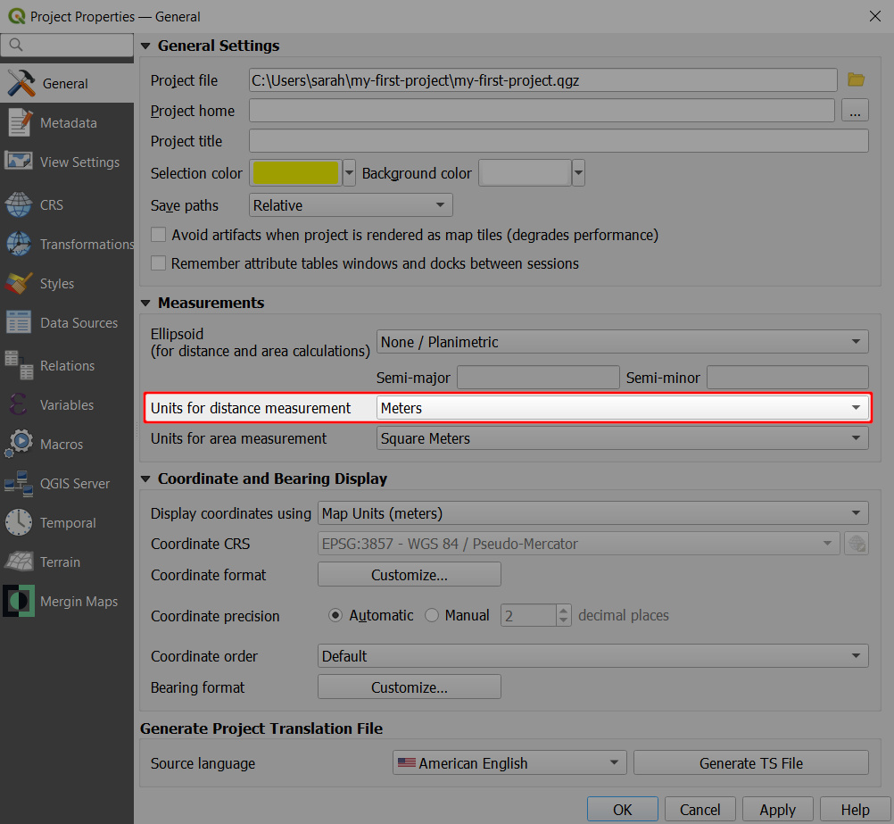

# How to Stake Out Points
[[toc]]

::: warning
Our mobile app was redesigned. We are in the process of updating this content to reflect these changes.
:::

Points in your survey layers can be staked out. <MobileAppName /> will navigate you towards the selected point showing you the direction and distance.

There are two stake out modes:
- long navigation mode
- short navigation mode

:::tip
Accurate stake out in short navigation mode may require an [external GPS receiver](../external-gps/) with GPS corrections.
:::

## Stake out in Mergin Maps mobile app
1. Select a point in your map window. From the form select the **Stake out** icon:

2. Stake out panel will appear showing the current distance and a connecting line between your position and the point.

3. Once you are closer to the point (less than 1 m), the stake out panel will switch to short navigation mode.

4. Precise stake out of the point (distance less than 10 cm) is highlighted by green:

## Changing stake out distance units in QGIS
Distance units displayed by the <MobileAppNameShort /> are defined in your project properties:
1. Open your <MainPlatformNameLink /> project in QGIS
2. Navigate to **Project Properties**
3. In the **General** tab, you can define the **Units for distance measurement** by choosing from several options, such as metres, miles, yards or feet.

   Units defined here are then used by default when measuring distances in QGIS, as well as during stake out in the mobile app
   
   
