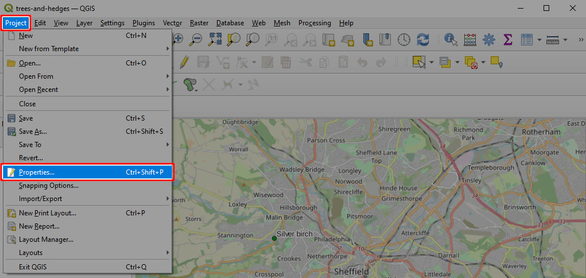
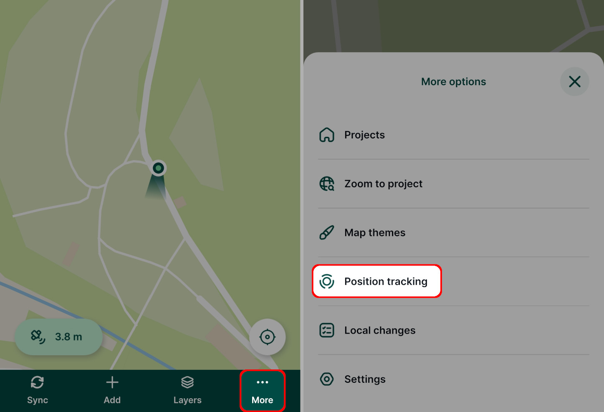
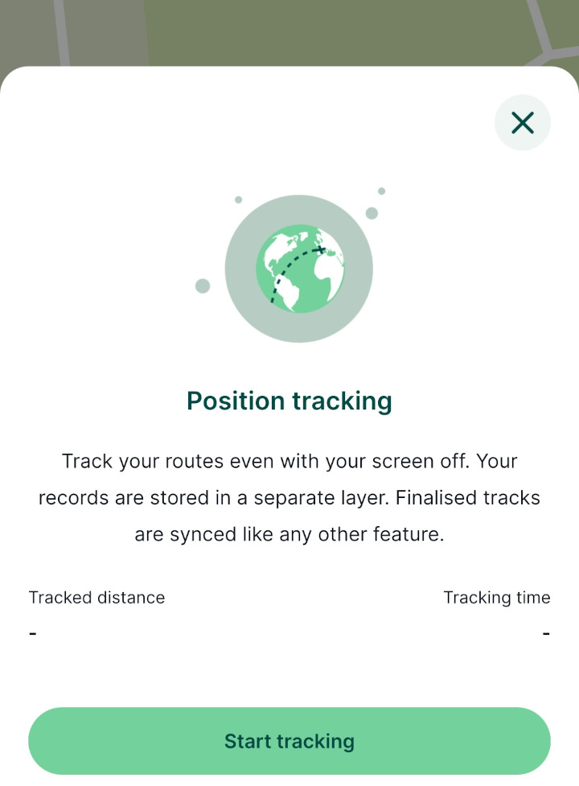
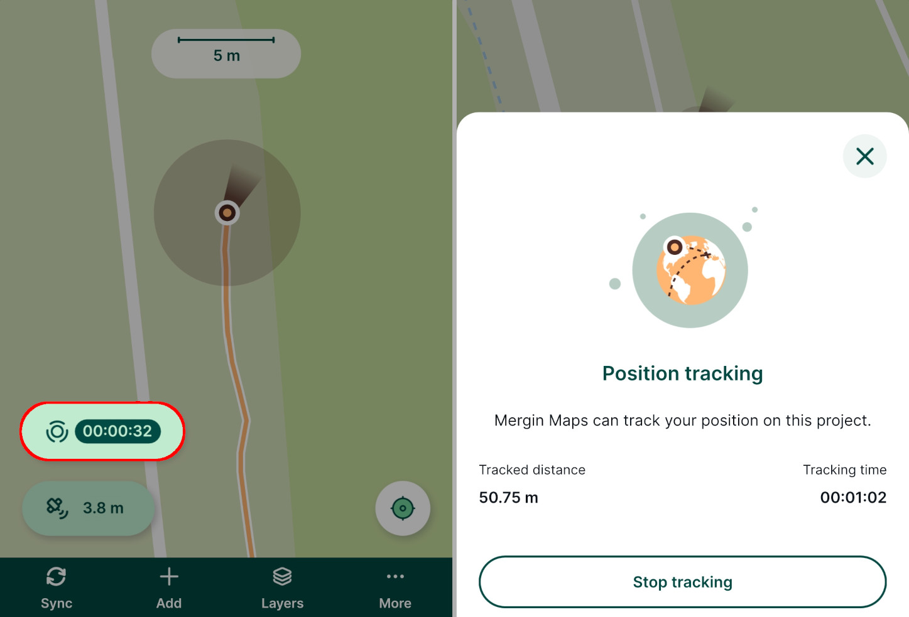

# Position Tracking
[[toc]]

Position tracking is useful when you want to record your tracks during the field survey. This can help you know the extent of areas you have already surveyed in addition to the surveyed features.

<YouTube id="64HXEb25D0Q" title="Position tracking"/>

## Set up position tracking in QGIS project

Tracking needs to be enabled in QGIS when [preparing your <MainPlatformName /> project](../../gis/features/#tracking).

1. Open your <MainPlatformName /> project in QGIS
2. Navigate to **Project** > **Properties** 
   

3. In the <MainPlatformName /> tab, check the **Enable tracking** option.
   

   You can also choose how often the position should be recorded. 
   
   This affects the accuracy of the tracking and it may affect the battery usage: for longer surveys that don't require high accuracy, you may want to choose the **Low** option. If you need to have more detailed tracking, choose **Best** available accuracy.

4. Don't forget to save and synchronise your project!

Enabled tracking means that a new line layer for tracking will be created in your <MainPlatformName /> project called `tracking_layer.gpkg`. This layer is created with a set of fields with set up [default values](../../layer/default-values/):

| Field name               | Data Type      |  Default variable      | Description                          |
|--------------------------|----------------|------------------------|--------------------------------------|
| `tracking_start_time`    | DateTime       | `@tracking_start_time` | Date and time when tracking started  |
| `tracking_end_time`      | DateTime       | `@tracking_end_time`   | Date and time when tracking ended    |
| `total_distance`         | Real           | `$length`              | Tracked distance |
| `tracked_by`             | String         | `@mm_username`     | Name of the current <MainPlatformNameLink /> user |

You can add new fields as needed, however, they should be set up with automatically generated [default values](../../layer/default-values/) as <MobileAppName /> will not open the form for manual inputs. You may use some of the QGIS functions, [position variables](../../layer/variables/#position-variables) or [project and user variables ](../../layer/variables/#project-and-user-variables).

## Using position tracking in Mergin Maps mobile app

To use tracking in the <MobileAppNameShort />, make sure that you enabled tracking in the QGIS project's settings. 

1. Tap **More** and select the **Position tracking** option.
   

2. Tap **Start tracking**.

   
   
3. The <MobileAppNameShort /> will continuously record your position.

   You can continue using the <MobileAppNameShort /> or other apps on your mobile device in the usual way. There will be an indicator that tracking is running in the status bar of your device.

   To stop tracking, go to the **Position tracking** option and tap **Stop tracking**. 
   
   Your tracks are saved in the automatically created `tracking_layer` in your project.
   
     
