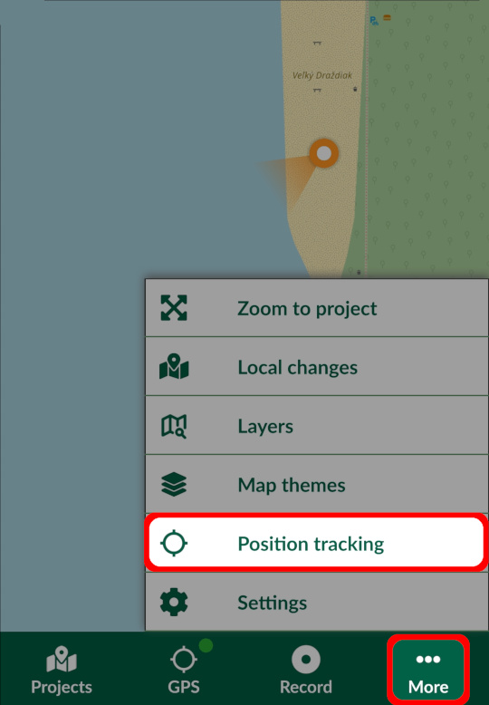
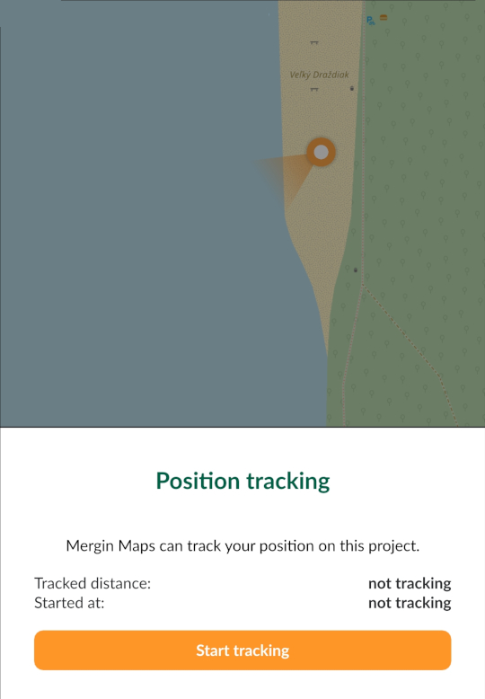
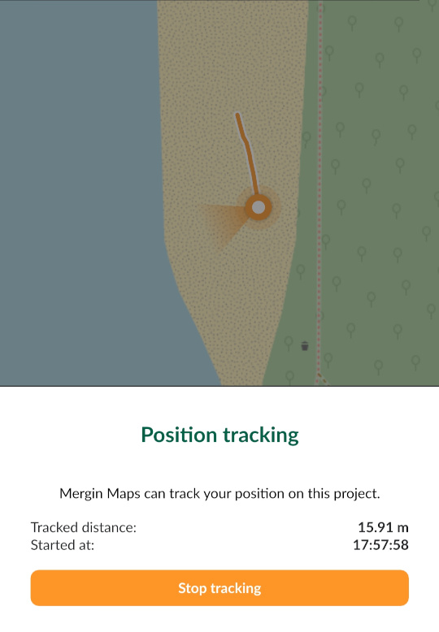

# How to Use Tracking in Mergin Maps Input
<SinceBadge type="App" version="2.2.0" />

Position tracking is useful when you want to record your tracks to know the extent of are you surveyed in addition to the surveyed feature.

## Set up tracking in QGIS project
Tracking needs to be turned in in the settings of your project in QGIS. You can choose how often the position should be recorded. This affects the accuracy of the tracking and it may affect the battery usage: for longer surveys that don't require high accuracy, you may want to choose the **low** option. If you need to have more detailed tracking, choose **high**.

This will create a new line layer for tracking in your <MainPlatformNameLink /> project called `tracking_layer.gpkg`. This layer is created with a set of fields with set up [default values](../../layer/settingup_forms_settings/#default-values):

| Field name               | Data Type      |  Default variable      | Description                          |
|--------------------------|----------------|------------------------|--------------------------------------|
| `tracking_start_time`    | DateTime       | `@tracking_start_time` | Date and time when tracking started  |
| `tracking_end_time`      | DateTime       | `@tracking_end_time`   | Date and time when tracking ended    |
| `total_distance`         | Real           | `$length`              | Tracked distance |
| `tracked_by`             | String         | `@mergin_username`     | Name of the current <MainPlatformNameLink /> user |

You can add new fields as needed, however, they should be set up with automatically generated [default values](../../layer/settingup_forms_settings/#default-values) as <MobileAppName /> will not open the form for manual inputs. You may use some of the QGIS function, [extra position variables](../../layer/position_variables/) or [extra QGIS variables](../../layer/plugin-variables/).

## Using tracking in Mergin Maps Input

To use tracking in <MobileAppName />, make sure that you enabled tracking in the QGIS project's settings. 

1. Tap **More** and select the **Position tracking** option.
   

2. Tap **Start tracking**. You can capture and edit features in the usual way even during the tracking.
   
   
3. To stop tracking, go to **Position tracking** option and tap **Stop tracking**
     
