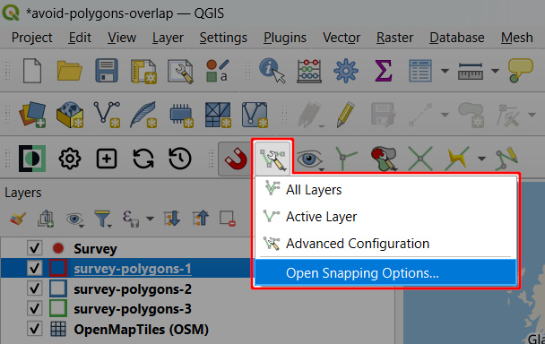
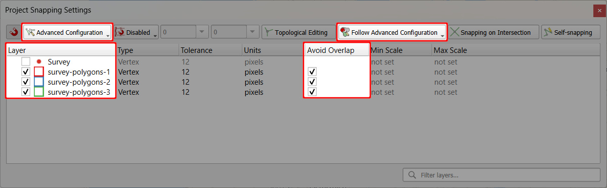

# How to Avoid Polygons Overlap

For polygon layers, <QGISHelp ver="latest" link="user_manual/working_with_vector/editing_geometry_attributes.html#overlapping-control" text="QGIS" /> offers options to control the overlapping. In the **Snapping toolbar**, you can set if you want to allow or avoid overlaps when digitising new features. 

<MobileAppName /> follows this setting: if you create a polygon that overlaps existing geometries in the layer, the polygon will be cropped and snapped to the existing features. 

You can apply this option for the [active layer](#avoid-overlap-on-active-layer) or use [advanced configuration](#follow-advanced-configuration-to-control-overlapping) to define which layers should be avoided when digitising new polygons.

## Avoid overlap on active layer
To use the *Avoid overlap* option in your <MainPlatformName /> project:
1. Open your project in QGIS
2. Make sure that the **Snapping toolbar** is visible in the toolbar panel.
   
   If not, click on the toolbar panel and activate the **Snapping** toolbar.

   

3. In the **Snapping toolbar**, select the *Avoid overlap on Active Layer* option or [*Follow Advanced Configuration*](#follow-advanced-configuration-to-control-overlapping)

   

4. Save and synchronise your project.

Now this option will be used when digitising new polygons both in QGIS and the <MobileAppNameShort />:

## Follow advanced configuration to control overlapping

It is also possible to set advanced configuration to control overlapping of multiple polygon layers. This is useful if you want to digitise polygons that will be cropped and snapped to existing features from *multiple* layers.

1. Open your project in QGIS

2. In the **Snapping toolbar** use *Open Snapping Options...* to open the **Project Snapping Settings**
   

3. In **Project Snapping Settings**, switch to *Advanced Configuration* and choose *Follow Advanced Configuration* for overlap control.
 
   Now select relevant layers in the *Layer* column and tick the *Avoid Overlap* option for those layers that should use this overlap control option.
   
   
   
4. Save and synchronise your project

