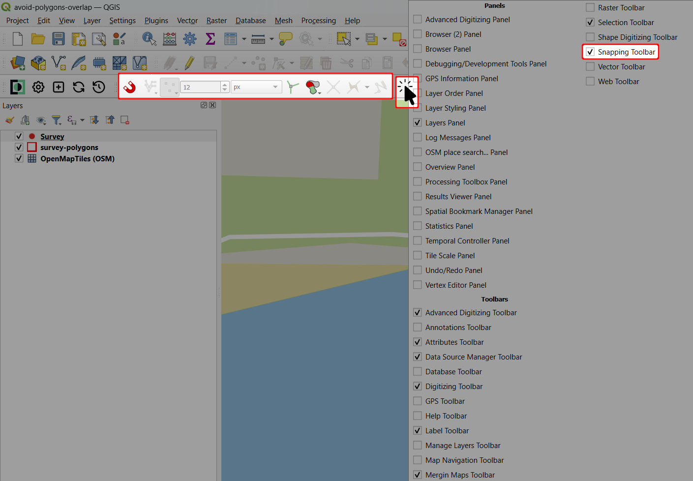
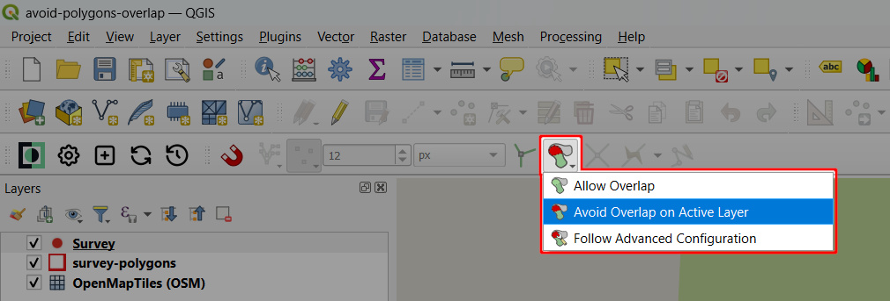
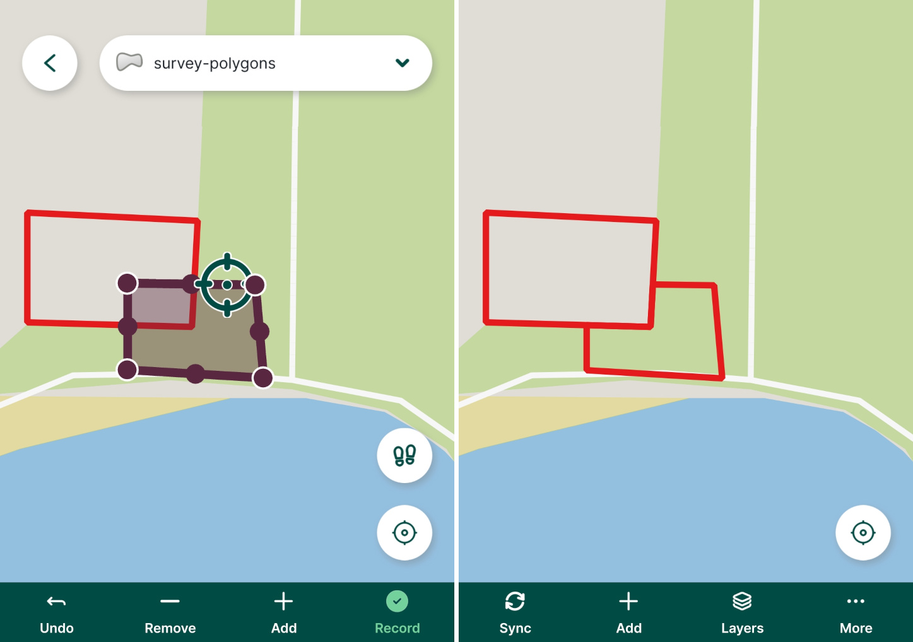

# How to Avoid Polygons Overlap

For polygon layers, <QGISHelp ver="latest" link="user_manual/working_with_vector/editing_geometry_attributes.html#overlapping-control" text="QGIS" /> offers options to control the overlapping. In the **Snapping toolbar**, you can set if you want to allow or avoid overlaps when digitizing new features. <MobileAppName /> follows this setting: if you create a polygon that overlaps existing geometries in the layer, the polygon will be cropped and snapped to the existing features.

To use the *Avoid overlap* option in your <MainPlatformName /> project:
1. Open your project in QGIS
2. Make sure that the **Snapping toolbar** is visible in the toolbar panel.
   
   If not, click on the toolbar panel and activate the **Snapping** toolbar.

   

3. In the **Snapping toolbar**, select the *Avoid overlap on Active Layer* option

   

4. Save and synchronise your project.

Now this option will be used when digitizing new polygons both in QGIS and the <MobileAppNameShort />:

