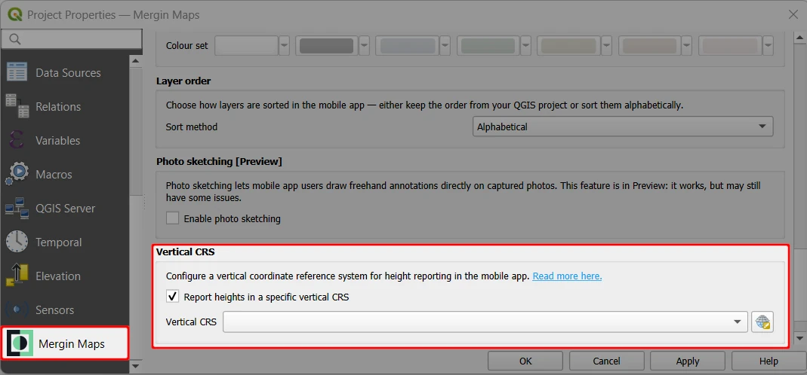
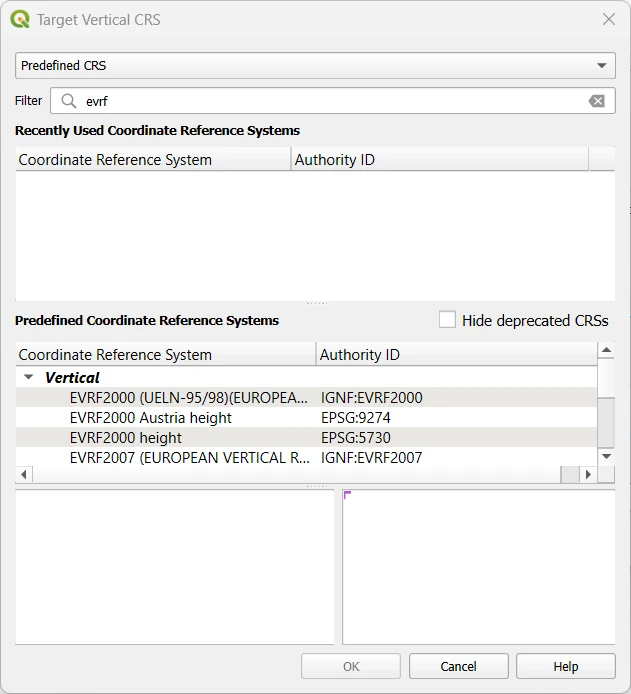
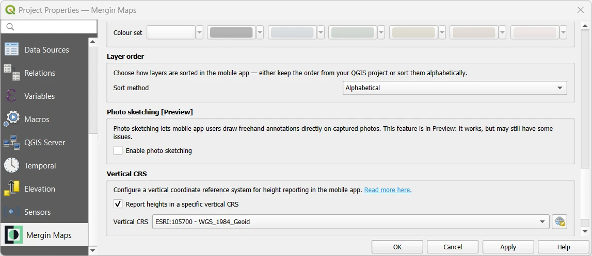
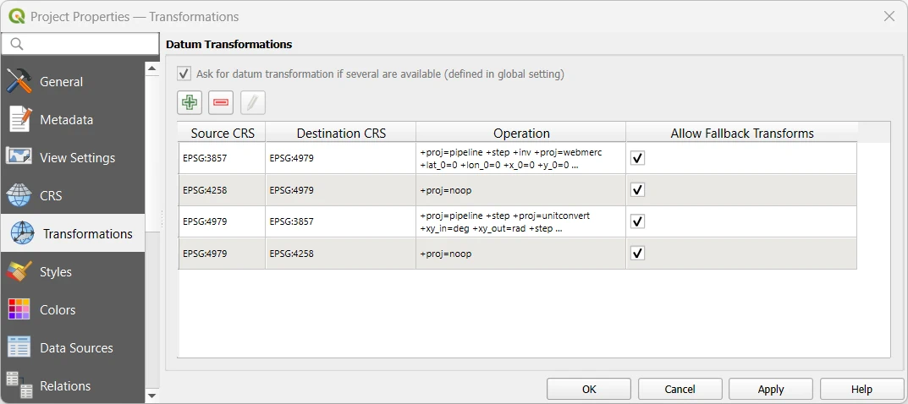
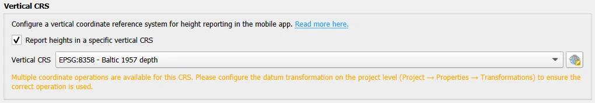
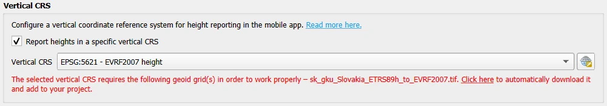
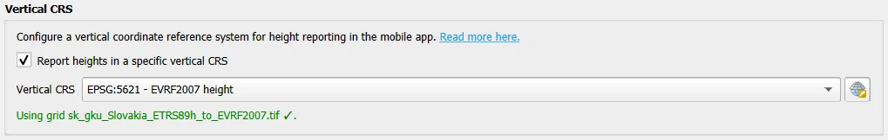

# Elevations

[[toc]]

When collecting data in the field, <MobileAppName /> provides information about your position and also elevation. By default, GPS receivers provide an *ellipsoidal height* that is related to the reference ellipsoid. However, for most applications, a *physical height* (also known as height above the sea level) is more appropriate.

An *orthometric* height is a physical height referred to a *geoid*, a special surface that resembles the mean sea level. The difference between ellipsoidal and orthometric height is called the *geoid separation* (also known as geoid height or undulation) and it can be applied to transform between these heights.

When transforming elevations from ellipsoidal to orthometric, <MainPlatformNameLink /> uses the EGM96 geoid model by default. However, it is also possible to use another geoid model as described in the [Using custom vertical reference system](#custom-vertical-reference-system) section. This may be especially useful when conducting more precise surveys or when a specific vertical reference system is required. 

:::warning Learn more
Height systems and elevations are complex topics. If you want to get more insight, we recommend going through some explanatory resources, such as [Height Systems](https://geodesy.science/item/height-systems/) by the International Association of Geodesy.
:::

::: tip Terminology
The terms *geoid*, *geoid separation* and *orthometric heights* are used in the <MobileAppNameShort /> and this documentation for simplicity. 

The same functionalities apply also if the used vertical reference system is defined by a *quasi-geoid*, another type of reference surface. Physical heights referred to a quasi-geoid are called *normal* heights.
:::

Information about the altitude and geoid separation (if available) are displayed in the [GPS info panel](../../field/mobile-app-ui/#current-position-and-gps-info).

There are some differences in the functionality and available details depending on the GPS provider, the OS of the mobile device and the connection setup, namely the type of elevation provided, available [position variables](../../layer/variables/#position-variables) and whether it is possible to use [custom vertical reference system](#custom-vertical-reference-system).

## Internal provider (no external device)

### Android
On Android, the [internal (fused)](../../field/mobile-app-ui/#gps-settings) GPS provider is used by default. It reports **orthometric heights** transformed from ellipsoidal heights by <MainPlatformName /> using the EGM96 geoid model and displays them in the [GPS info panel](../../field/mobile-app-ui/#current-position-and-gps-info).

**Position variables**: :white_check_mark: *Ellipsoidal elevation*, *orthometric elevation*, *geoid separation* values are available and can be stored using [position variables](../../layer/variables/#position-variables).

**Custom vertical CRS**: :white_check_mark: It is possible to use the <QGISPluginNameShort /> to transform the elevation to a different [vertical reference system](#custom-vertical-reference-system).

### iOS
On iOS, the GPS provider can provide orthometric and ellipsoidal heights.

#### Ellipsoidal height not available
If ellipsoidal height **is not** available, <MainPlatformName /> does not transform the elevation in any way. iOS reports *above the sea level* heights by default, so this information is displayed in the [GPS info panel](../../field/mobile-app-ui/#current-position-and-gps-info) in the <MobileAppNameShort />. 

**Position variables**: 
- :white_check_mark: *orthometric elevation* is available and can be stored using [position variables](../../layer/variables/#position-variables)
- :no_entry_sign: *ellipsoidal elevation* and *geoid separation* values are **not** available

**Custom vertical CRS**: :no_entry_sign: It is not possible to transform elevations to a different vertical reference system.

#### Ellipsoidal height available
If iOS provides also the ellipsoidal heights, <MainPlatformName /> transforms them to **orthometric elevations using the EGM96 geoid model** by default and displays them in the [GPS info panel](../../field/mobile-app-ui/#current-position-and-gps-info).

**Position variables**: :white_check_mark: *ellipsoidal elevation*, *orthometric elevation*, *geoid separation* values are available and can be stored using [position variables](../../layer/variables/#position-variables).

**Custom vertical CRS**: :white_check_mark: It is possible to use the <QGISPluginNameShort /> to transform the elevation to a different [vertical reference system](#custom-vertical-reference-system).

## External provider - Bluetooth
<Badge text="Android only" type="tip"/>
On Android, external GPS can be connected [using Bluetooth](../../field/external_gps/#how-to-connect-external-gps-receiver-in-android-via-mergin-maps-mobile-app-recommended). If possible, we recommend using this option.

If there is no [user-defined transformation](#custom-vertical-reference-system), the <MobileAppNameShort /> uses data reported by the GPS provider as-is, including the ellipsoidal height and geoid separation. <MainPlatformName /> does not receive information about the geoid model used; this information should be supplied by the GPS provider.

**Position variables**: :white_check_mark: *ellipsoidal elevation*, *orthometric elevation*, *geoid separation* values are available and can be stored using [position variables](../../layer/variables/#position-variables).

**Custom vertical CRS**: :white_check_mark: It is possible to use the <QGISPluginNameShort /> to transform the elevation to a different [vertical reference system](#custom-vertical-reference-system). The defined geoid model is displayed in the <MobileAppNameShort />.

## External provider - Network
External GPS can be connected using network connection on both iOS and Android. We recommend using this option.

The functionality is the same as described above in [External provider - Bluetooth ](#external-provider-bluetooth).

## External provider - Mock location

Mock location should be only used if you are unable to connect the external GPS directly in the <MobileAppNameShort />. Because of system limitations, both Android and iOS send only a subset of available data. Some [position variables](../../layer/variables/#position-variables) may not be available.

### Android
If there is no [user-defined transformation](#custom-vertical-reference-system) (custom geoid), the <MobileAppNameShort /> uses data reported by the GPS provider as-is.

**Position variables**: 
- :white_check_mark: *orthometric elevation* is available and can be stored using [position variables](../../layer/variables/#position-variables)
- :no_entry_sign: *ellipsoidal elevation* and *geoid separation* values are **not** available

**Custom vertical CRS**: 
- :warning: It is possible to use the <QGISPluginNameShort /> to transform the elevation to a different [vertical reference system](#custom-vertical-reference-system). However, it is necessary to **set up the mock app to report ellipsoidal heights**, otherwise the geoid separation would be applied twice leading to incorrect elevation values. 
- :white_check_mark: If custom vertical reference system is used, the *orthometric elevation*, *ellipsoidal elevation* and *geoid separation* variables are available and can be stored using [position variables](../../layer/variables/#position-variables).

### iOS
If there is no [user-defined transformation](#custom-vertical-reference-system) (custom geoid), the <MobileAppNameShort /> uses data reported by the GPS provider as-is.

**Position variables**:  
- :white_check_mark: *orthometric elevation* is available and can be stored using [position variables](../../layer/variables/#position-variables)
- :no_entry_sign: *ellipsoidal elevation* and *geoid separation* values are **not** available

**Custom vertical CRS**: 
- :warning: It is possible to use the <QGISPluginNameShort /> to transform the elevation to a different [vertical reference system](#custom-vertical-reference-system). However, it is necessary to **set up the mock app to report ellipsoidal heights**, otherwise the geoid separation would be applied twice leading to incorrect elevation values. 
- :white_check_mark: If custom vertical reference system is used, the *orthometric elevation*, *ellipsoidal elevation* and *geoid separation* variables are available and can be stored using [position variables](../../layer/variables/#position-variables).

## Custom vertical reference system

Vertical reference system can be specified in [<MainPlatformName /> Project Properties](../../manage/plugin/#mergin-maps-project-properties) in QGIS. The grid shift file will be packaged with the project based on the selected vertical reference system.

In the <MobileAppNameShort />, the info about the custom vertical system is displayed in the [GPS info panel](../../field/mobile-app-ui/#current-position-and-gps-info).

1. Open your <MainPlatformName /> project and navigate to the <MainPlatformName />  tab in **Project Properties**

2. Check the *Report height in a specific vertical CRS* option :heavy_check_mark:
   

3. Select a vertical CRS from the list or use the **Select CRS** button to choose from predefined CRS.
   
   Use the filter to narrow the search using a keyword or the EPSG code. 
   
   Select a CRS and click **OK**.
   

5. **Apply** the changes in **Project Properties** and synchronise your changes.
   
   
When recording and displaying heights in the <MobileAppNameShort />, this vertical system will be used instead of the default EGM96 model.

::: tip Transformations
When transforming elevations to another reference system, <MainPlatformName /> expects WGS 84 (EPSG: 4979) as the source CRS. 

To transform elevations to another CRS, make sure that the correct datum transformation is defined in the **Transformations** tab in **Project Properties** where:
- **Source CRS**: EPSG: 4979 (WGS 84)
- **Destination CRS**: the reference system of your choice

:::
### Multiple datum transformation available
For some vertical CRS, there may be multiple datum transformations available. If this is the case, you will get a warning when selecting the CRS.

Make sure to define the preferred datum transformation in the **Transformations** tab in **Project Properties**.

### Downloading grid shift files
Some specific vertical CRS transformations may not be included in QGIS by default (see [custom projections in QGIS](../proj/#custom-projections-in-qgis)). In this the case, the <QGISPluginNameShort /> will display a warning that it needs to download the geoid grid file.

Use the **click here** link to download the grid.

The geoid grid will be downloaded and packaged with your project.

