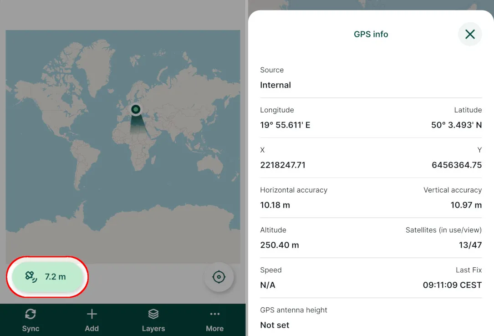

# Elevations

[[toc]]

When collecting data in the field, <MobileAppName /> provides information your position and also elevation. By default, GPS receivers provide an *ellipsoidal height* that is related to the reference ellipsoid. However, for most applications, a *physical height* (also known as height above the sea level) is more appropriate.

An *orthometric* height is a physical height referred to a *geoid*, a special surface that is resembles the mean sea level. The difference between ellipsoidal and orthometric height is called the *geoid separation* (also known as geoid height or undulation) and it can be applied to transform these heights.

When transforming elevations from ellipsoidal to orthometric, <MainPlatformNameLink /> uses the EGM96  geoid model by default. However, it is also possible to use another geoid model as described in the [Using custom geoid](#using-custom-geoid) section. This may be especially useful when conducting more precise surveys or when a specific vertical reference system is required. 

:::warning Learn more
Height systems and elevations are complex topics. If you want to get more insight, we recommend going through some explanatory resources, such as [Height Systems](https://geodesy.science/item/height-systems/) by the International Association of Geodesy.
:::

::: tip Terminology
The terms *geoid*, *geoid separation* and *orthometric heights* are used in the <MobileAppNameShort /> and this documentation for simplicity. 

The same functionalities apply also if the used vertical reference system is defined by a *quasi-geoid*, another type of reference surface. Physical heights referred to a quasi-geoid are called *normal* heights.
:::

Information about the altitude and geoid separation (if available) are displayed in the [GPS info panel](../../field/mobile-app-ui/#current-position-and-gps-info).

There are some differences in the functionality and available details depending on the GPS provider, the OS of the mobile device and the connection setup, namely the type of elevation provided, available [position variables](../../layer/variables/#position-variables) and whether it is possible to use [custom geoid](#using-custom-geoid).

## Internal provider (no external device)

### Android
In Android, the [internal (fused)](../../field/mobile-app-ui/#gps-settings) GPS provider is used by default. It reports ellipsoidal heights that <MainPlatformName /> transforms to **orthometric heights using the EGM96 geoid model** by default and displays them in the [GPS info panel](../../field/mobile-app-ui/#current-position-and-gps-info).

**Position variables**: :white_check_mark: ellipsoidal elevation, :white_check_mark:  orthometric elevation, :white_check_mark: geoid separation values are available and can be stored using [position variables](../../layer/variables/#position-variables).

**Custom geoid**: :white_check_mark: It is possible to use the <QGISPluginNameShort /> to [set up a different geoid model](#using-custom-geoid) and transform the elevations to a different vertical reference system.

### iOS
In iOS, the GPS provider can provide orthometric and ellipsoidal heights.

#### Ellipsoidal height not available
If ellipsoidal height **is not** available, <MainPlatformName /> does not transform the elevations in any way. iOS reports *above the sea level* heights by default, so this information is displayed in the [GPS info panel](../../field/mobile-app-ui/#current-position-and-gps-info) in the <MobileAppNameShort />. 

**Position variables**: 
- :white_check_mark: orthometric elevation is available,
- :no_entry_sign: ellipsoidal elevation and :no_entry_sign: geoid separation values are **not** available and **can not** be stored using [position variables](../../layer/variables/#position-variables).

**Custom geoid**: :no_entry_sign: It is not possible to use custom geoid model.

#### Ellipsoidal height available
If iOS provides also the ellipsoidal heights, <MainPlatformName /> transforms them to **orthometric elevations using the EGM96 geoid model** by default and displays them in the [GPS info panel](../../field/mobile-app-ui/#current-position-and-gps-info).

**Position variables**: :white_check_mark: ellipsoidal elevation, :white_check_mark:  orthometric elevation, :white_check_mark: geoid separation values are available and can be stored using [position variables](../../layer/variables/#position-variables).

**Custom geoid**: :white_check_mark: It is possible to use the <QGISPluginNameShort /> to [set up a different geoid model](#using-custom-geoid) and transform the elevations to a different vertical reference system.

## External provider - Bluetooth
<Badge text="Android only" type="tip"/>
External GPS can be connected [using Bluetooth](../../field/external_gps/#how-to-connect-external-gps-receiver-in-android-via-mergin-maps-mobile-app-recommended). If possible, we recommend to use this option.

If there is no [user-defined transformation](#using-custom-geoid), the <MobileAppNameShort /> uses data reported by the GPS provider as-is, including the ellipsoidal height and geoid separation. <MainPlatformName /> does not receive information about the geoid model used; this information should be supplied by the GPS provider.

**Position variables**: :white_check_mark: ellipsoidal elevation, :white_check_mark:  orthometric elevation, :white_check_mark: geoid separation values are available and can be stored using [position variables](../../layer/variables/#position-variables).

**Custom geoid**: :white_check_mark: It is possible to use the <QGISPluginNameShort /> to [set up a different geoid model](#using-custom-geoid) and transform the elevations to a different vertical reference system. The defined geoid model is displayed in the <MobileAppNameShort />.

## External provider - Network
External GPS can be connected using network connection. The functionality works the same as described above in [External provider - Bluetooth ](#external-provider-bluetooth). It is available for both iOS and Android.

## External provider - Mock location

Mock location should be only used if you are unable to connect the external GPS directly in the <MobileAppNameShort />. Because of system limitations, both Android and iOS send only a subset of available data.

### Android
If there is no [user-defined transformation](#using-custom-geoid), the <MobileAppNameShort /> uses data reported by the GPS provider as-is.

**Position variables**: 
- :white_check_mark: orthometric elevation is available,
- :no_entry_sign: ellipsoidal elevation and :no_entry_sign: geoid separation values are **not** available and **can not** be stored using [position variables](../../layer/variables/#position-variables).

**Custom geoid**: :warning: It is possible to use the <QGISPluginNameShort /> to [set up a different geoid model](#using-custom-geoid) and transform the elevations to a different vertical reference system. However, it is necessary to set up **the mock app to report ellipsoidal heights**, otherwise the geoid separation would be applied twice leading to incorrect elevation values.

### iOS
The <MobileAppNameShort /> uses data reported by the GPS provider as-is.

**Position variables**:  :warning: When using the mock location, iOS only sends a minimal subset of available GPS data, namely the coordinates X, Y, and elevation. It is not possible to obtain or display any other [position variables](../../layer/variables/#position-variables), including accuracy.

**Custom geoid**: :no_entry_sign: It is not possible to use custom geoid model.

## Using custom geoid

The geoid model can be specified in [<MainPlatformName /> Project Properties](../../manage/plugin/#mergin-maps-project-properties) in QGIS. The grid shift file then needs to be packages with the project.

In the <MobileAppNameShort />, the info about the custom geoid model is displayed in [GPS info panel](../../field/mobile-app-ui/#current-position-and-gps-info).

