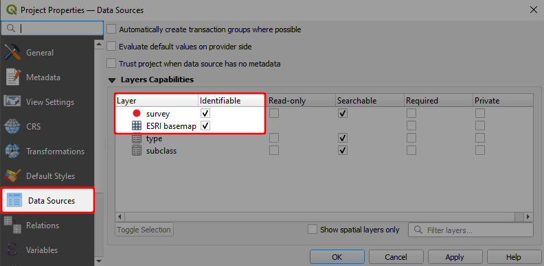
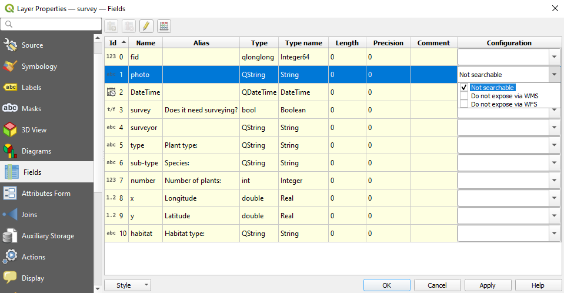

# Enable Browsing

In Input app, in addition to viewing map data, you can view and search attribute forms related to your data or non-spatial tables within your project.

## QGIS project configuration

To be able to view the attribute table of a layer, you need to first configure your <QGISHelp ver="3.10" link="user_manual/introduction/qgis_configuration.html?highlight=properties#data-sources-properties" text="QGIS project" />

- Open QGIS Desktop with you QGIS Project
- In the Menu > Project > Properties click on "Data Sources"

- Under **Identifiable** column, select the layers you'd like to browse the attribute forms.

Input app, only displays a summary of the table for all the data. By default, it shows the first column as the header for summary of the field. To change that, you can set the <QGISHelp ver="3.10" link="user_manual/working_with_vector/vector_properties.html#display-properties" text="Display Name" />

## Browse data forms in Mergin Maps Input
You can now open the attribute table in Input, by:

- Open a project in Input
- From the lower menu, select **(More)** > **Browse feature**
- Select the layer/table from the list

The attribute table should appear:

## Search features
While browsing data in the attribute table, you can use search to quickly find features. 

The search: 
- looks up for a match in all searchable attributes values.
- is not case sensitive

In Layer properties (left click on layer on the Layers panel -> Properties -> "Fields"), you can define which attributes (fields) are searchable and which are not. By default, all attributes are searchable.

If a field is marked in a field configuration as **Not searchable**, the search will omit field values in the compare function. So if you search for specific existing value of such field, you should expect no results.