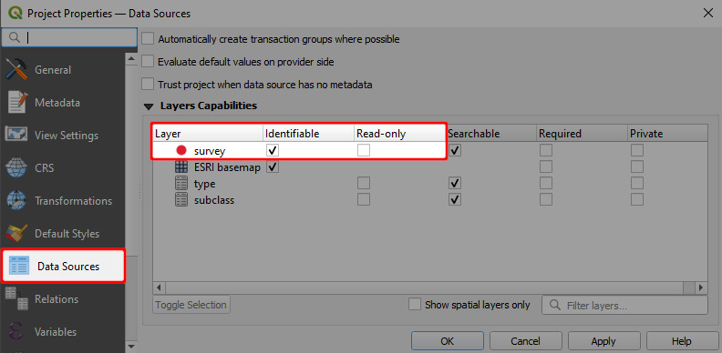

# How to Enable Digitising

1. Open QGIS Desktop with your <MainPlatformName /> Project 
2. Navigate to the **Data Sources** in the **Project Properties**
   
   You need to have at least one layer without "Read-only" check
3. **Apply** the changes. Don't forget to save and sync your project!
