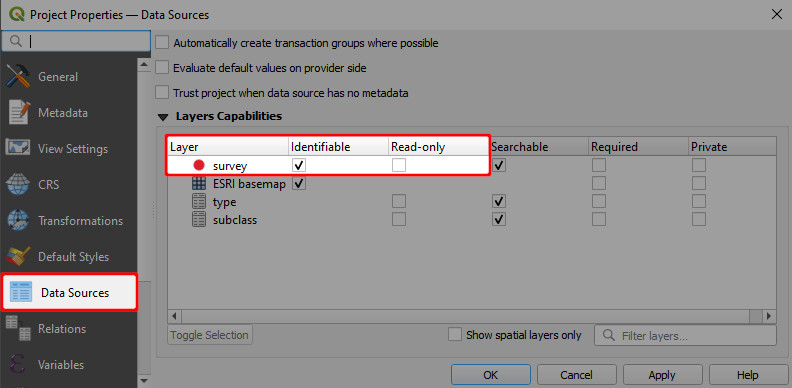

# How to Enable Digitising

1. Open your <MainPlatformName /> Project in QGIS
2. Navigate to **Project Properties**
   
   
3. Inspect **Layers Capabilities** in the **Data Sources** tab.

   At least one layer in your project needs to have no check in the **Read-only** column, otherwise it cannot be edited.
   
   
   
4. **Apply** the changes. Don't forget to save and sync your project!
