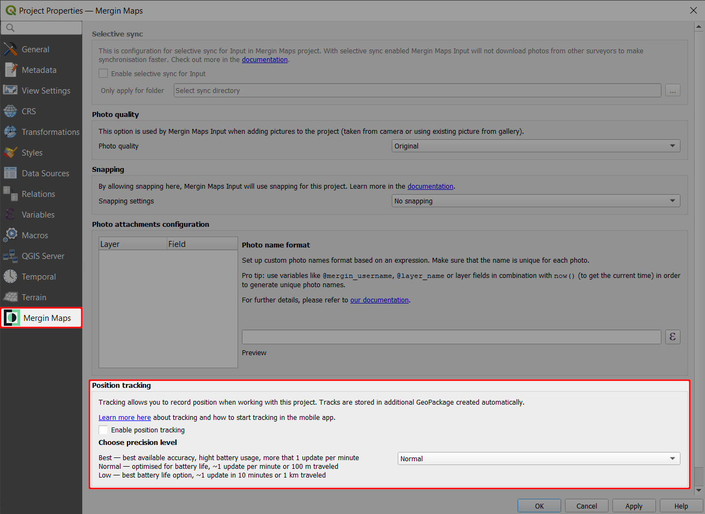

# QGIS Project Preparation
[[toc]]

Project preparation is done in QGIS. For more information about loading layers, styling the data and creating map themes, visit <QGISHelp ver="3.22" link="user_manual/index.html" text="QGIS documentation page" />. 

In addition, <MobileAppName /> uses some of the features within the project to help visualise, capture and browse the data. Here is an overview of the project preparations steps.

:::tip
Our tutorials can guide you through QGIS project preparation step by step.

In [Creating a Project in QGIS](../../tutorials/creating-a-project-in-qgis/) you will learn how to create a project, add new layers and configure a basic form.

[Further Project Customisation](../../tutorials/further-project-customisation/) will show you how to style layers, add labels, customise the preview panel, define map themes and set up the project extent.
:::

## Background layers
Various online and offline maps can be used as background layers for navigation during the field survey. You can find more information in [Background Maps](../settingup_background_map/).


## Project settings
- Ensure the paths are set to *Relative* in the **General** tab in Project Properties. All paths to the project data in <MobileAppName /> are relative to the project location.

- Define the <QGISHelp ver="3.22" link="user_manual/introduction/qgis_configuration.html?highlight=properties#data-sources-properties" text="layers capabilities" /> in the **Data Sources** in Project Properties.
   - [Identifiable](../search_data/#setting-identifiable-layers-in-qgis-project) layers can be queried in <MobileAppName />. If you want to be able to search for attribute values in a layer, it needs to be identifiable and searchable.
   - **read-only** layers cannot be modified. If a vector layer is not intended to be used as a survey layer, set it as read-only.
   - [non-spatial](../../layer/non-spatial-data/) layers need to be set as searchable to enable browsing, searching, or editing.


### Project extent
In <MobileAppName />, there is an option to [zoom to the project extent](../../field/mobile-app-ui/#more-options-zoom-to-project-map-themes-position-tracking-measure-local-changes-settings). 

If the project extent is not set, <MobileAppName /> zooms to all visible layers. This is not particularly convenient when you have a layer with a large/global extent (e.g. Open Street Map). Instead, you may want to set the project extent to the area of your interest.


To set the project extent:
1. Navigate to **Project** > **Properties**. 
   

2. Select **View Settings** and check the **Set Project Full Extent** option. 

   Here, either enter the coordinate extent of your project bounding box or use the map canvas extent. The extent can be also calculated from a layer in your project.

   

3. Click **Apply** to save the changes

4. Save and synchronise the project to <MainPlatformNameLink />. Now you can use the **Zoom to project** option in the <MobileAppNameShort /> to zoom to the extent you have specified in QGIS.


### Photo quality
<SinceBadge type="Plugin" version="2022.3.2" /><SinceBadge type="App" version="1.5.1" />
The quality of photographs and pictures that are saved in the <MainPlatformName /> project can be set up in the **<MainPlatformName />** tab in **Project properties**. When pictures are added using <MobileAppName /> (uploaded or taken with the camera), they will be resized accordingly.

By default, the quality is set to *Original* - the original pictures are stored. If you want to resize the pictures, you can choose from *High*, *Medium*, or *Low* quality. The [EXIF metadata](../../layer/exif/) of the original files are kept.

Don't forget to save and sync your project!


### Photo names
<SinceBadge type="Plugin" version="2023.2.0" /> <SinceBadge type="App" version="v2.2.0" />

Names of the photos that are captured in the field using <MobileAppName /> can be customised. The name format can be set in QGIS with <QGISPluginName />.  

::: tip
[How to Set Photo Names Format](../photo-names/) will guide you through the setup and provide examples of expressions that can be used to name your photos.
:::


### Snapping
<SinceBadge type="Plugin" version="2022.5" />
If you want to use snapping in <MobileAppName /> during the field survey, you need to set it up in the **<MainPlatformName />** tab in **Project properties**.


The snapping options are:
- *No snapping* - snapping is not enabled (default)
- *Basic snapping* - features are snapped to the vertices and segments of vector features in the project
- *Follow QGIS snapping* - uses the snapping preferences defined in the <MainPlatformName /> project in QGIS

:::tip
[How to Set Up Snapping for <MobileAppName />](../snapping/) contains detailed steps that may help you with the snapping setup.
:::


### Tracking
<SinceBadge type="Plugin" version="2023.3" />

Tracking your position when doing the field survey with <MobileAppName /> can be enabled in the **<MainPlatformName />** tab in **Project properties**.



You can read more about this functionality in [How to Use Tracking in Mergin Maps mobile app](../../field/tracking/).

### Map sketching

Map sketching for the <MobileAppNameShort /> can be enabled in the **<MainPlatformName />** tab in **Project properties**. Here, you can also set the colours that will be available for sketches.


You can read more about this functionality in [Map Sketching](../../field/map-sketching/).

### Map themes
[Map Themes](../setup_themes/) make possible to switch between different background maps in <MobileAppName /> (e.g. cartography maps and aerial imagery)

## Survey layers
Vector layers can be used as survey layers in <MobileAppName />. You can apply styles and set up the forms to make your field survey easier.

### Layer symbology
The same symbology as defined in the QGIS project will be used in <MobileAppName />. However, <MobileAppName /> does not include all the SVG markers that are available within QGIS. Therefore, if you are using SVG markers for your layer styling, ensure those are copied to the project folder.

### Forms
During the field survey, it is often necessary to fill out some attributes in the form to record the properties of surveyed features. Forms can make the survey easier, consistent and more effective. Detailed description of form widgets and form configuration can be found in [Setting Up Form Widgets](../../layer/form-widgets/) and [Advanced Form Configuration](../../layer/form-configuration/).

### Settings for Mergin Maps mobile app preview panel
What appears in the <MobileAppName /> preview panel can be defined in the **Display** tab in **Layer Properties**:
- **Display Name**: a field name or an expression.
- **HTML Map Tip**: the content of the preview panel. While QGIS always interprets the content of map tip as being HTML, <MobileAppName /> extends the syntax to allow two more modes: field values and images. If the map tip is not specified, <MobileAppName /> will try to use the first three fields and show their attribute values.


#### HTML
Sample map tip content that will show render as HTML page:

```
<p><strong>Notes:</strong>[% "notes" %]</p>
```

If the map tip does not contain any special marker, it is assumed that the map tip is HTML content. Only a limited subset of HTML is supported - see [Qt documentation](https://doc.qt.io/qt-5/richtext-html-subset.html)

#### Field values
Sample map tip content that will show "description" and "time" field values:

```
# fields
description
time
```

If the map tip content has `# fields` marker on the first line, the following lines will be understood as field names that should be listed in the preview. At most three fields will be shown. Expressions are not allowed.

#### Image
Sample map tip content that will cause an image to be show specified by file path in field "image_1" (containing path relative to the project folder):

```
# image
file:///[%@project_folder%]/[% "image_1" %]
```

If the map tip has `# image` marker on the first line, the following line is understood as the URL for the image. It can be a regular file on the file system, but it could be even a remote image from the network. Expressions embedded in the image URL will be evaluated (enclosed in `[% 1+1 %]`).


