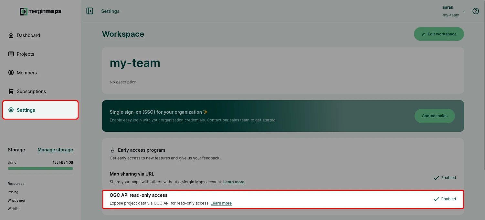
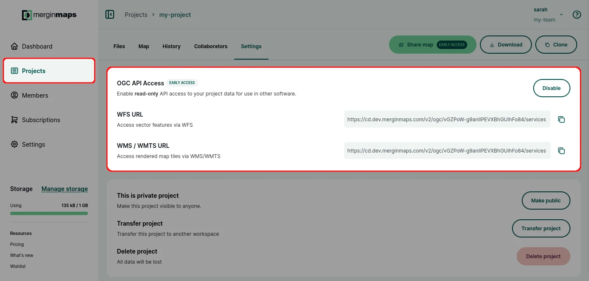
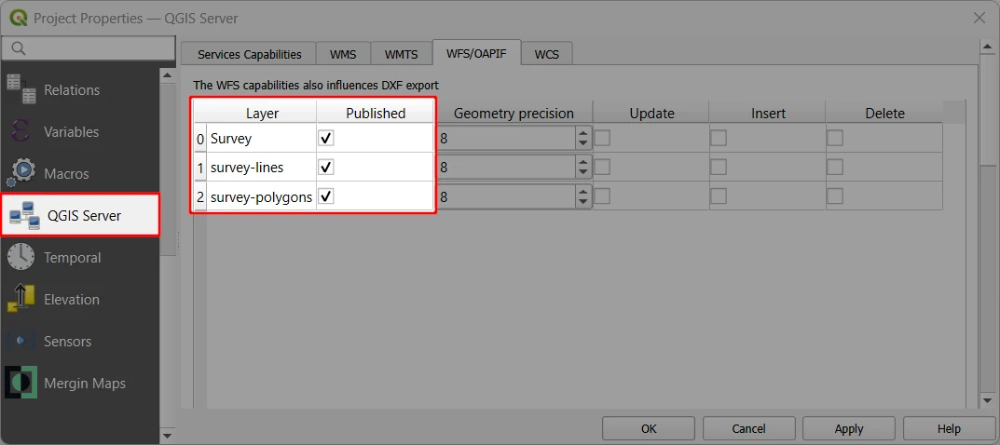
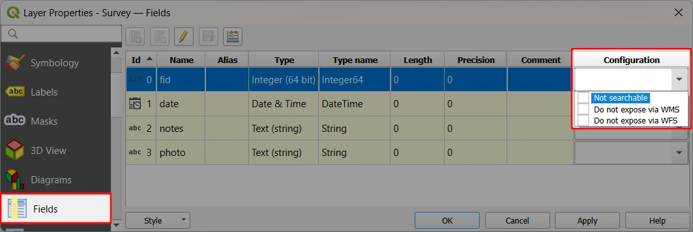
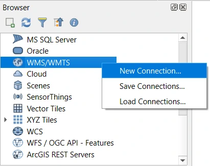
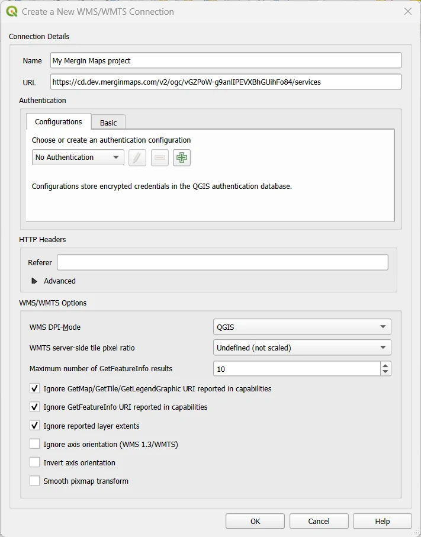
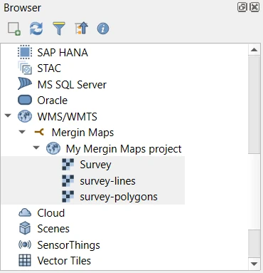
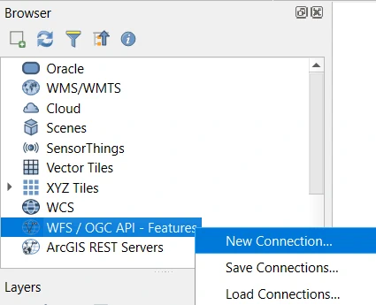
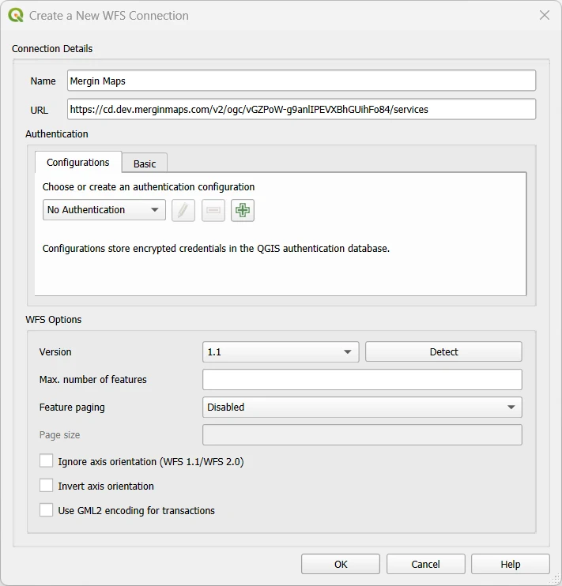
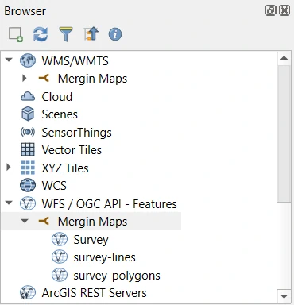

# Publishing Projects via OGC API (WMS/WMTS, WFS)
[[toc]]

Your project data can be published using OGC API as WMS / WMTS or WFS. This way, your data can be displayed (read-only) in other software or web applications.

::: tip Early access feature
OGC API read-only access is one of the early access program features. It needs to be enabled for your workspace so you can try it out.
:::

## Enabling OGC API access
As early access feature, OGC API has to be enabled for your workspace:
1. Navigate to the **Settings** tab on the <DashboardShortLink />
2. Make sure that the *OGC API read-only access* feature is enabled

Now you can enable OGC API access for your <MainPlatformName /> project:

**WFS URL** and **WMS / WMTS URL** can be copied and used, e.g., to [connect to these services in QGIS](#example-wms-wmts-and-wfs-connection-in-qgis).

## Setup WMS, WMTS and WFS properties in QGIS
In QGIS, you can define which layers and fields from your project should be published via WMS/WMTS and WFS.

Explore the **QGIS server** tab in **Project Properties**:
- in the **Service Capabilities** tab, you can (optionally) define the *title* and other metadata of your service
- in the **WMTS** and **WFS** tabs, select the layers that should be published

There may be some fields that you do not want to publish. These can be defined in the **Layer Properties** in the **Fields** tab for each field of the layer: 

Save and synchronise the project.

## Example WMS/WMTS and WFS connection in QGIS
[WFS URL and WMS/WMTS URL](#enabling-ogc-api-access) from the dashboard can be used to load the web services to any software that supports WFS and/or WMS (for example QGIS) to display the project data.

### WMS/WMTS connection
WMS/WMTS can be connected to QGIS in the **Browser** panel:

1. Right-click on the **WMS/WMTS** entry and select **New Connection...**

2. Fill in the connection details:
   - **Name**
   - **URL** - enter the URL copied from the <DashboardLink />
   - set **WMS DPI-Mode** to *QGIS*
   - select following options: 
      - :white_check_mark: <NoSpellcheck id="Ignore GetMap/GetTile/GetLegendGraphic URI reported in capabilities" />
      - :white_check_mark:  <NoSpellcheck id="Ignore GetFeatureInfo URI reported in capabilities" />
      - :white_check_mark: <NoSpellcheck id="Ignore reported layer extents" />
   

3. Published layers from your project should now be displayed in the Browser panel and can be added to the project.

### WFS connection
WMS/WMTS can be connected to QGIS in the **Browser** panel:

1. Right-click on the **WFS/OGC API - Features** entry and select **New Connection...**

2. Fill in the connection details:
   - **Name**
   - **URL** - enter the URL copied from the <DashboardLink />
   - **Version** - use the **Detect** button or select the value **1.1** from the list

3. Published layers from your project should now be displayed in the Browser panel and can be added to the project.

