# Publishing Projects via OGC API (WMS/WMTS, WFS, OGC API - Features)
[[toc]]

You can publish your project data via OGC API as *WMS / WMTS*, *WFS* or *OGC API - Features*. This allows other software or web applications to display your data (read-only).

::: tip Early access feature
OGC API read-only access is one of the early access program features. To use this feature, you must first enable it for your workspace.
:::

## Enabling OGC API access

As an early access feature, OGC API has to be enabled for your workspace:
1. Navigate to the **Settings** tab on the <DashboardShortLink />
2. Ensure the *OGC API read-only access* feature is enabled

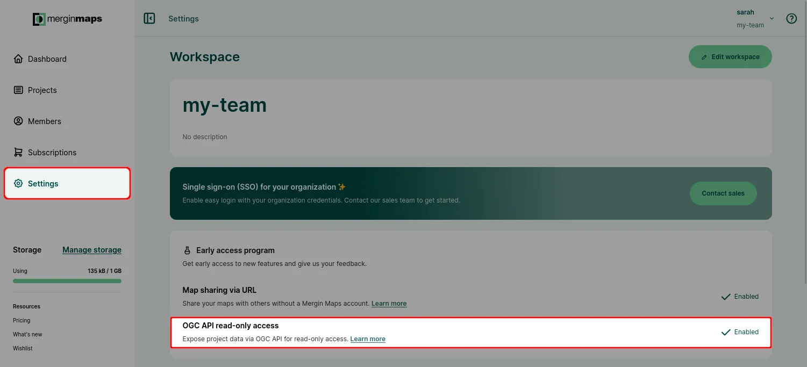

## OGC API project setup
To publish a project via OGC API:
1. Set up the QGIS Server parameters for your project [in QGIS](#setup-wms-wmts-and-wfs-properties-in-qgis)
2. Enable OGC API access at the project level [on the dashboard](#ogc-api-for-a-project)

### Set up WMS, WMTS and WFS properties in QGIS {#setup-wms-wmts-and-wfs-properties-in-qgis}
In QGIS, you can specify which layers from your project will be published via *WMS/WMTS*, *WFS* and *OGC API - Features*.

Open your project and navigate to the **QGIS Server** tab in **Project Properties**:
- in the **Service Capabilities** tab, you can (optionally) *enable Service Capabilities* and define the *title* and other metadata of your service
- define [WMS/WMTS properties](#wms-wmts-properties) in the **WMS** and **WMTS** tabs
- define [WFS and OGC API - Features properties](#wfs-and-ogc-api-features-properties) in the **WFS/OAPIF** tab

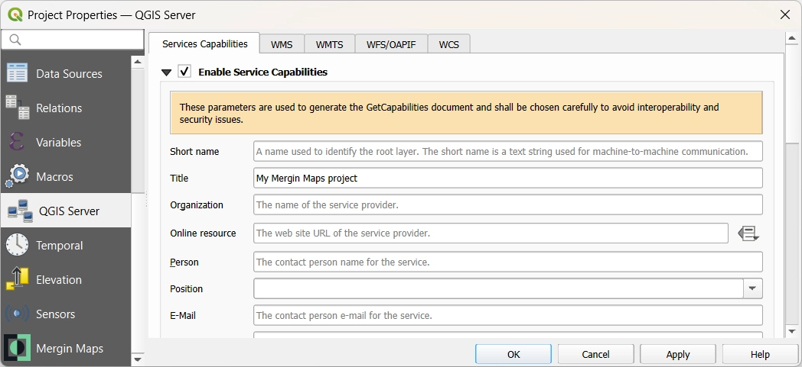

After making changes, remember to save and synchronise your project.

#### WMS/WMTS properties
Define layers for *WMS/WMTS* publication in the **WMS** and **WMTS** tabs of **QGIS Server Project Properties**.

In the **WMS** tab, you can add or remove layers that will be **excluded** from publishing.

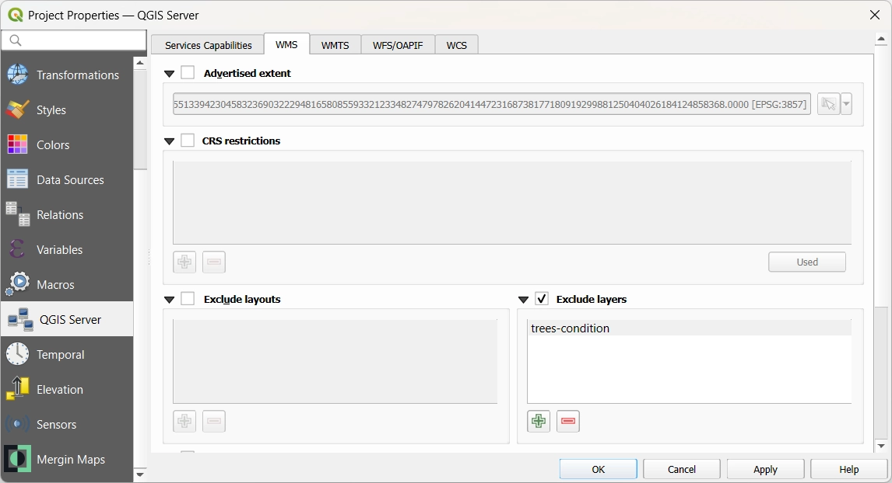

In the **WMTS** tab, you can select the layers to be :white_check_mark: **published**.

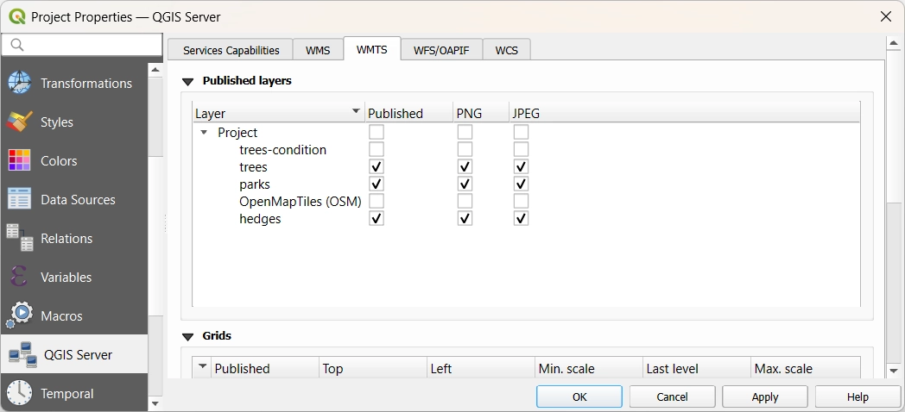

#### WFS and OGC API - Features properties
In the **WFS/OAPIF** tab of **QGIS Server Project Properties**, specify the :white_check_mark: **published** layers from the list. These layers will be published via *WFS* or *OGC API - Features*.

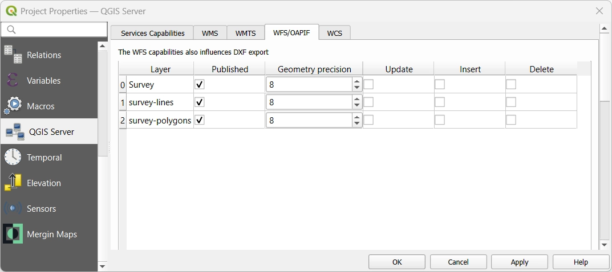

If a published layer contains fields you do not want to publish, navigate to the **Fields** tab of **Layer Properties** and check the **Do not expose via WMS/WFS** option for each of these field.

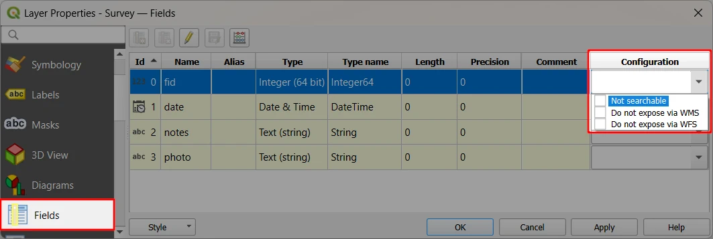

### OGC API for a project 

After enabling OGC API access for your [workspace](#enabling-ogc-api-access), you can enable it for your <MainPlatformName /> projects.

1. Go to the **Project** tab on the <DashboardShortLink /> and open your project

2. In the **Settings & API** tab, you can enable or disable OGC API Access

   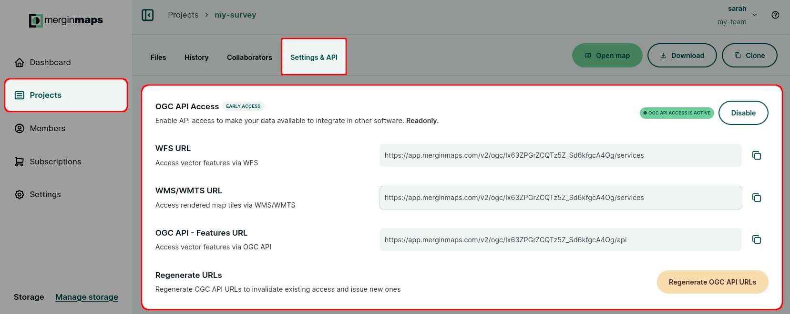

You can copy the **WFS URL**, **WMS / WMTS URL** and **OGC API - Features URL** to connect these services to other software or web applications, such as [QGIS](#example-wms-wmts-and-wfs-connection-in-qgis).

OGC API access can be **disabled** at any time. Re-enabling it will restore the same URLs.

#### Regenerating OGC API URLs

If necessary, you can invalidate existing access and generate new URLs by clicking the **Regenerate OGC API URLs** button.

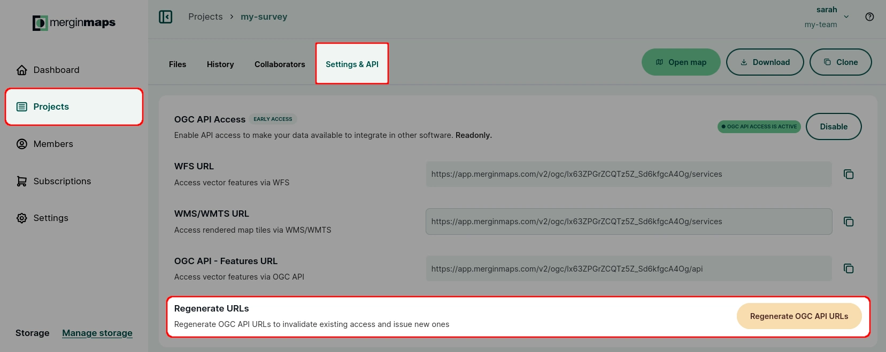

Keep in mind that any applications or services that use the old URLs will lose access immediately and must be updated with the new URLs.

## Example connections in QGIS {#example-wms-wmts-and-wfs-connection-in-qgis}
Use the [WFS, WMS/WMTS and OGC API - Features URLs](#enabling-ogc-api-access) from the dashboard to load web services to any software that supports them. 

The following sections demonstrate how to display these services in QGIS.

### WMS/WMTS connection
Connect to *WMS/WMTS* in QGIS via the **Browser** panel:

1. Right-click the **WMS/WMTS** entry and select **New Connection...**
   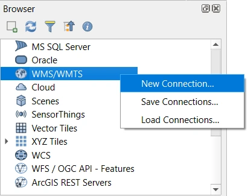

2. Provide the connection details:
   - **Name**
   - **URL** - enter the URL copied from the [dashboard](#enabling-ogc-api-access)
   - set **WMS DPI-Mode** to **QGIS**
   - select the following options: 
      - :white_check_mark: <NoSpellcheck id="Ignore GetMap/GetTile/GetLegendGraphic URI reported in capabilities" />
      - :white_check_mark:  <NoSpellcheck id="Ignore GetFeatureInfo URI reported in capabilities" />
      - :white_check_mark: <NoSpellcheck id="Ignore reported layer extents" />
   
   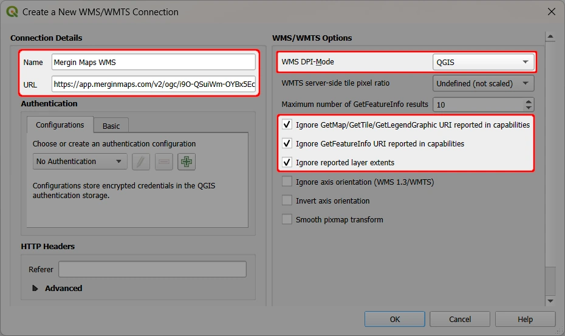

3. Published layers will now appear in the Browser panel and can be added to your project.
   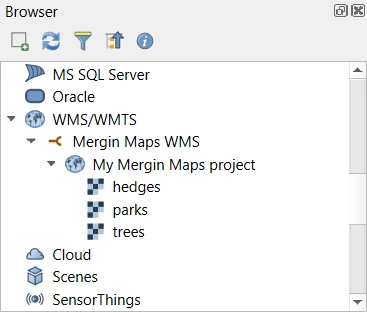

### WFS connection
Connect to *WFS* in QGIS via the **Browser** panel:

1. Right-click the **WFS/OGC API - Features** entry and select **New Connection...**
   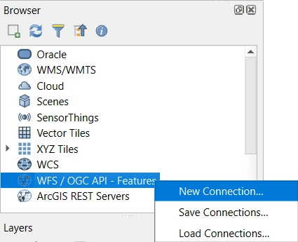

2. Provide the connection details:
   - **Name**
   - **URL** - enter the URL copied from the [dashboard](#enabling-ogc-api-access)
   - **Version** - click **Detect** or select **1.1** from the list

   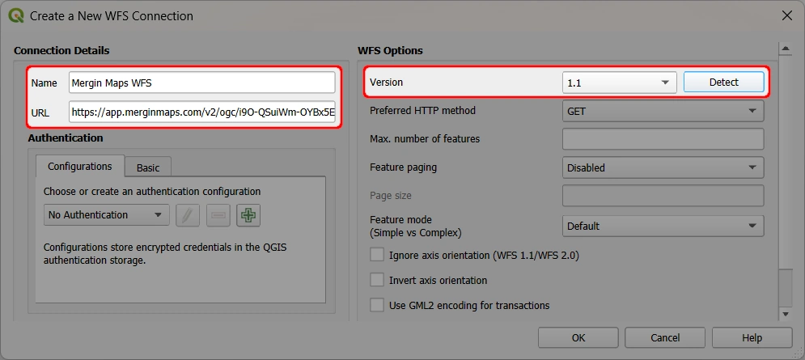

3. Published layers from will now appear in the Browser panel and can be added to your project.
   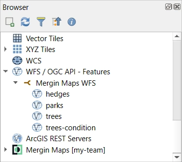

### OGC API - Features connection
Connect to *OGC API - Features* in QGIS via the **Browser** panel:

1. Right-click the **WFS/OGC API - Features** entry and select **New Connection...**
   

2. Provide the connection details:
   - **Name**
   - **URL** - enter the URL copied from the [dashboard](#enabling-ogc-api-access)
   - **Version** - select **OGC API - Features** from the list

   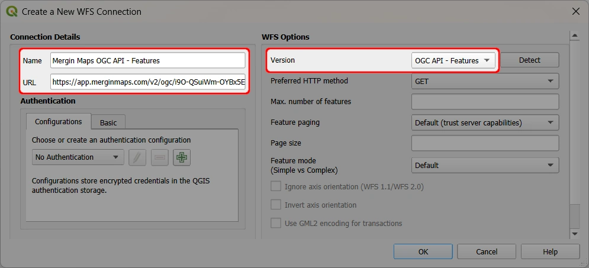

3. Published layers will now appear in the Browser panel and can be added to your project.
   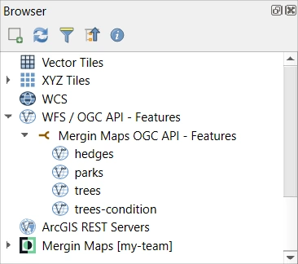

