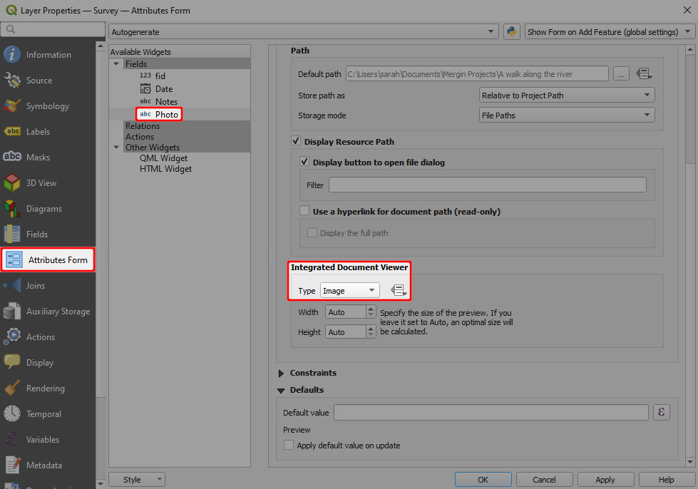
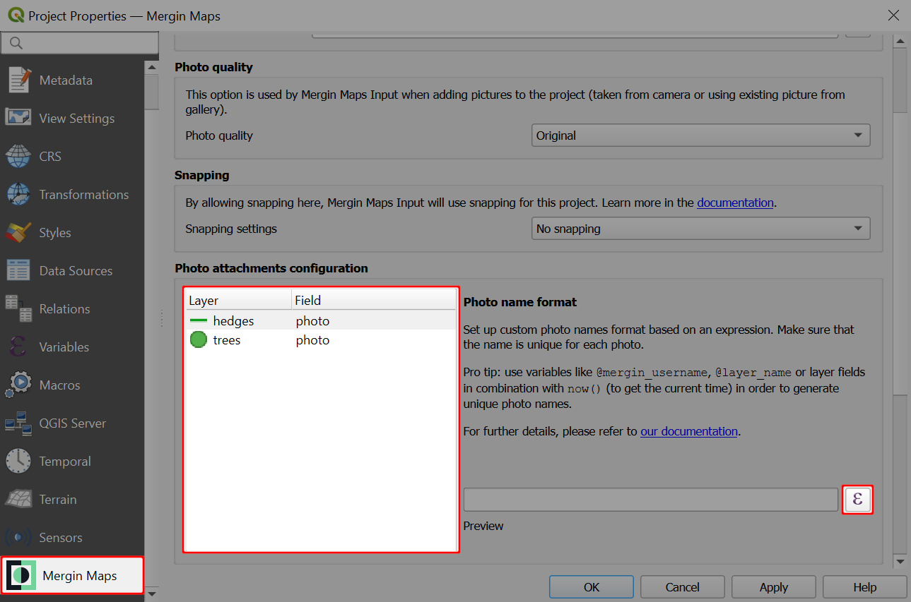

# How to Set Photo Names Format
<SinceBadge type="Plugin" version="2023.2.0" /> <SinceBadge type="App" version="v2.2.0" />

[[toc]]

Names of the photos that are captured in the field using <MobileAppName /> can be customised. The name format can be set in QGIS with <QGISPluginName />. 

## Photo widget setup
To use this option, make sure that the [photo widget](../../layer/settingup_forms_photo/#attachment-widget-in-qgis) of the fields you use for taking pictures is set up correctly, i.e. using the attachment widget, storing relative paths and, if needed, with a [custom folder](../../layer/settingup_forms_photo/#how-to-set-up-a-custom-folder-for-storing-photos) for storing photos. 

Ensure that the **Integrated Document Viewer** has the **Type** set to *Image*.

## Setting up custom photo names
1. Open your <MainPlatformNameLink /> project in QGIS and navigate to **Project Properties**
   

2. In the **Mergin Maps** tab, you can see the list of layers and their fields with correctly configured photo attachment widgets.

   Select a layer from the list and click on the **Expression builder** icon.
   
 
3. In the **Expression Dialog** window, enter the expression that should be use as the photo's name. Please, keep in mind [basic recommendations](#best-practice-for-photo-name-expressions) to make sure the naming works as intended.

   Here we use a combination of the layer's name, <MainPlatformName /> username and current timestamp (other examples ale listed [below](#examples-of-photo-names-expressions)): 
   ` @layer_name + '-' +  @mergin_username + '-' + format_date(now(),'yyMMddhhmmss')`
   
   Example result is displayed in the **Preview**: `hedges-sarah-230707194052`
   
   
   
   Click **OK** to confirm the expression.

4. Set up the photo name format for other fields and layers. 

   The **Preview** in **Mergin Maps** tab includes the [custom folder for photos](#how-to-set-up-a-custom-folder-for-storing-photos), if you have set it up. Otherwise you will see only the sample name of a photo.
  
     
   

### Best practice for photo name expressions
There are some tips to keep in mind when creating the expression for your photo name:

:white_check_mark: **Each photo needs to have a unique name** to avoid issues during synchronisation and ensure that photos and features are linked correctly.

Therefore, we recommend using combinations of variables that will ensure that there would not be multiple photos with the same name, such as the current date and time `now()`, <MainPlatformName /> username `@mergin_username`, layer name `@layer_name` or a field value.

:white_check_mark: The file extension (`.jpg`) is added automatically.

:white_check_mark: When using a field value in the expression, make sure that it is a field that will be filled out during the survey, e.g. by using [constraints](../../layers/settingup_forms_settings/#constraints). If the field is empty, the expression won't work!

:white_check_mark: If you want to use a [numeric field](../../layers/settingup_forms/#numbers) in your expression, you need to convert it to a string first using the `to_string()` function

:no_entry_sign: The expression is evaluated with the **current** field values. The name of the photo will stay the same even if you change the value of the field later.

:no_entry_sign: The setup needs to be saved and synchronised. Only photos that are taken after synchronisation will have the name defined by the expressions. Existing photos will keep their original names.
   
In general, it is useful to use some of these variables:
- Current timestamp `now()` is a good starting point to ensure uniqueness of the name of the photo. 

  It can be variously reformatted using the `format_date()` function. See <QGISHelp ver="latest" link="/user_manual/expressions/functions_list.html#format-date" text="See QGIS User manual" /> for more details.
  
- When working in a team, consider using <MainPlatformName /> username `@mergin_username`.
  
  Even if multiple team members capture a photo at the same time, the name will be different. Also, it makes it easy to sort photos based on who took them. 

- Layer name `@layer_name` or a field value.
  
  Depending on the layers in your project and their fields, it can help create a unique photo name when taking multiple pictures in a row. It can also help to make it easier to browse pictures in your <MainPlatformNameLink /> project.

### Examples of photo names expressions
Here are some example expressions that can be used or modified to fit your needs:

- Expression: ` @layer_name + '-' +  @mergin_username + '-' + format_date(now(),'yyMMddhhmmss')`
   - Preview: `hedges-sarah-230707154052.jpg`
   - Note: This is a combination of the name of a layer (`hedges`), <MainPlatformName /> username (`sarah`) and reformatted timestamp that starts with the year and ends with seconds.

- Expression: ` "species" +  format_date( now(),'-yyyyMMdd-hhmmss')`
   - Preview: `Silver birch-20230707-154052.jpg`
   - Note: `Silver birch` is a value of the `species` field. Current timestamp is reformatted with added hyphens to separate the date and time.

- Expression: `'photo-' +  format_date( now(),'ssmmhhddMMyy')`
   - Preview: `photo-520415070723.jpg`
   - Note: A string can be added to the photo name (here: `photo-`). The order of the timestamp is reversed (compared to the previous examples), starting from seconds.

- Expression: `@layer_name + ' ' + to_string("house-number") + ' at ' + format_date( now(),'ssmmhh') + ' on '+ format_date( now(),'ddMMyy')`
   - Preview: `house 41 at 520415 on 070723.jpg`
   - Note: Here we use the name of a layer (`house`), followed by a string adding space. A numeric field (`house-number`) is converted to a string. The timestamp is divided to display the time and date separately, with added strings `at` and `on` to make the photo name more readable.
