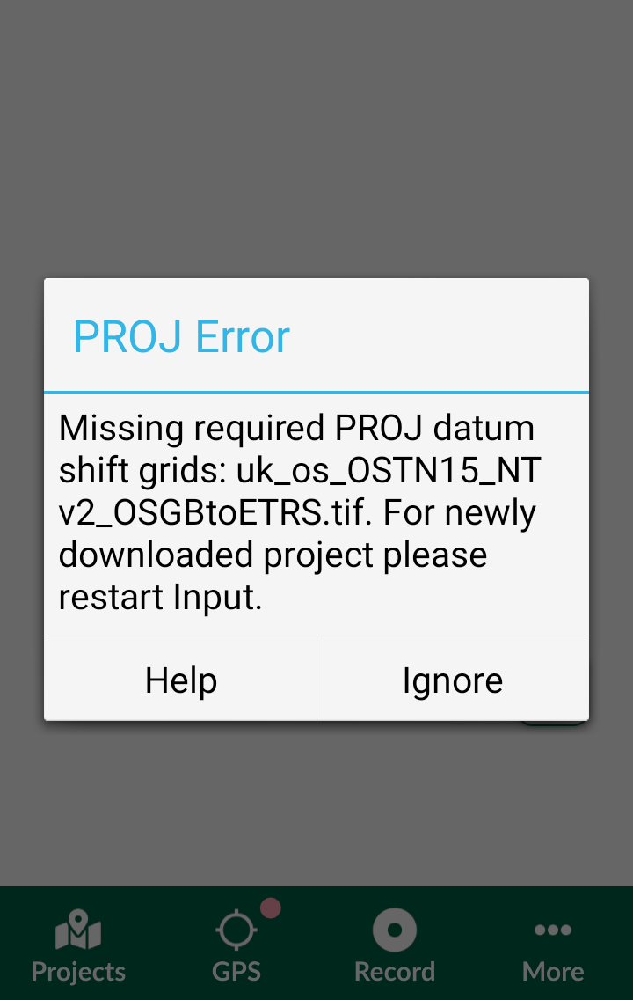

# Custom Projections 

<Badge text="Since Input 0.8.0" type="info"/>

::: tip
You can read more about Map Projections and Coordinate Reference Systems in this [extended article](./projections/index.md).
:::

If you use 
Some projections use a grid file to transform coordinates. Grid files for transforms are usually not shipped with QGIS. But QGIS offers to auto install these to the correct location for you! These files are then automatically used for all your projects if required. Once this is selected and ready, QGIS calls PROJ library to do datum transformation.
<GitHubRepo id="OSGeo/PROJ-data" desc="PROJ data" />

## Using custom PROJ

When <MobileAppName /> is launched, it searches for `<project folder>/proj` for custom PROJ datum shifts files in all available projects on the disk. These shift files can be then used in all projects for custom PROJ datum shift.

If you want to use your custom PROJ datum shifts, copy them to the folder `<project folder>/proj` to correctly render your QGIS project on <MobileAppName />. Note that one the project is firstly downloaded to <MobileAppName />, you have to restart <MobileAppName /> to load your custom datum shifts.

We recommend to use Mergin service to transfer the project with the required proj resources to your mobile device.

:::tip
Projections issues can cause misplacement of your field data. You can read more about this topic in our blog [Why are my survey points shifted?](https://www.lutraconsulting.co.uk/blog/2021/04/21/projections-field/).
:::
