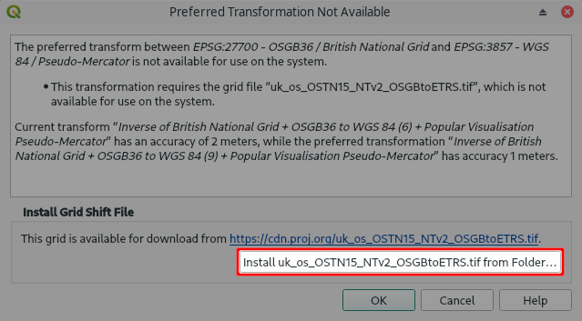
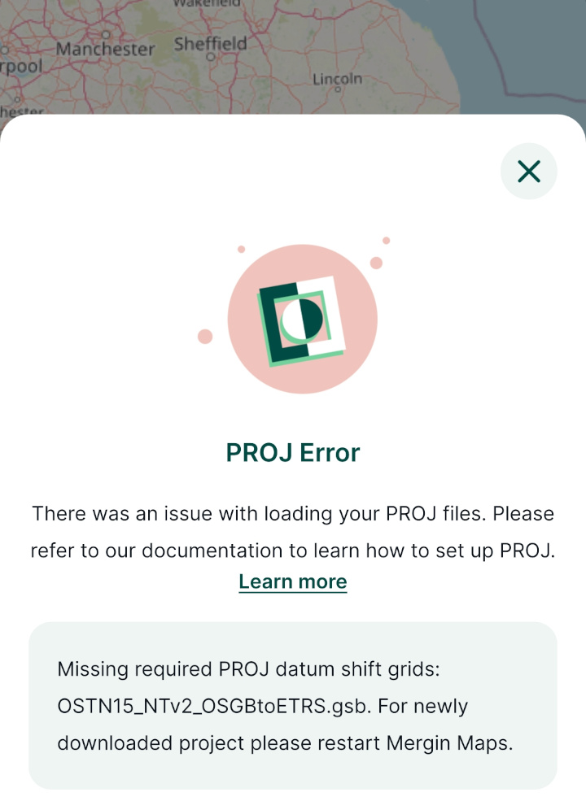
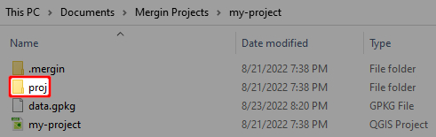
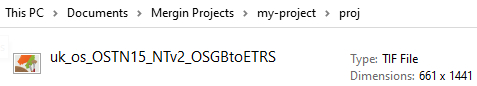

# Custom Projections 
[[toc]]

## Custom projections in QGIS
It is common to have multiple layers with different coordinate reference systems in one QGIS project. To display these layers accurately, it is necessary to define the transformation between the coordinate reference systems. 

QGIS on Windows and macOS comes with preinstalled projections and transformations that are handled by [PROJ](https://proj.org), including a whole lot of grid shift files for accurate horizontal and vertical coordinate transformations. However, some specific projections that are not included in <GitHubRepo id="OSGeo/PROJ-data" desc="PROJ data" />  may require you to install additional grid shift files manually. If this is the case, QGIS will show you a warning and will allow you to install the grid shift file from a folder.

:::tip
Grid shift files are usually provided by national geodetic authorities. Common formats are *Geodetic TIFF grids* (.tiff) and *National Transformation version 2* (<NoSpellcheck id=".gsb" />) files. 
<GitHubRepo id="OSGeo/PROJ-data" desc="PROJ data" /> gathers *Geodetic TIFF grids* from various sources, so you might be able to download your grid shift file from there. 
:::

You only need to do this setup once. After you install the grid files, they are automatically used by QGIS whenever needed. 

:::warning
If you want to share your project with someone else, they also need to install the grid shift files in their QGIS in order to display the data correctly.
:::

### Further reading about projections and transformations
This [extended article](../projections/) contains more information about map projections, coordinate reference systems and transformations. 

If you want to learn more about this topic, we recommend to go through the <QGISHelp ver="3.22" link="gentle_gis_introduction/coordinate_reference_systems.html" text="QGIS online documentation" /> or [PROJ documentation](https://proj.org/operations/index.html).

Projections issues are one of the common causes of misplacement of your field data as mentioned in our blog [Why are my survey points shifted?](https://www.lutraconsulting.co.uk/blog/2021/04/21/projections-field/).

## Custom projections in Mergin Maps mobile app
If you had to install grid shift files in QGIS in order to display your layers correctly, it is also necessary to provide the same grid shift files to <MobileAppName />.

<MobileAppName /> supports grid shift files formats:
- *National Transformation version 2* (<NoSpellcheck id=".gsb" />)
- *Geodetic TIFF grids* (.tiff)

When the app starts, it searches for `proj` folders in all available projects on the disk. The grid shift files found in these folders can be then used in all projects.

### Adding grid shift files to Mergin Maps mobile app

It couldn't be easier! When [creating a new <MainPlatformName /> project](../../manage/create-project/#create-a-project-in-qgis) by packaging current QGIS project or using current QGIS project as is, <QGISPluginName /> will copy all required datum shift grids to the appropriate project folder.

All you need to do is:
1. Define the coordinate systems, projections and transformations in your <MainPlatformName /> project in QGIS as you need.

2. Synchronise the project using the <QGISPluginNameShort />. 
   If a shift grid file is missing, you will get a warning containing a link to **fix the issue**.
<!--add warning screenshot -->

3. Download the project with the grid shift files to <MobileAppName />. 
   When the project is downloaded to the app for the first time, you will get a **PROJ Error** that will prompt you to **restart the app** to load the grid shift files. The error message should not appear after the restart of the app.

### Adding grid shift files manually
If you want to add grid shift files to the <MobileAppNameShort /> manually:
1. Create a folder called `proj` in your project folder
   
2. Copy the grid shift file to the `proj` folder
   
   
   :::tip
   Grid shift files installed in QGIS on your computer can be found in these locations:
   - Windows users: `C:\Users\USER\AppData\Roaming\QGIS\QGIS3\profiles\default\proj` (USER is your username)
   - macOS users: `~/Library/Application\Support/QGIS/QGIS3/profiles/default/proj`
   - Linux users: `~/.local/share/QGIS/QGIS3/profiles/default/proj`
   :::
   
3. Synchronise the project using the <QGISPluginNameShort />
4. Download the project with the grid shift files to <MobileAppName />. 
   When the project is downloaded to the app for the first time, you will get a **PROJ Error** that will prompt you to **restart the app** to load the grid shift files. The error message should not appear after the restart of the app.

