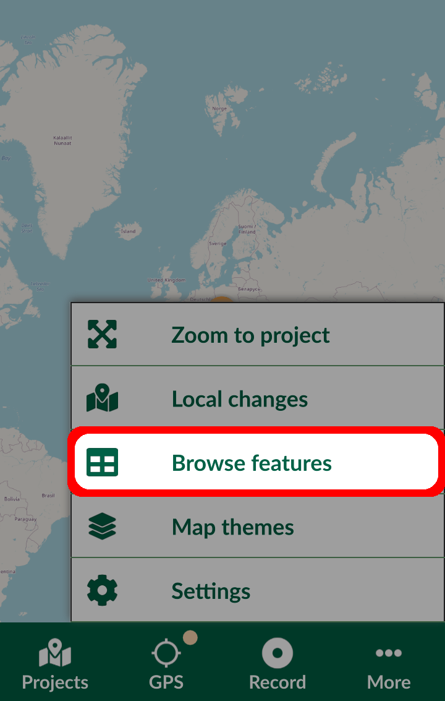
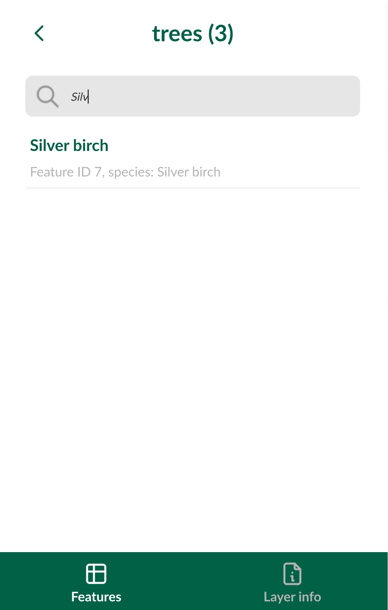

# Searching for Values in Attribute Fields
[[toc]]

In <MobileAppName />, you can search for the content of fields in spatial layers and non-spatial tables, as well as searching values from multiple fields.

## Setting identifiable layers in QGIS project
To be able to browse the attributes of a layer, it needs to be set as *Identifiable* in your <QGISHelp ver="3.22" link="user_manual/introduction/qgis_configuration.html?highlight=properties#data-sources-properties" text="QGIS project" />.

1. Open your QGIS project
2. In the Menu > Project > Properties click on **Data Sources**
3. Check and uncheck layers in the **Identifiable** column to define which layers you want to be able to browse in your project.

:::warning
If you define a layer as **not identifiable**, you won't be able to tap it in <MobileAppName /> or use the **Identify tool** in QGIS to see its attribute form.
:::

## Exclude a field from the search
By default, all attributes are searchable. You can exclude a field from the search in the **Layer properties**. 
1. Navigate to the **Fields** tab
2. Check the **Not searchable** option in the **Configuration** column

:::warning
If a field is marked in a field configuration as **Not searchable**, it will be omitted from the search. There will be no search results, even if you search for a specific existing value of this field.
:::

## Searching for values in Mergin Maps Input
Attribute data can be browsed in <MobileAppName /> by tapping **Browse features** in the **More** tab.

You can select a layer or a table from the list to open the attribute table and type in the string to shortlist the matching records.

Selecting an individual record will open the form of the feature.

:::tip
The search looks up for a match in all searchable attributes values and is not case sensitive.
:::

